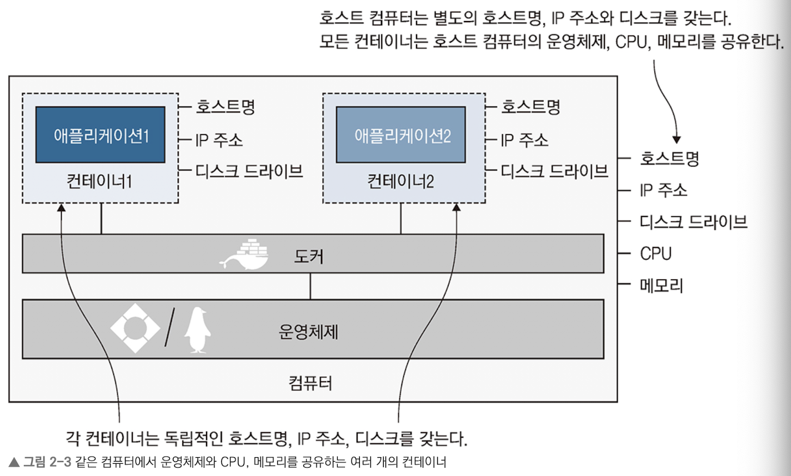

 

### 도커의 장점

- 다양한 환경에서 이식성이 뛰어나다. OS 간의 이식성도 도커가 책임지고, 클라우드 환경과 온프레미스 환경 사이의 이식성도 좋다.

- MSA 환경에서 더욱 효율적으로 동작한다.

- 개발팀와 데브옵스 팀 간의 연결체 역할을 수행한다

- 컨테이넌 오케스트레이션을 가능케 한다.

 

### 컨테이너란 무엇인가

- 간단하게 설명하면 프로그램을 실행할 수 있는 별도의 실행환경을 의미한다.

- 때문에 컨테이너는 도커에서 관리하는 호스트명, IP주소, 디스크가 함께 포함되어 있다. 이는 도커가 만들어낸 가상 리소스이다.

- 가상 환경과의 주된 차이점은 가상환경은 실행을 위해 별도의 OS를 요구하지만 Docker의 경우 호스트 운영체제를 공유하는 부분에서 차이가 발생한다.

- 그렇기에 도커는 어느정도 호스트 OS에 종속적인 부분이 존재하기도 한다. 다만, CLI command와 같은 API 자체는 대부분의 경우 OS에 종속적이지 않기 때문에 보편적으로는 OS에 상관없이 동작한다.

- 컨테이너에서 실행되는 프로그램은 호스트 OS에 종속성을 갖는다. 대부분의 이미지가 Linux를 기반으로 만들어지긴 한다.

 

