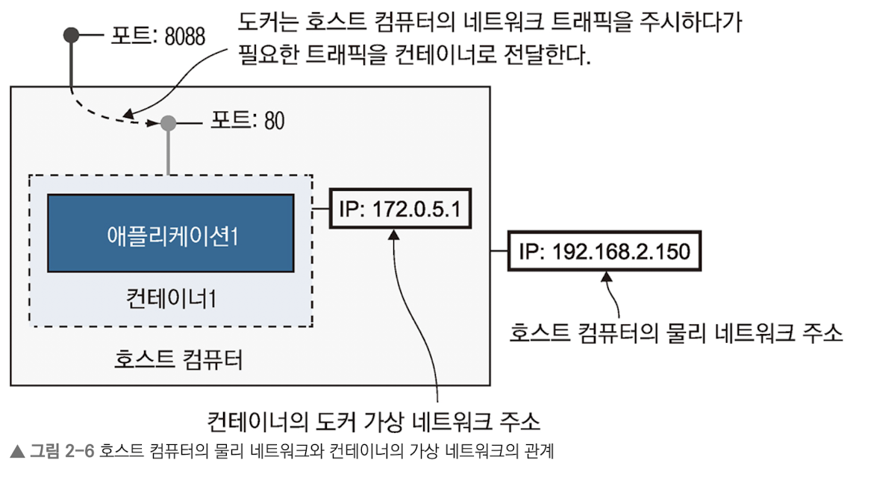
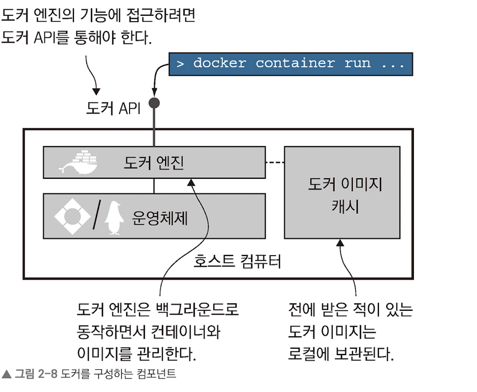

```bash
docker container run diamol/ch02-hello-diamol                        ─╯
---------------------
Hello from Chapter 2!
---------------------
My name is:
e17da96e972c
---------------------
Im running on:
Linux 6.6.26-linuxkit aarch64
---------------------
My address is:
inet addr:172.17.0.2 Bcast:172.17.255.255 Mask:255.255.0.0
```

<br/>


```bash
> docker container run --detach --publish 8080:80 diamol/ch02-hello-diamol-web

# --detach 커맨드를 사용할 경우 컨테이너가 백그라운드에서 실행된다.
# --publish 는 컨테이너의 포트를 호스트 컴퓨터에 공개한다.
# 도커는 기본적으로 컨테이너의 환경을 외부로 노출하지 않는다.
```



<br/>



- 도커 엔진은 도커의 관리 기능을 맡는다. 로컬 이미지 캐시를 담당하며, 항상 백그라운드에서 실행중이다.

- 도커 API는 표준 HTTP 기반 REST API다. 엔진 설정에 따라 외부에 노출 할 수 있고, 기본적으로는 외부 노출을 허용하지 않는다.

- 도커 CLI는 도커 API의 클라이언트다. docker ~~ 를 실행할 때 바로 이 도커 CLI를 호춣한다.

<br/>

### 연습문제

- 문제의 요구 사항은 현재 실행중인 컨테이너의 파일 시스템에 접근하여 HTML 문서를 수정하라인데, exec를 안 알려주고 냅다 하라고 하시면…

- 일단 문제가 요구한 대로 컨테이너를 실행하고,` exec -it [Container ID] /bin/sh `커맨드를 통해 내부에 접속 후, Vi를 통해 HTML 파일 수정 

<br/>

