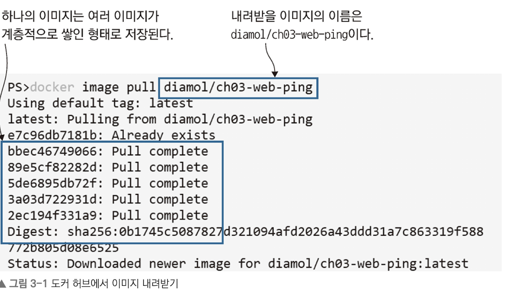
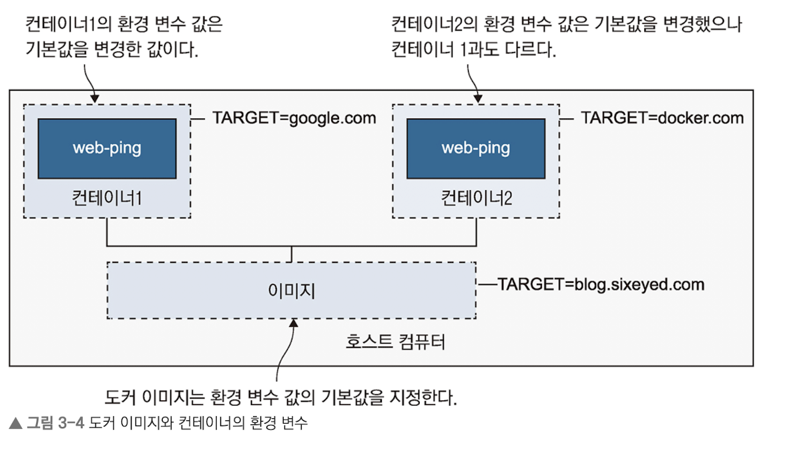

<br/>

### 도커 이미지란

- 실행 가능한 프로그램을 엮어서 도커에서 실행할 수 있도록 빌드해 놓은 것

	

- 도커 이미지는 기본적으로 하나의 압축된 프로그램이라고 볼 수 있다. 다만 내부적으로는 여러 개의 작은 파일로 구성되어 있다. 도커는 이 파일들을 조합하여 하나의 이미지로 구성한다.

<br/>

### 환경변수



- 컨테이너를 실행하면서 매번 정적인 이미지를 전달하지 못할 수 있기 때문에 `--env`  커맨드를 통해 환경변수를 지정할 수 있음

- 또한 호스트 환경의 환경 변수를 따르지 않고, 컨테이너에 지정된 환경변수만 따라감

<br/>

## 이미지 빌드

- 도커 이미지를 빌드하기 위해선 어떤 행위를 할 것인지 기술한 DockerFile이 필요하다. 예제에선 아래와 같은 예제를 제공했다.


```docker
FROM diamol/node

ENV TARGET="blog.sixeyed.com"
ENV METHOD="HEAD"
ENV INTERVAL="3000"

WORKDIR /web-ping
COPY app.js .

CMD ["node", "/web-ping/app.js"]
```

<br/>

## 이미지 레이어 특성

- 도커의 이미지 레이어는 여러 이미지에서 공유된다. 실습으로 실행했던 이미지들은 diamol/node라는 이미지 레이어를 공유하고, 따라서 이 이미지들이 실제로 차지하는 디스크 용량은 각자가 필요로하는 용량보다 적다. (저장 공간의 효율화)

- 다만 이러한 특성으로 인해 한 번 업로드 된 이미지 레이저의 수정은 불가능하다.

- 이미지 빌드 시, 이미지 레이어의 해시와 동일한 해시가 캐시에 존재하면 재사용한다.

<br/>

## 과제

- diamol/ch03-lab 에 존재하는 파일의 일부를 수정하고, 이를 도커 파일 없이 이미지로 빌드하라는 과제이다.

- 안 알려준 걸로 과제를 계속 내는데 아주 마음에 들지 않는다. 깃헙에 정답을 게시했다고는 하는데 뭐하자는거지. 과제의 방향성은 나쁘지 않은데 학습 의욕을 확 꺾어버리는 방식으로 느껴진다. 최소한 어떤 키워드를 사용해야 할지 정도는 제시되어야 한다.


```docker
# DIAMOL Chapter 3 Lab - Sample Solution

docker container run -it --name ch03lab diamol/ch03-lab

echo Elton >> ch03.txt 

exit

docker container commit ch03lab ch03-lab-soln
      
docker container run ch03-lab-soln cat ch03.txt

OR 

docker container run ch03-lab-soln cmd /s /c type ch03.txt

```

- ~~장난하나. 과제의 의미를 모르나. 답을 보기 전에 문제를 못푸는걸 과제로 내면 어쩌라는걸까.~~

<br/>

<br/>

