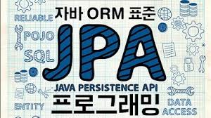

# Java ORM 표준 JPA - 김영한 저

<figure><figcaption></figcaption></figure>

자바 ORM 표준 JPA (2015, 김영한 저, 에이콘 출판사)을 읽고 핵심적인 개념 (FetchType, Proxy, Entity Manager... )들을 요약하여 정리하였습니다.&#x20;

JPA 기술 자체는 사용하기에 굉장히 편리하지만 추상화 정도가 높기에 핵심적인 내부 동작들을 이해하지 못하면 부작용이 발생할 가능성이 다분합니다. 해당 도서는 국내에서 한글로 된 서적으로는 유일하게 JPA 내부 동작 및 원리를 설명하여 개발자가 현업에서 마주할 수 있는 문제를 방지할 수 있도록 돕습니다.

몇 안 되는 단점으로는 `Creteria` 처럼 잘 사용되지 않는 기술에 대해 지면이 과하게 투자된 점과 QueryDsl 같은 사용 빈도가 높은 주변 기술에 대한 설명이 다소 부족한 점이 있습니다.

그럼에도 책 자체는 JPA의 핵심 기술 및 동작 원리에 대해 상세하게 기술되어 있으므로 독자들이 집중할 부분을 조금만 잘 잡는다면 성장에 큰 도움이 되리라 생각합니다.
