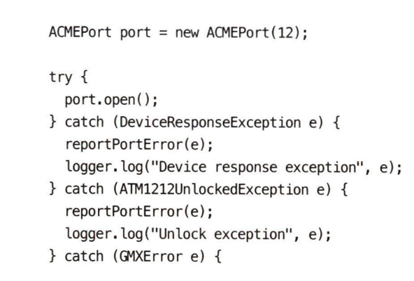
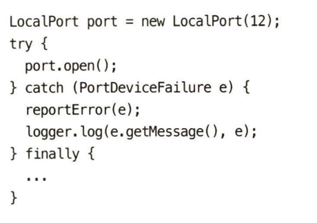

- 오류보단 예외를 사용해라.

- UncheckedException를 사용하자. CheckedException은 좋은 아이디어 같았지만, 객체 상속 과정에서 하위 클래스 메서드에서 CheckedException을 추가하려면 상위 클래스 메서드에도 영향을 미친다. 이는 다른 형제 클래스의 메서드에도 영향을 미치고 이는 OCP 원칙을 위배하게 됟다.

- 예외에 의미를 제공해라

	- 예외를 던질 때는 전후 상황을 충분히 덧붙인다. 그럼 오류가 발생한 위치와 원인을 찾기 쉬워진다. AA님이 그렇게 열심히 예외 메서지를 구성한 이유가…

- 호출자를 고려해 예외 클래스를 정의하라

	- 외부 라이브러리 호출 시, 이를 감싸는 커스텀 클래스를 만들고 예외를 규정하는 방식으로 코드를 개선할 수 있다. 이를 통해 추후에 외부 API를 교체하거나 유지보수하기 용이해진다.

[//]: # (column_list is not supported)

	[//]: # (column is not supported)

		

	[//]: # (column is not supported)

		

- 정상 흐름을 정의하라

- Null을 반환하지 마라. NPE 난다…

- 메서드에 Null을 전달하지 마라.

	- 정상적인 인수로 null을 기대하는 API가 아니라면 메서드로 null을 전달하는 코드는 피하는게 좋다.

	- Kotlin이 이런쪽에서 null check를 잘 해주는 편이긴 하지..

- 

