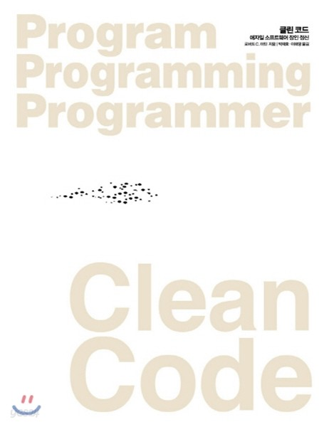

# Clean Code - Notion2Gitbook

<figure><figcaption>
600 페이지 분량의 잔소리
</figcaption></figure>

600페이지에 가까운 빽빽한 책인만큼 많은 내용이 담겨있지만 주된 내용은 몇 가지로 줄일 수 있을 것 같습니다.

* 클래스, 메서드, 비즈니스 로직은 최소한의 책임만을 가진 상태로 유지해라. 작을수록 좋다. 그러니 **제발 작게 짜라.**
* 클래스, 메서드, 변수 네이밍은 이해를 도울 수 있도록 신중하게 선정해라.
* 이름을 짓기 힘들다면 너무 많은 역할을 부여하지 않았는지 고민해라. ~~그니까 좀 작게 짜라고~~
* 메서드의 단위가 작을수록 테스트는 용이해진다. ~~그러니 작게 짜라~~
* 다음 작업자가 예상치 못할만한 코드를 구현하면 곤란하다.&#x20;
  * 놀람 최소화 원칙, `addItem()`내부에 특정 필드에 UUID를 덧붙여서 자료구조에 추가하는 로직은 다음 작업자가 예상하기 어렵다. 최소한 `modifyFiledAndAddItem()` 처럼 메서드에서 일어나는 일을 명확히 설명하는 쪽이 좋으며, 더 좋은 것은 특정 필드를 갱신하는 로직을 별도의 메소드로 분리하는 것이다.

...

예, 사실 600페이지 분량의 세계적인 잔소리입니다. 그래도 피가 되고 살이 되는 내용들이며, 저도 읽은 이후 상당한 변화를 체감한 좋은 책이라고 생각합니다. 지면 중 전혀 이해하지 못한 내용 (_함수의 추상화 정도, 6장 객체와 자료구조_)도 있어서, 후기를 작성하며 다시 읽고 추가로 공부해보려 합니다.
