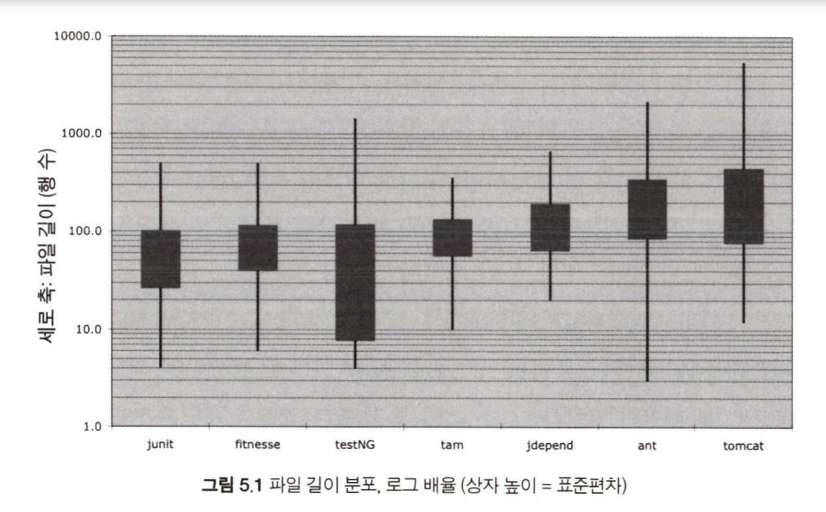
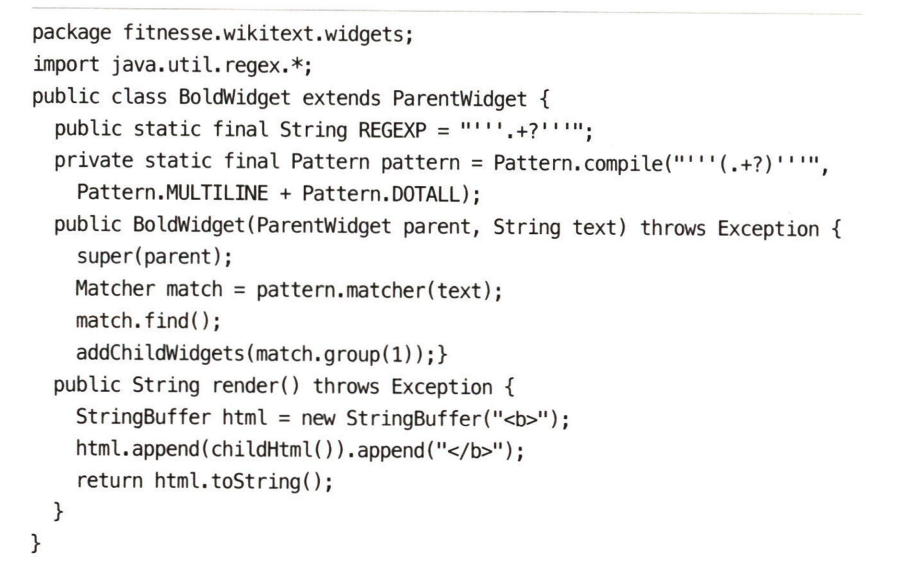

### 코드 형식은 중요하다!

- 너무 중요해서 융통성 없이 맹목적으로 따르는 것은 지양해야 한다. 코드 형식은 의사소통의 일환임을 인지해야한다.

- 오늘 구현한 코드의 기능은 다음 버전에서 바뀔 가능성이 높다. 하지만 오늘 구현한 코드의 가독성은 앞으로 바뀔 코드의 품질에 지대한 영향을 끼친다.

- 파일 하나의 크기는 작은 수록 좋으며, 수 만 라인이 넘어가는 대형 프로젝트도 500줄 가량의 파일들의 모음으로 이루어진다.

	

 

### 신문 기사처럼 작성하라

- 신문 기사는 위에서 아래로 중요한 내용이 먼저 나온다. 세세한 사실은 숨기고 커다란 그림을 보여준다. 따라서 첫 부분에는 소스 파일을 대표하는 고차원 개념과 알고리즘을 설명한다. 아래로 갈수록 저차원 함수를 작성하며 의도를 세세하게 표현한다. 

	- 예를 들어 유저 서비스 클래스에선 상단에 회원가입, 로그인, 회원정보 조회 메서드가 위치하고, 파일 하단에 레포지토리와 통신하는 메서드가 나오는게 낫다.

 

### 개념은 빈 행으로 분리하라

- 일련의 행 묶음은 완결된 생각 하나를 표현한다.

- 딱봐도 한숨이 나온다. 어후

- 연관성이 높은 함수는 되도록 근처에 위치하는게 좋다. 여기저기 소스 코드를 뒤지게 하는건 되도록 피하는 것이 좋다

- 지역 변수는 사용하는 위치에서 가장 가까운 편이 좋다.

- 인스턴스 변수는 클래스 맨 처음에 선언하는게 좋다.

- 함수 간 종속성을 띄는 경우엔 두 함수는 가까이 위치하고, 호출하는 함수는 상단에 호출되는 함수는 하단에 위치하는게 자연스럽다. 

- 개발자들은 너무 긴 행에 대해 거부감을 가지고 있다. 아니 근데 80자도 짧은데…? 모니터가 커지고 해상도가 좋아져서 그른가… 100자까진 괜찮은듯…? 근데 그냥 네이버 컨벤션 적용하면 쉬울듯… 저자도 100자에서 120자까지는 괜찮다고 한다. 하지만 그 이상은 과하다는 것을 보면 로버트 마틴 할아버지도 비슷한 감상을 가진듯

- 팀은 한가지 규칙에 합의해야 하고, 팀원은 그 규칙을 반드시 따라야한다. 그래야 소프트웨어의 스타일이 일관성을 띈다.

- 

 

