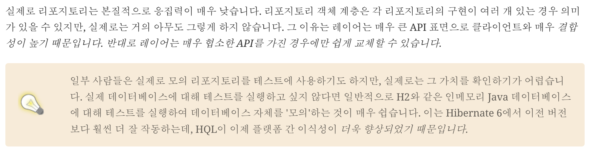

---

**요약: Hibernate 진영에선 Spring Data JPA와 같은 프레임워크가 권장하는 Repository Layer가 필요치 않다고 주장합니다. 근데 전 아닌 것 같아요…!**

 

꽤 파격적인 이야기라고 생각하는데, 하이버네이트 진영에서도 이미 관행처럼 굳어진 아키텍쳐를 짚고 넘어가긴 부담스러웠는지 상당히 조심스럽게 이야기를 시작했습니다.

### DAO와 리포지토리에 대한 장대한 이야기

	> 암흑기였던 Java EE 4 시절, Hibernate가 표준화되고 이후 Java 엔터프라이즈 개발에서 JPA가 부상하기 전에는 오늘날 Hibernate가 처리하는 지저분한 JDBC 상호작용을 직접 코딩하는 것이 일반적이었습니다. 그 끔찍했던 시절에 *데이터 액세스 개체(DAO)라는 패턴이 등장했습니다. DAO는 지저분한 JDBC 코드를 모두 넣을 공간을 제공하고 중요한 프로그램 논리를 깔끔하게 남겨 두었습니다.*

		2001년에 Hibernate가 갑자기 등장했을 때 개발자들은 이 기능을 좋아했습니다. 그러나 Hibernate는 아무런 사양을 구현하지 않았고, 많은 사람들이 프로젝트 로직의 Hibernate 의존성을 줄이거나 최소한 *지역화하기를 원했습니다. 확실한 해결책은 DAO를 유지하되 그 안에 있는 JDBC 코드를 Hibernate *`*Session*`* 호출로 대체하는 것이었습니다.*

		우리는 그다음에 일어난 일에 대해 부분적으로 우리 자신을 탓합니다.

		2002년과 2003년에만 해도 이는 매우 합리적인 일로 보였습니다. 실제로 저희는 *동면 모드에서 DAO 사용을 권장하거나 적어도 권장하지 않음으로써 이 접근 방식이 인기를 얻는 데 기여했습니다. 이러한 실수와 이를 인지하는 데 너무 오래 걸린 점에 대해 사과드립니다.*

		결국 일부 사람들은 DAO가 자신의 프로그램이 ORM에 지나치게 의존하지 않도록 보호해주기 때문에 Hibernate를 "교체"하고 JDBC나 다른 것으로 대체할 수 있다고 믿게 되었습니다. 데이터베이스와의 모든 상호작용이 명시적이고 동기적인 JDBC의 프로그래밍 모델과 업데이트가 암시적이고 SQL 문이 비동기적으로 실행되는 Hibernate의 상태 저장 세션 프로그래밍 모델에는 상당한 차이가 있기 때문에 이는 결코 사실이 아니었습니다.

		하지만 2006년 4월 JPA 1.0의 최종 초안이 승인되면서 Java의 지속성에 대한 전체 환경이 바뀌었습니다. 이제 Java는 표준 API의 여러 고품질 구현을 통해 ORM을 수행할 수 있는 표준 방법을 갖게 되었습니다. 이것이 DAO의 종말이었죠?

		DAO는 '리포지토리'로 이름이 바뀌었고, JPA의 프런트엔드로서 일종의 좀비 사후 세계를 계속 누리고 있습니다. 하지만 정말 그만한 가치가 있을까요, 아니면 불필요한 추가 복잡성과 부풀림에 불과한 것일까요? 스택 추적을 읽기 어렵게 만들고 코드를 디버깅하기 어렵게 만드는 불필요한 추가 계층일까요?

		JPA `EntityManager`는 "저장소"이며, 지속성에 대해 하루 종일 고민하는 사람들이 작성한 잘 정의된 사양이 있는 표준 저장소입니다. 이러한 저장소 프레임워크가 실제로 *유용한 기능을 제공했다면, 그리고 *`*EntityManager*`*가 제공하는 것 이상의 기능을 제공했다면 수십 년 전에 이미 *`*EntityManager*`*에 추가했을 것입니다.*

	 

요약하자면* 기존의 DAO 패턴이 JDBC의 지저분한 코드를 담당했고, JPA 표준이 발매되면서 굳이 DAO 계층이 존재할 필요성도 없어졌지만, *<u>*여전히 데이터베이스 접근엔 별도의 계층(Repository Layer)이 관행적으로 사용되고 있다. 이게 지금도 존재할 필요가 있나?*</u>* *라고 볼 수 있습니다.

 

 

> *OK, so, look, if it makes you feel better, one way to view EntityManager is to think of it as a single generic "repository" that works for every entity in your system. From this point of view, JPA is your persistence layer. And there’s few good reasons to wrap this abstraction in a second abstraction that’s less generic.*

*기분이 나아질지 모르겠지만, *`*EntityManager*`*를 보는 한 가지 방법은 시스템의 모든 엔터티에 대해 작동하는 하나의 일반 "리포지토리"로 생각하는 것입니다. 이러한 관점에서 보면 JPA 는 지속성 계층입니다. 그리고 이 추상화를 일반적이지 않은 두 번째 추상화로 포장할 좋은 이유가 거의 없습니다.*

 

즉, 도메인 모델은 이미 설계 단계에서 분리되어 있으며, EntityManager는 이미 모든 엔티티를 포괄할 수 있는 레포지토리의 역할을 수행할 수 있으므로, Repository 계층이 실제적으로 필요치 않을 수 있다는 의견을 제안하며이에 대한 몇 가지 근거를 제시하는데 이는 다음과 같습니다.

 

- *most nontrivial queries touch multiple entities, and so it’s often quite ambiguous which repository such a query belongs to,*

- *most queries are extremely specific to a particular fragment of program logic, and aren’t reused in different places across the system, and*

- *the various operations of a repository rarely interact or share common internal implementation details.
*

- *대부분의 중요하지 않은 쿼리는 여러 엔티티에 영향을 미치기 때문에 그러한 쿼리가 어느 리포지토리에 속하는지 매우 모호한 경우가 많습니다.*

- *대부분의 쿼리는 특정 프로그램 로직 조각에 매우 한정되어 있으며 시스템 전체에서 다른 곳에서 재사용되지 않습니다.*

- *리포지토리의 다양한 작업은 상호 작용하거나 공통된 내부 구현 세부 정보를 공유하는 경우가 거의 없습니다.*

 

 

Hibernate의 주장은 대체로 맞습니다. 다만 2번째 근거로 시스템 전체에서 재사용되지 않는다는 주장에는 조금 의구심이 드네요. 자세히 다시 보겠습니다!

 

---

## 선택은 각자의 몫

모든 독자는 자신의 경험에 의거하여 글을 읽게 됩니다. 저 역시도 1.7 챕터를 읽으면서 제가 작성했던 코드에 대해 생각하고, 이 과정에서 Repository Layer, 실질적으로는 `**Spring Data JPA**`에 대한 의존성을 없애는 과정을 가정할 때, 몇 가지 상황을 마주할 수 있을 것 같습니다.

1. 다른 비즈니스 로직 레이어에서 동일한 Repository 기능을 참조하는 경우

1. `JpaRepository`에서 제공하던 기본적인 기능(CRUD)과 `Custom Repository implement,` `QueryMethod` 기능을 제거하는 경우

 

각 경우에 나누어 변경점들을 생각해보겠습니다.

---

### 다른 비즈니스 로직 레이어에서 동일한 Repository 기능을 참조하는 경우

N개의 서비스 클래스에서 동일한 레파지토리를 참조하고 있는 경우는 꽤 흔합니다. 예컨데 `PostService`, `CreditService`와 같은 다양한 영역에서 **UserRepository** 라는 하나의 레파지토리를 참조하는 경우는 흔하니까요.

만약 Repository를 없애고 <u>UserRespository에서 수행하던 메서드를 모두 UserService에 포함된 메서드로 재구현</u>한다면 어떤 일이 생길까요. 제가 생각하기엔 두 가지 경우로 나뉠 것 같습니다. 

1. PostController, CreditController 와 같은 Service 클래스 객체를 참조하는 계층에서 UserService 메서드를 호출하고, 리턴값을 다른 서비스 클래스 메서드로 전달하는 방식

1. PostService, CreditService와 같은 Service 클래스가 UserService를 참조하는 방식

 

1번째 케이스에선 대부분의 컨트롤러들이 기존에 비해 비대해질 것이라 예상합니다. 서비스 레이어에서 Repository를 호출하던 부분이 Controller가 Service method를 호출하는 방식으로 전환되며 비즈니스 로직이 전개되는 과정이 일부 Controller에게 이양될 가능성이 농후하다고 봅니다. 
Controller를 되도록 Endpoint 역할만 수행하도록 구성하는 편이라 그다지 마음에 들지 않네요.

2번째 케이스는 더욱 좋지 않다고 생각합니다. 동일한 레이어 상에서 너무 많고, 또 복잡한 의존성을 갖게 되는 형태가 될 것이며, 심심찮게 순환참조 에러도 마주하게 되리라 봅니다. 1번째 케이스는 불호의 영역이었다면 2번째 케이스는 꼭 피해야하는 케이스라고 생각되네요.

 

---

### JpaRepository Method(CRUD)과 Custom Repository implement, QueryMethod 기능 제거

Hibernate의 제안처럼 Repsitory Layer를 걷어낸다면 어떤 일이 일어날지 상상해보겠습니다. 

일단 `QueryMethod`를 사용하지 못합니다. 이건 Spring Data JPA 고유 기능이니 당연한 일일 겁니다. 작은 프로젝트에선 이로 인한 변경사항이 상대적으로 작겠지만, 비교적 덩치가 크고 성숙한 프로젝트일 수록 변경 사항이 많은 것을 예상할 수 있습니다. 엔티티 모델이 갖는 상태값이 다양할 가능성이 크니까요.

JpaRepository에서 제공하는 기본 CRUD 메서드 예컨데 findbyId() 와 같은 메서드도 사용할 수 없을 겁니다만 제 경험상 해당 기능은 활용도가 낮아서 큰 체감이 없을 것 같긴 하네요. EntityManager로 충분히 처리할 수 있는 일이라고 생각합니다. 

`Custom Repository Implementateion`은 논의의 여지가 많은 부분이라고 생각합니다.

Spring data에선 Custom Repository implement 을 지원합니다. 즉, DomainRepository의 추상 메서드를 호출할 때, 해당 메서드의 구현 메서드를 자연스럽게 호출해주는 기능을 지원하고, 이는 JpaRepository가 제공하는 기본 메서드나 QueryMethod로 구현하기 어려운 쿼리를 작성할 때 유용하게 사용되었습니다.

Hibernate 제안대로 Repository Layer를 걷어내고 Service Layer에서 위의 작업들을 처리한다고 하면 가정상 아래와 같은 수정 사항이 발생할 거라 생각합니다.

1. **QueryMethod로 정의한 함수들이 서비스 클래스에서 HQL, JPQL, DSL로 재구현**

1. **Custom Repository Implementateion 메서드 재구현**

 

---

### Summary

나열하고 보니 생각보다 변경해야 할 점이 많습니다. Custom Repository 메서드야 포함되어 있는 클래스가 Repository의 구현 클래스에서 서비스 클래스로 옮겨가고, QueryMethod 기능이 서비스 클래스에서 재구현되며, 최종적으로 `**Controller**`**와** `**Service Layer**`**가 비대해질 것을 예상할 수 있습니다.** 

그렇다면 여기서 다시 생각해보겠습니다. Hibernate의 제안은 어떤 장점을 갖는가?

앞서 나열한 작업들과 변경 사항을 감수할만한 이점을 가질 수 있을까요? 
저는 아니라고 생각합니다.

`Spring Data JPA`는 Hibernate의 공식 의견처럼 과대평가되거나 불필요한 과정을 강요하는 걸지도 모릅니다.하지만 결과적으로 비즈니스 로직 레이어와 데이터베이스 상호작용 레이어가 분리되며 코드의 가독성과 책임 분리 원칙이 더 지켜지기 쉬운 형태가 되지 않았나 생각합니다. Spring Data JPA가 최종적으로 Hibernate Wrapping library인 점에서, Hibernate 만으로 동일한 기능 구현은 가능하겠지만 **굳이 그래야 할 이유가 있을까요?** 저는 찾지 못했습니다.

물론 Hibernate가 이런 제안을 한 이유도 납득은 갑니다. 데이터베이스과 상호작용하기 위한 코드가 JDBC를 직접 사용하던 예전에 비해 많이 깔끔해졌고, ORM Libaray의 목적성 자체가 데이터베이스 엔티티를 일반 객체처럼 사용하기 위함이었으니, 이를 위한 별도 레이어는 오히려 철학적으로 맞지 않다고 보는 시각도 이해는 되지만… 역시 계층 하나가 사라졌을 때 다른 계층에 너무 많은 책임을 이양하는 결과를 낳을 것 같다는 생각이 드네요.

혹시 다른 의견이나 Repository Layer를 제거했을 때 얻을 수 있는 이점이 있으시다면 언제든 제안 부탁드리겠습니다! 오늘의 포스팅 여기서 마무리하겠습니다!

