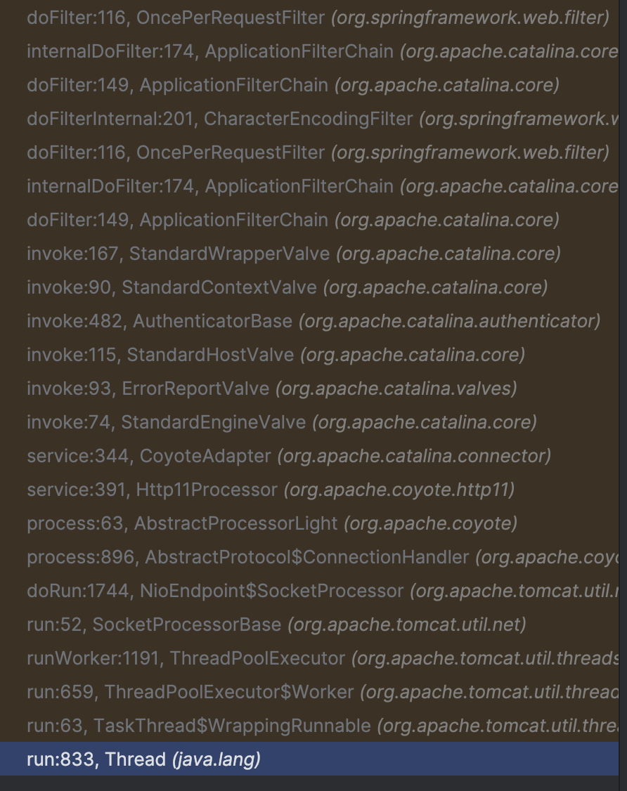
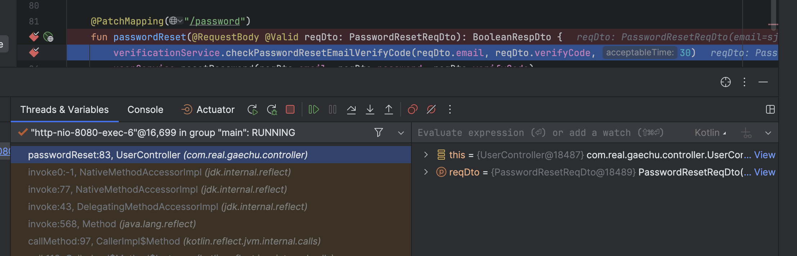
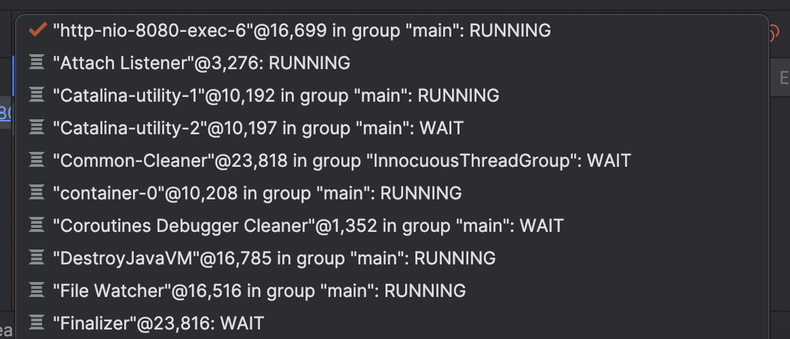
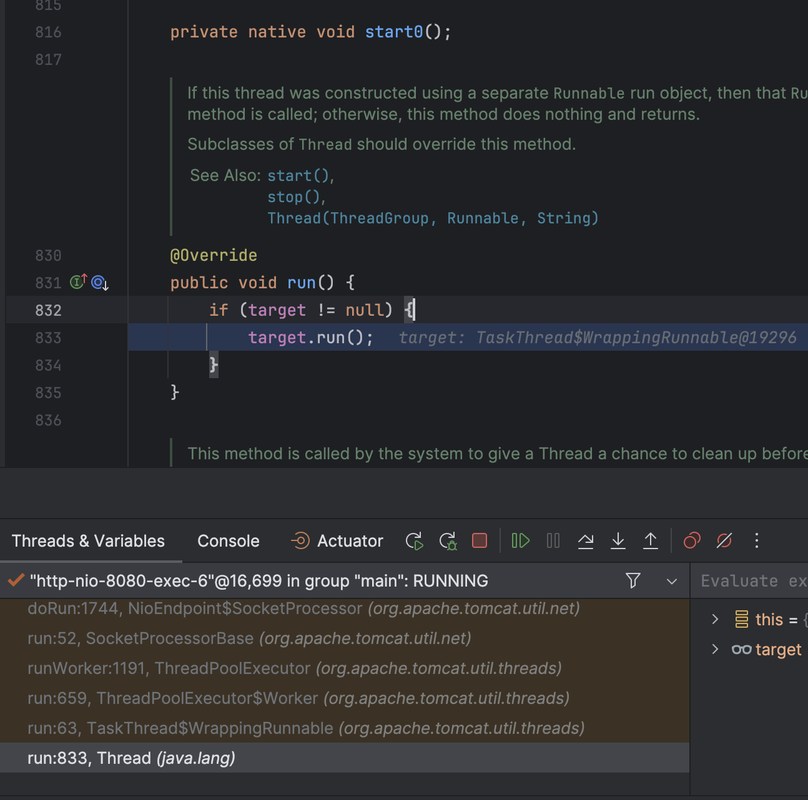
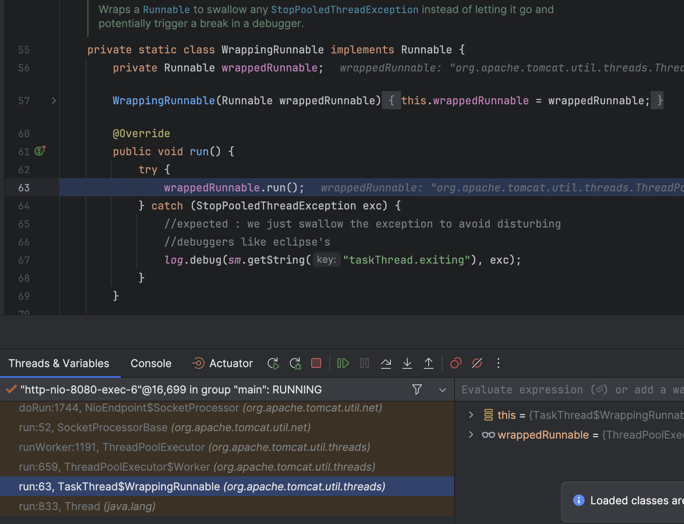
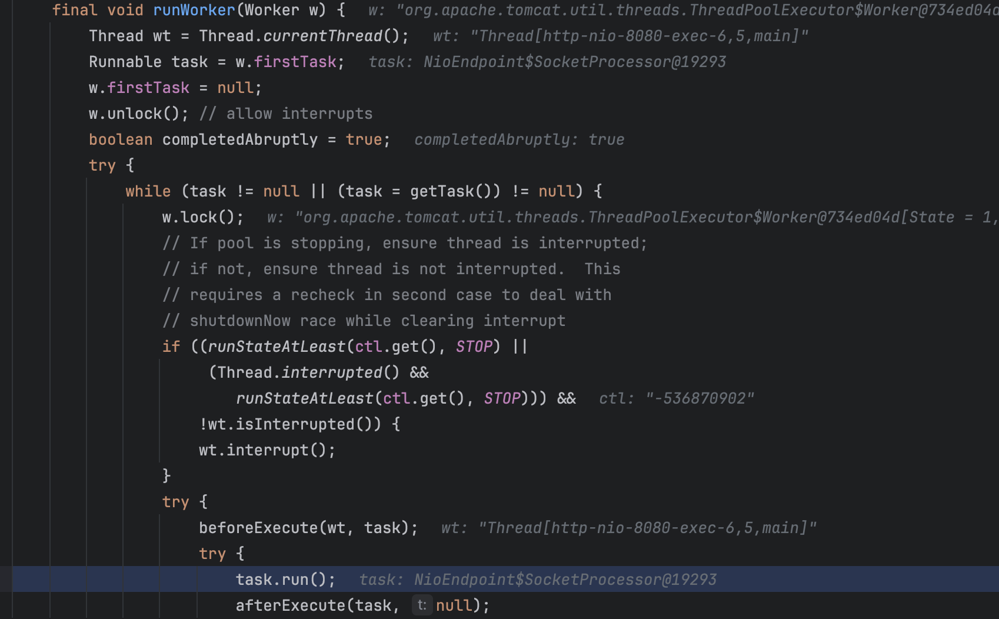
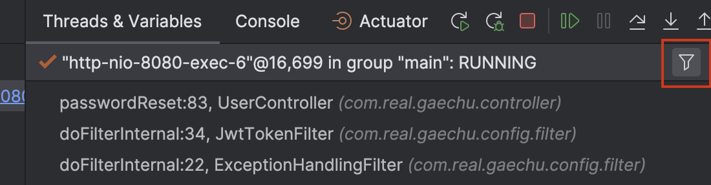
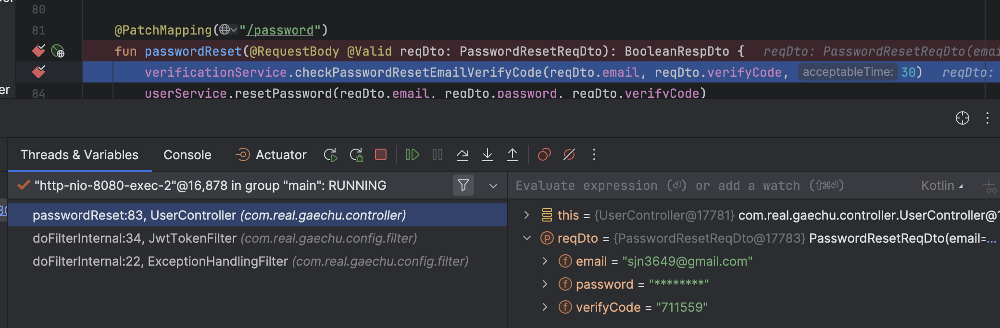

### 


### Intellij-JVM 디버거는 어썸해요…!

저는 커리어 로드에 있어 비교적 짧은 기간동안 직장을 많이 옮겨다니며 경험을 쌓은 케이스이고 그 과정에서 의도치 않게 몇 개의 언어를 다뤄봤는데요. 그 중 가장 훌륭한 Debug 기능을 갖추고 있는 케이스가 `Jetbrains IDE` + `Java, Kotlin` 조합이었습니다.

물론 다른 언어 + Jetbrains IDE 조합으로도 사실 개발과정에서 크게 불편하진 않지만 JVM 디버거 기능은 정말 훌륭한게,  JVM 언어는 독자적으로 사용하기 보단 Spring Framework와 함께 사용하는 경우가 대부분이잖아요? 그런데 이 Spring Framework이 워낙 방대한 프레임워크다 보니까 어지간해선 하나의 동작이 어떤 방식으로 이뤄지는지 세세하게 파악하기 힘들단 말이죠. 

예를 들어 *HTTP Request Call이 발생하면 WebServer가 이를 감지하고 DispatcherServlet 에 이를 전달해서, 적합한 Handler Bean을 탐색하여 호출한다. *

여기까지만 해도 크게 틀린 설명은 아니겠지만, 실제로 일어나는 작업 중 거의 **대부분이 생략된 설명이라는 것** 계신가요? 우리는 Intellij Debug를 통해 실제로 Break Point까지 실행된 Thread Stack Trace를 확인할 수 있습니다.

<br/>



<br/>

- Controller에 Break Point를 걸어두고 호출한 Stack Trace

	
```plain text
passwordReset:83, UserController (com.real.gaechu.controller)
invoke0:-1, NativeMethodAccessorImpl (jdk.internal.reflect)
invoke:77, NativeMethodAccessorImpl (jdk.internal.reflect)
invoke:43, DelegatingMethodAccessorImpl (jdk.internal.reflect)
invoke:568, Method (java.lang.reflect)
callMethod:97, CallerImpl$Method (kotlin.reflect.jvm.internal.calls)
call:113, CallerImpl$Method$Instance (kotlin.reflect.jvm.internal.calls)
lambda 'reflectionCall' in 'callDefaultMethod':207, KCallableImpl (kotlin.reflect.jvm.internal)
reflectionCall:228, KCallableImpl (kotlin.reflect.jvm.internal)
callDefaultMethod$kotlin_reflection:206, KCallableImpl (kotlin.reflect.jvm.internal)
callBy:112, KCallableImpl (kotlin.reflect.jvm.internal)
invokeFunction:332, InvocableHandlerMethod$KotlinDelegate (org.springframework.web.method.support)
doInvoke:252, InvocableHandlerMethod (org.springframework.web.method.support)
invokeForRequest:188, InvocableHandlerMethod (org.springframework.web.method.support)
invokeAndHandle:118, ServletInvocableHandlerMethod (org.springframework.web.servlet.mvc.method.annotation)
invokeHandlerMethod:925, RequestMappingHandlerAdapter (org.springframework.web.servlet.mvc.method.annotation)
handleInternal:830, RequestMappingHandlerAdapter (org.springframework.web.servlet.mvc.method.annotation)
handle:87, AbstractHandlerMethodAdapter (org.springframework.web.servlet.mvc.method)
doDispatch:1089, DispatcherServlet (org.springframework.web.servlet)
doService:979, DispatcherServlet (org.springframework.web.servlet)
processRequest:1014, FrameworkServlet (org.springframework.web.servlet)
service:888, FrameworkServlet (org.springframework.web.servlet)
service:658, HttpServlet (jakarta.servlet.http)
internalDoFilter:205, ApplicationFilterChain (org.apache.catalina.core)
doFilter:149, ApplicationFilterChain (org.apache.catalina.core) [8]
doFilter:51, WsFilter (org.apache.tomcat.websocket.server)
internalDoFilter:174, ApplicationFilterChain (org.apache.catalina.core)
doFilter:149, ApplicationFilterChain (org.apache.catalina.core) [7]
doFilter:110, OncePerRequestFilter (org.springframework.web.filter)
internalDoFilter:174, ApplicationFilterChain (org.apache.catalina.core)
doFilter:149, ApplicationFilterChain (org.apache.catalina.core) [6]
doFilter:108, CompositeFilter$VirtualFilterChain (org.springframework.web.filter)
lambda$doFilterInternal$3:231, FilterChainProxy (org.springframework.security.web)
doFilter:-1, FilterChainProxy$$Lambda$2337/0x0000007001e35f78 (org.springframework.security.web)
lambda$wrap$1:479, ObservationFilterChainDecorator$FilterObservation$SimpleFilterObservation (org.springframework.security.web)
doFilter:-1, ObservationFilterChainDecorator$FilterObservation$SimpleFilterObservation$$Lambda$2353/0x0000007001e4a7e0 (org.springframework.security.web)
lambda$wrap$1:340, ObservationFilterChainDecorator$AroundFilterObservation$SimpleAroundFilterObservation (org.springframework.security.web)
doFilter:-1, ObservationFilterChainDecorator$AroundFilterObservation$SimpleAroundFilterObservation$$Lambda$2354/0x0000007001e4aa08 (org.springframework.security.web)
lambda$wrapSecured$0:82, ObservationFilterChainDecorator (org.springframework.security.web)
doFilter:-1, ObservationFilterChainDecorator$$Lambda$2338/0x0000007001e363c8 (org.springframework.security.web)
doFilter:128, ObservationFilterChainDecorator$VirtualFilterChain (org.springframework.security.web)
doFilter:100, AuthorizationFilter (org.springframework.security.web.access.intercept)
wrapFilter:240, ObservationFilterChainDecorator$ObservationFilter (org.springframework.security.web)
doFilter:227, ObservationFilterChainDecorator$ObservationFilter (org.springframework.security.web)
doFilter:137, ObservationFilterChainDecorator$VirtualFilterChain (org.springframework.security.web)
doFilter:126, ExceptionTranslationFilter (org.springframework.security.web.access)
doFilter:120, ExceptionTranslationFilter (org.springframework.security.web.access)
wrapFilter:240, ObservationFilterChainDecorator$ObservationFilter (org.springframework.security.web)
doFilter:227, ObservationFilterChainDecorator$ObservationFilter (org.springframework.security.web)
doFilter:137, ObservationFilterChainDecorator$VirtualFilterChain (org.springframework.security.web)
doFilter:131, SessionManagementFilter (org.springframework.security.web.session)
doFilter:85, SessionManagementFilter (org.springframework.security.web.session)
wrapFilter:240, ObservationFilterChainDecorator$ObservationFilter (org.springframework.security.web)
doFilter:227, ObservationFilterChainDecorator$ObservationFilter (org.springframework.security.web)
doFilter:137, ObservationFilterChainDecorator$VirtualFilterChain (org.springframework.security.web)
doFilter:100, AnonymousAuthenticationFilter (org.springframework.security.web.authentication)
wrapFilter:240, ObservationFilterChainDecorator$ObservationFilter (org.springframework.security.web)
doFilter:227, ObservationFilterChainDecorator$ObservationFilter (org.springframework.security.web)
doFilter:137, ObservationFilterChainDecorator$VirtualFilterChain (org.springframework.security.web)
doFilter:179, SecurityContextHolderAwareRequestFilter (org.springframework.security.web.servletapi)
wrapFilter:240, ObservationFilterChainDecorator$ObservationFilter (org.springframework.security.web)
doFilter:227, ObservationFilterChainDecorator$ObservationFilter (org.springframework.security.web)
doFilter:137, ObservationFilterChainDecorator$VirtualFilterChain (org.springframework.security.web)
doFilter:63, RequestCacheAwareFilter (org.springframework.security.web.savedrequest)
wrapFilter:240, ObservationFilterChainDecorator$ObservationFilter (org.springframework.security.web)
doFilter:227, ObservationFilterChainDecorator$ObservationFilter (org.springframework.security.web)
doFilter:137, ObservationFilterChainDecorator$VirtualFilterChain (org.springframework.security.web)
doFilterInternal:34, JwtTokenFilter (com.real.gaechu.config.filter)
doFilter:116, OncePerRequestFilter (org.springframework.web.filter)
wrapFilter:240, ObservationFilterChainDecorator$ObservationFilter (org.springframework.security.web)
doFilter:227, ObservationFilterChainDecorator$ObservationFilter (org.springframework.security.web)
doFilter:137, ObservationFilterChainDecorator$VirtualFilterChain (org.springframework.security.web)
doFilterInternal:22, ExceptionHandlingFilter (com.real.gaechu.config.filter)
doFilter:116, OncePerRequestFilter (org.springframework.web.filter)
wrapFilter:240, ObservationFilterChainDecorator$ObservationFilter (org.springframework.security.web)
doFilter:227, ObservationFilterChainDecorator$ObservationFilter (org.springframework.security.web)
doFilter:137, ObservationFilterChainDecorator$VirtualFilterChain (org.springframework.security.web)
doFilter:107, LogoutFilter (org.springframework.security.web.authentication.logout)
doFilter:93, LogoutFilter (org.springframework.security.web.authentication.logout)
wrapFilter:240, ObservationFilterChainDecorator$ObservationFilter (org.springframework.security.web)
doFilter:227, ObservationFilterChainDecorator$ObservationFilter (org.springframework.security.web)
doFilter:137, ObservationFilterChainDecorator$VirtualFilterChain (org.springframework.security.web)
doHeadersAfter:90, HeaderWriterFilter (org.springframework.security.web.header)
doFilterInternal:75, HeaderWriterFilter (org.springframework.security.web.header)
doFilter:116, OncePerRequestFilter (org.springframework.web.filter)
wrapFilter:240, ObservationFilterChainDecorator$ObservationFilter (org.springframework.security.web)
doFilter:227, ObservationFilterChainDecorator$ObservationFilter (org.springframework.security.web)
doFilter:137, ObservationFilterChainDecorator$VirtualFilterChain (org.springframework.security.web)
doFilter:82, SecurityContextHolderFilter (org.springframework.security.web.context)
doFilter:69, SecurityContextHolderFilter (org.springframework.security.web.context)
wrapFilter:240, ObservationFilterChainDecorator$ObservationFilter (org.springframework.security.web)
doFilter:227, ObservationFilterChainDecorator$ObservationFilter (org.springframework.security.web)
doFilter:137, ObservationFilterChainDecorator$VirtualFilterChain (org.springframework.security.web)
doFilterInternal:62, WebAsyncManagerIntegrationFilter (org.springframework.security.web.context.request.async)
doFilter:116, OncePerRequestFilter (org.springframework.web.filter)
wrapFilter:240, ObservationFilterChainDecorator$ObservationFilter (org.springframework.security.web)
doFilter:227, ObservationFilterChainDecorator$ObservationFilter (org.springframework.security.web)
doFilter:137, ObservationFilterChainDecorator$VirtualFilterChain (org.springframework.security.web)
doFilterInternal:42, DisableEncodeUrlFilter (org.springframework.security.web.session)
doFilter:116, OncePerRequestFilter (org.springframework.web.filter)
wrapFilter:240, ObservationFilterChainDecorator$ObservationFilter (org.springframework.security.web)
doFilter:-1, ObservationFilterChainDecorator$ObservationFilter$$Lambda$2341/0x0000007001c3c2a0 (org.springframework.security.web)
lambda$wrap$0:323, ObservationFilterChainDecorator$AroundFilterObservation$SimpleAroundFilterObservation (org.springframework.security.web)
doFilter:-1, ObservationFilterChainDecorator$AroundFilterObservation$SimpleAroundFilterObservation$$Lambda$2342/0x0000007001c3c4e8 (org.springframework.security.web)
doFilter:224, ObservationFilterChainDecorator$ObservationFilter (org.springframework.security.web)
doFilter:137, ObservationFilterChainDecorator$VirtualFilterChain (org.springframework.security.web)
doFilterInternal:233, FilterChainProxy (org.springframework.security.web)
doFilter:191, FilterChainProxy (org.springframework.security.web)
doFilter:113, CompositeFilter$VirtualFilterChain (org.springframework.web.filter)
lambda$createCacheFilter$3:195, HandlerMappingIntrospector (org.springframework.web.servlet.handler)
doFilter:-1, HandlerMappingIntrospector$$Lambda$1977/0x0000007001cf6a10 (org.springframework.web.servlet.handler)
doFilter:113, CompositeFilter$VirtualFilterChain (org.springframework.web.filter)
doFilter:74, CompositeFilter (org.springframework.web.filter)
doFilter:230, WebMvcSecurityConfiguration$CompositeFilterChainProxy (org.springframework.security.config.annotation.web.configuration)
invokeDelegate:352, DelegatingFilterProxy (org.springframework.web.filter)
doFilter:268, DelegatingFilterProxy (org.springframework.web.filter)
internalDoFilter:174, ApplicationFilterChain (org.apache.catalina.core)
doFilter:149, ApplicationFilterChain (org.apache.catalina.core) [5]
doFilterInternal:100, RequestContextFilter (org.springframework.web.filter)
doFilter:116, OncePerRequestFilter (org.springframework.web.filter)
internalDoFilter:174, ApplicationFilterChain (org.apache.catalina.core)
doFilter:149, ApplicationFilterChain (org.apache.catalina.core) [4]
doFilterInternal:93, FormContentFilter (org.springframework.web.filter)
doFilter:116, OncePerRequestFilter (org.springframework.web.filter)
internalDoFilter:174, ApplicationFilterChain (org.apache.catalina.core)
doFilter:149, ApplicationFilterChain (org.apache.catalina.core) [3]
doFilterInternal:109, ServerHttpObservationFilter (org.springframework.web.filter)
doFilter:116, OncePerRequestFilter (org.springframework.web.filter)
internalDoFilter:174, ApplicationFilterChain (org.apache.catalina.core)
doFilter:149, ApplicationFilterChain (org.apache.catalina.core) [2]
doFilterInternal:201, CharacterEncodingFilter (org.springframework.web.filter)
doFilter:116, OncePerRequestFilter (org.springframework.web.filter)
internalDoFilter:174, ApplicationFilterChain (org.apache.catalina.core)
doFilter:149, ApplicationFilterChain (org.apache.catalina.core) [1]
invoke:167, StandardWrapperValve (org.apache.catalina.core)
invoke:90, StandardContextValve (org.apache.catalina.core)
invoke:482, AuthenticatorBase (org.apache.catalina.authenticator)
invoke:115, StandardHostValve (org.apache.catalina.core)
invoke:93, ErrorReportValve (org.apache.catalina.valves)
invoke:74, StandardEngineValve (org.apache.catalina.core)
service:344, CoyoteAdapter (org.apache.catalina.connector)
service:391, Http11Processor (org.apache.coyote.http11)
process:63, AbstractProcessorLight (org.apache.coyote)
process:896, AbstractProtocol$ConnectionHandler (org.apache.coyote)
doRun:1744, NioEndpoint$SocketProcessor (org.apache.tomcat.util.net)
run:52, SocketProcessorBase (org.apache.tomcat.util.net)
runWorker:1191, ThreadPoolExecutor (org.apache.tomcat.util.threads)
run:659, ThreadPoolExecutor$Worker (org.apache.tomcat.util.threads)
run:63, TaskThread$WrappingRunnable (org.apache.tomcat.util.threads)
run:833, Thread (java.lang)

```

무려 Thread.run() 에서 부터 BreakPoint 까지 말이죠! 오늘은 이 기능을 가지고 제가 Framework나 Libarary의 동작 방식을 탐색하는 방법을 공유해보고자 합니다.

<br/>

---

### Controller Method 첫 줄에 Break Point를 추가하고 API Call을 날려보면…

[//]: # (column_list is not supported)

	[//]: # (column is not supported)

		

	[//]: # (column is not supported)

		

오늘의 예시를 위해 Controller에 Break Point를 걸어두고 해당 API를 호출해봤습니다. 그리고 Debuger의 Threads Stack Trace Tab에는 150줄의 Trace가 생성되었습니다. 다른 쓰레드들도 활발하게 동작 중인 것을 감안하면 훨씬 더 많은 작업들이 프로그램 안에서 실행중인 셈이죠.

하지만 단순히 엄청나게 많은 양의 정보는 학습에 그다지 도움이 되지 않을 수 있습니다. 저 역시도 Intellij를 수 년간 사용해왔지만 Debuger의 Thread trace 정보를 주의깊게 살피진 않았거든요. 하지만 의도를 가지고 집중해서 살핀다면 이 방대한 정보는 결코 무가치하지 않습니다. 말로만 들었던 것들을 실제로 확인할 수 있거든요. 한번 볼까요?

<br/>

---

### Tread.run()부터 살펴보기



가장 먼저 [Tread.run](http://tread.run/) 메서드가 실행됩니다. target 객체의 클래스까지 확인 가능하네요. TaskThread 클래스에 포함된 private class 인 WrappingRunnable 클래스 객체입니다.

TaskThead 클레스에 포함된 것 어떻게 아냐구요? 



딸각 한번이면 즉시 해당 Class의 Stack trace point로 이동할 수 있습니다. 저는 이 기능이 특히 유용한게 클래스 서두엔 보통 해당 클래스의 역할과 기능에 대한 주석이 포함되어 있는 경우가 많은데, 이걸 확인하다가 내가 어디까지 보고 있었는지를 잊어버리는 경우가 많거든요. 

그럴 때 다시 Treads. & Variables 탭에서 확인하고 싶은 라인을 클릭만 하면 손쉽게 이동이 가능합니다. 저는 이럴 때 마치 코드를 탐험하는 로드뷰 같은 기분이 들어요. 



조금 더 진행해보면 ThreadPoolExecutor 에서 task를 실행하는 부분까지 볼 수 있네요. 이후엔 소켓을 연결하고 HandShake하는 부분도 나옵니다. 이건 너무 길어서 토글로 넣어둘게요.

- `NioEndpoint$SockerProcessor.doRun() `

	
```java

    /**
     * This class is the equivalent of the Worker, but will simply use in an
     * external Executor thread pool.
     */
    protected class SocketProcessor extends SocketProcessorBase<NioChannel> {

        public SocketProcessor(SocketWrapperBase<NioChannel> socketWrapper, SocketEvent event) {
            super(socketWrapper, event);
        }

        @Override
        protected void doRun() {
            /*
             * Do not cache and re-use the value of socketWrapper.getSocket() in
             * this method. If the socket closes the value will be updated to
             * CLOSED_NIO_CHANNEL and the previous value potentially re-used for
             * a new connection. That can result in a stale cached value which
             * in turn can result in unintentionally closing currently active
             * connections.
             */
            Poller poller = NioEndpoint.this.poller;
            if (poller == null) {
                socketWrapper.close();
                return;
            }

            try {
                int handshake = -1;
                try {
                    if (socketWrapper.getSocket().isHandshakeComplete()) {
                        // No TLS handshaking required. Let the handler
                        // process this socket / event combination.
                        handshake = 0;
                    } else if (event == SocketEvent.STOP || event == SocketEvent.DISCONNECT ||
                            event == SocketEvent.ERROR) {
                        // Unable to complete the TLS handshake. Treat it as
                        // if the handshake failed.
                        handshake = -1;
                    } else {
                        handshake = socketWrapper.getSocket().handshake(event == SocketEvent.OPEN_READ, event == SocketEvent.OPEN_WRITE);
                        // The handshake process reads/writes from/to the
                        // socket. status may therefore be OPEN_WRITE once
                        // the handshake completes. However, the handshake
                        // happens when the socket is opened so the status
                        // must always be OPEN_READ after it completes. It
                        // is OK to always set this as it is only used if
                        // the handshake completes.
                        event = SocketEvent.OPEN_READ;
                    }
                } catch (IOException x) {
                    handshake = -1;
                    if (logHandshake.isDebugEnabled()) {
                        logHandshake.debug(sm.getString("endpoint.err.handshake",
                                socketWrapper.getRemoteAddr(), Integer.toString(socketWrapper.getRemotePort())), x);
                    }
                } catch (CancelledKeyException ckx) {
                    handshake = -1;
                }
                if (handshake == 0) {
                    SocketState state = SocketState.OPEN;
                    // Process the request from this socket
                    if (event == null) {
                        state = getHandler().process(socketWrapper, SocketEvent.OPEN_READ);
                    } else {
                        state = getHandler().process(socketWrapper, event);
                    }
                    if (state == SocketState.CLOSED) {
                        socketWrapper.close();
                    }
                } else if (handshake == -1 ) {
                    getHandler().process(socketWrapper, SocketEvent.CONNECT_FAIL);
                    socketWrapper.close();
                } else if (handshake == SelectionKey.OP_READ){
                    socketWrapper.registerReadInterest();
                } else if (handshake == SelectionKey.OP_WRITE){
                    socketWrapper.registerWriteInterest();
                }
            } catch (CancelledKeyException cx) {
                socketWrapper.close();
            } catch (VirtualMachineError vme) {
                ExceptionUtils.handleThrowable(vme);
            } catch (Throwable t) {
                log.error(sm.getString("endpoint.processing.fail"), t);
                socketWrapper.close();
            } finally {
                socketWrapper = null;
                event = null;
                //return to cache
                if (running && processorCache != null) {
                    processorCache.push(this);
                }
            }
        }
```

얼마전에 HTTP를 좀 더 공부해보면서 Http/2까진 TCP 프로토콜 위에서 만들어졌다고 알게되었는데 이렇게 확인하게 되네요. 해당 클래스에선 TCP HandShake를 수행합니다. 

StackTrace를 주의깊게 보면서 얻게되는 가장 큰 장점이 여기서 드러납니다. 내가 공부했던 내용이 실제로 어떤 코드로 구현되었는지 확인하고, 최종적으로 <span style='color:green'>**내가 사용하는 모든 것이 마법이 아니었음을 알게되는 과정.**</span> 이 과정을 통해 우리는 간과하고 지내던 많은 요소들이 어떻게 상호작용하고, 동작하며, 어떤 종료 절차를 밟는지 확인 할 수 있습니다. 

 물론 제가 언급한 내용만 살피자면 Break Point로 설정된 Controller Method를 실행하기까지의 과정이지만, Method Stack은 결국 최종적으로 다음 로직을 수행하도록 설계되었기 때문에 StackTrace에 포함된 코드들은 Step Points를 지나 다음 코드들을 실행하게 됩니다. 즉, StackTrace 상 중간에 멈춘 함수들도 추가 작업들이 종료된 이후엔 다시 정상적으로 실행될것이라는 거죠. 그 과정에서 점유된 자원이 반환되고, Connection이 끊어지기도 할 것입니다. 어쩌면 Catch문이 실행되거나, Exception을 반환할 수도 있고, final block이 선언되어 있다면 최종적으로 실행될 것입니다. 아름답네요.

이후에도 많은 과정들이 나열됩니다. Socket과 Protocol의 상태에 따라 **Protocol Upgrade**가 수행될 수도 있고, 모종의 이유로 인해 Exception이 발생하였을 때 점유한 자원을 반환하는 코드도 기재되어 있습니다. 그 다음엔 `HTTP11Processor`에서 HTTP 통신 과정을 처리하고, 프로토콜이 멈추진 않았는지, 해당 요청은 Async인지 아닌지, Parsing이 가능한 올바른 요청인지 등등… 정말 많은 작업을 거칩니다. (제가 아무리 시간이 많아도 모두 나열하기엔 삶이 유한하네요… 여기서부턴 많은 부분 생략하겠습니다…!)

결국은 `Spring MVC`에 포함된 `OncePerRequestFilter`까지 이르게 됩니다. (아마 Spring MVC Framework에서 Tomcat FilterChain에 Filter를 추가해뒀겠죠? 유관된 내용은 Spring Boot AutoConfig 패키지에서 찾을 수 있을 것 같지만 본 포스팅의 요지에서 벗어나므로 굳이 지금 살피진 않겠습니다.) 생소한 Class들 사이에서 Spring을 마주치니 반갑기까지 하네요.

Request는 `Spring FilterChain`을 거쳐서 결국 제 컨트롤러로 도달하게됩니다. 참 많은 일들이 있었고, 많은 것들은 배울 수 있으며, 보는 눈도 넓힐 수 있었습니다. 

하지만 언제나 이런식으로 모든 Thread Stack Trace가 필요한건 아닙니다. 사실 학습에는 굉장히 도움이 되는 방식이지만, 업무에 사용하기에 적합한 방식은 아니잖아요? API 만들고 퇴근해야죠… 그럴 땐 간단한 필터링 만으로 사용자가 구현한 Project 내부의 소스만 참조해서 볼 수도 있습니다!

---

### Project에 포함된 소스 코드만 골라보기



<br/>

사용법은 아주 간단합니다. Thread & Variables 탭의 필터 버튼을 클릭하기만하면 내 프로젝트에서 작성된 Trace만 확인할 수 있습니다. 작업 과정에서 문제가 생긴다면 해당 버튼을 유용하게 사용할 수 있겠죠?

<br/>

---

### 그 밖의 일반적인 사용법



- CodeLine에 Break Point 걸고 해당 시점에 확인 가능한 지역변수, 클래스 변수를 확인할 수 있습니다. 

- 또한 다음 BreakPoint까지 로직을 진행하거나, Step Over(해당 라인을 실행하면서 다음 라인으로 이동)/ Step Into (해당 라인의 함수 안으로 이동)/ Step out(해당 함수에서 벗어나며 다음 동작을 실행함)도 가능합니다. 

- 이에 대한 자세한 내용은 [정말 잘 정리된 포스팅](https://jojoldu.tistory.com/149)에서…!

	[https://jojoldu.tistory.com/149](https://jojoldu.tistory.com/149)

<br/>

---

오늘은 Intellij Debug를 통해 제가 학습하는 방법을 공유해보았습니다. 사실 이렇다할 팁이라곤 Stack Trace밖에 없는 것 같지만… 그래도 이 부분이 지나치기엔 너무 가치 있는 정보들이라서 공유해봤습니다. 여러분도 시간이 되신다면 지금 개발하고 계신 프로그램을 한번 자세히 살펴보셔도 좋을 것 같아요. 분명 많은 것들을 새롭게 발견하실 수 있을테니까요.

<br/>

이상 오늘도 긴 포스팅 읽어주셔서 감사합니다. 안녕!

