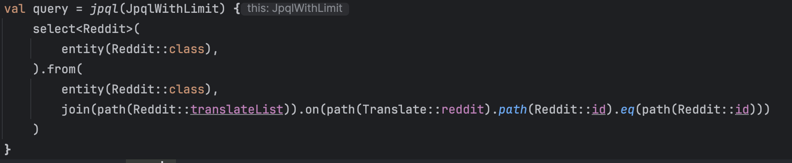
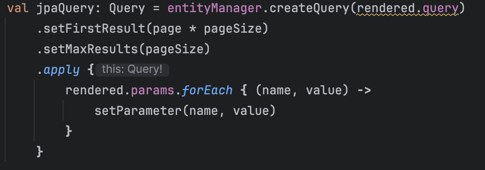
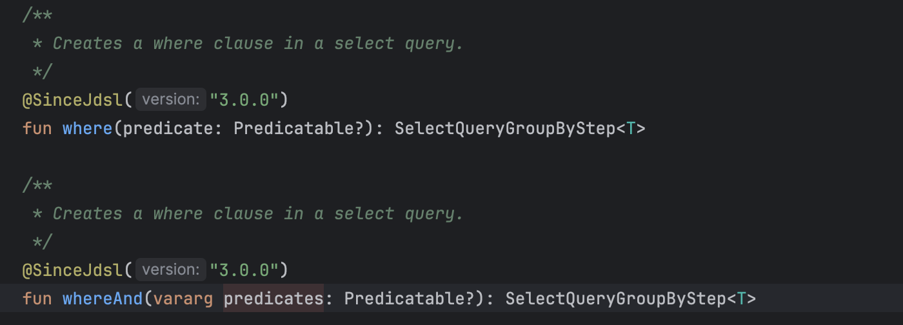
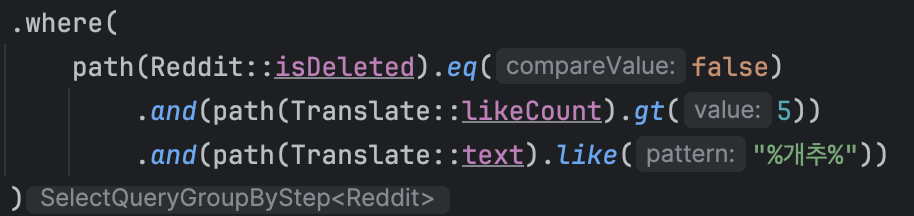
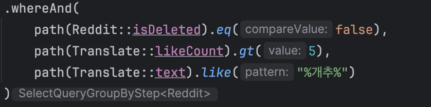
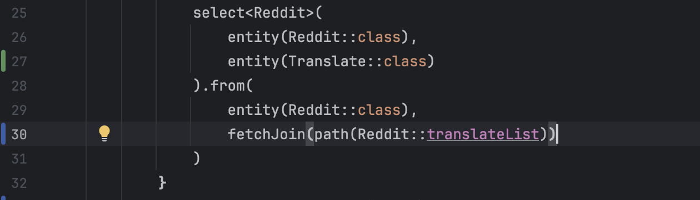

# Kotlin Jdsl과 춤을 - 사소한 팁

\


### Join절의 On 조건으로 entity를 사용할 수 없습니다.

* entity() 함수는 반드시 Alias를 포함하고 이는 JPQL로 변환될 때 entity AS alias 형태로 변환됩니다. 따라서 entity() 함수는 Select, From절의 대상으로는 사용될 수 있으나, JOIN절의 대상으로는 사용할 수 없습니다. (ON절에는 AS 키워드가 허용되지 않기 때문에 )

```sql
SELECT NEW RedditRespDto(Reddit, Translate)
FROM Reddit AS Reddit
         INNER JOIN FETCH Translate AS Translate 
ON Translate.reddit = Reddit AS Reddit // <- AS ... 구문이 추가되어 오류가 발생한다.
```

*   사진의 코드처럼 `on()` 조건에 `entity()`메서드를 확용하여 Predicate를 구현하면, JOIN문의 ON절에 AS 키워드가 포함되어 구문 오류가 발생합니다. 따라서 서로 다른 엔티티클래스에서 엔티티 객체를 대상으로 `join()`을 수행하기 위해선, `on()` 메서드 파라미터로 전달되는 Predicate를 `path()`를 사용하여 구성해야 합니다.

    

```sql
SELECT NEW RedditRespDto(Reddit, Translate)
FROM Reddit AS Reddit
         INNER JOIN FETCH Translate AS Translate
ON Translate.reddit.id = Reddit.id
WHERE 1 = 1
```

\


***

### JPQL로는 Paging을 구현할 수 없다.

* JPQL 표준에서 `LIMIT`은 지원하지만 `OFFSET`은 지원하지 않습니다. 따라서`JPQL`만 이용해서 한 페이지에 10개의 게시물을 조회하는 기능으로 10페이지를 조회하기 위해선, 최소 100개의 레코드를 서버로 조회하고, 이 중 10개만 선별하도록 추가적인 구현이 필요하여 그다지 권할만한 방식은 아닌 것 같습니다.



* 따라서 EntityManager의 `setFirstValue(), setMaxValue()` 함수를 사용하여 offset과 limit을 제한하는 방식을 권합니다.

\


***

### where()보단 whereAnd() 조건이 사용하기 편합니다.



*   일반적으로 쿼리를 구성할 떄 Where절엔 N개의 조건이 AND 구문으로 엮이는 경우가 많은데, `where()` 함수는 하나의 Predicate 객체를 인자로 받기 때문에 파라미터들을 or(…), and(…) 방식으로 엮어서 전달해야하지만, whereAnd() 메서드는 N개의 predicates 조건을 전달받아 내부적으로 And 연산으로 구성하기 때문에 상대적으로 코드가 간결해집니다.

    

    
* 위의 두 조건은 동일한 기능으로 수행되지만, 표현상의 차이가 존재합니다. 필요와 기호에 따라 적합한 방식을 선택하시면 좋을 것 같습니다.

\


***

### Spring을 사용한다면 JqplRenderContext는 Spring Bean으로 등록해두는 쪽이 편합니다.

```kotlin
private final val completedRenderModule = object : JpqlRenderModule {
        override fun setupModule(context: JpqlRenderModule.SetupContext) {
            context.addAllSerializer(
                JpqlLimitSerializer(), // CustomDSL Serializers
            )
        }
    }

    @Bean
    fun jpqlRenderContext(): JpqlRenderContext {
        return JpqlRenderContext().registerModule(completedRenderModule)
    }
```

* Kotlin-jdsl 자체는 Spring에 의존성을 가지지 않는 프로젝트이기에 `*JqplRenderContext*`_가 매번 생성하기에 비용이 많이 드는 객체이기에 재사용하는 것을 권한다._ 정도로만 언급되었지만, 이해하기 편하게 생각하면 Spring Bean으로 등록했을 때 효율이 좋다는 것을 알 수 있습니다.
* 또한 CustomDSL를 사용한다면 `JpqlRenderModule`에 `Custom Serializer`를 포함하여, `JpqlRenderContext`에 등록해야하므로 Bean으로 등록하는 시점에 함께 등록하는 편이 좋습니다.

\


***

#### FETCH JOIN 요청 시, SELECT절에 엔티티를 명시하지 않아도 됩니다.

*   Fetch Join을 수행하기 위한 방법은 크게 2가지로, SELECT절에 주 엔티티와 Fetch join 엔티티를 명시하는 방법 혹은 FROM절에 fetchJoin() 메서드를 통해 Fetch join 엔티티를 명시하는 방법이 있습니다.

    

```sql
SELECT
			r1_0.*,
	    t1_0.*
	FROM
    tb_reddit r1_0 
	JOIN tb_reddit_translate tl1_0 
		ON r1_0.id=tl1_0.reddit_id
```

* 여기서 **27line** 의 `entity(Translate::class)` 는 주석처리되어도 동일한 SQL문이 실행되지만. 결과값은 전혀 다르게 반환됩니다. (최종적으로 실행되는 SQL문은 동일하지만 JPQL은 살짝 다르게 생성됩니다.)
* 예시로 작성한 Reddit 엔티티와 Translate 엔티티는 1:N 관계로 구현되었는데, 만약 3개의 Reddit 레코드가 존재하고, 해당 Reddit 레코드들이 모두 합하여 10개의 Translate 엔티티를 포함한다고 가정하였을 때, 27line을 남겨두는 경우 **10개의 결과값**이 조회됩니다. 이 결과값에서 Reddit엔티티는 중복되어 나타납니다. 반대로 27line을 주석 처리 후 실행 시, Reddit엔티티를 기준으로 **3개의 결과값**이 조회됩니다.
* 문장으로 설명하기엔 다소 애매한 부분이 있을 것 같아 결과값을 시각적으로 비교할 수 있도록 링크를 첨부합니다.

[https://www.diffchecker.com/UvgKumH8/](https://www.diffchecker.com/UvgKumH8/)

\
\
