<br/>

## 서두

Hibernate, 내지는 JPA를 사용하는 개발자들에겐 한 가지 유명한 명제가 있습니다.

<span style='color:blue'>**Hibernate는 Transaction Commit 시점에, 영속성 컨텍스트에 속한 엔티티 중 내용에 변경이 발생한 엔티티를 감지하고 이를 데이터베이스에 반영한다.**</span>

<br/>

때문에 영속성 컨텍스트에 영속 상태로 저장된 데이터는 변경이 발생했을 때 별도의 `save()` 없이도 데이터베이스에 변경사항을 저장할 수 있습니다.

그리고 Spring Framework이 제공하는 선언적 트랜잭션 어노테이션과 함께 아래와 같이 사용할 수 있습니다.


```javascript
@Transaction
public void updateUserLastLoginAt(Long id){
	User user = ...
	user.updateLastLogin()
} // 굉장히 편리하다
```

<br/>

`user` 객체 내부에선 단지 객체의 속성 일부를 변경하였을 뿐, 이를 데이터베이스에 반영하는 코드가 없음에도 JPA는 user 엔티티의 속성의 변화를 감지하고 이를 데이터베이스에 반영합니다.

마법같은 일이지만, <span style='color:orange'>이 판에 마법은 없고,</span> <span style='color:blue'>Hibernate는 오픈소스이며,</span> ~~저는 시간이 넉넉한 관계로~~ 어떤 코드가 실제로 Tranaction을 감시하고 있다가 변경사항을 반영하는지 찾아보기로 했습니다.

<br/>

먼저, 최근 유용하게 사용중인 Copilot에게 물어봤습니다. 일단 Hibernate는 오픈소스고 Github에 등록되어 있으니 뭐라도 알지 않을까요?

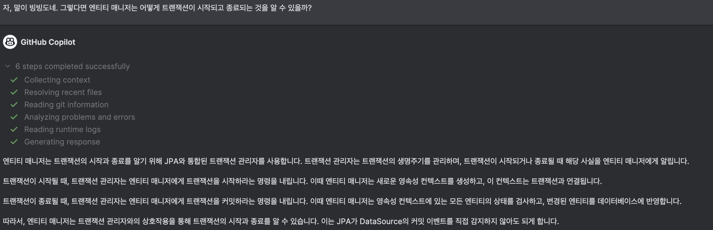

<br/>

음… 별로 영양가있는 정보는 아닌 것 같습니다. 저는 Spring Framework에서 제어하는 Transaction을 어떻게 Hibernate가 감지하는지가 궁금했거든요. 추가 질문을 해봅시다.

<br/>


<br/>

결과는?

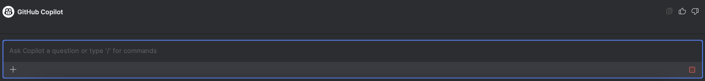

<br/>

네… AI는 분명 굉장히 유용하지만 일정 수준 이상의 데이터나 정보는 잘 모르는 경향이 있습니다. 또한 줄어들었다고 해도 거짓말이나 부정확한 정보들도 있으니 더 괴롭히지 말고 직접 찾아보기로 합니다.

<br/>

## Hibernate Project 탐험

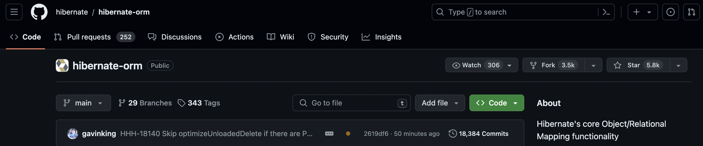

<br/>

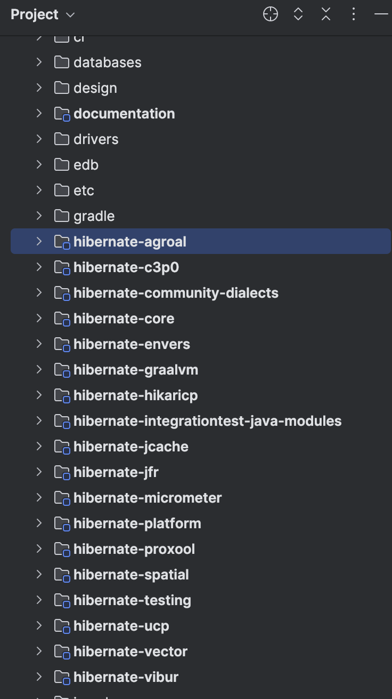

시작부터 쉽지않네요. 수 백명의 기여자가 존재하는 Java 대표 ORM 프레임워크인만큼 분량부터 압도적입니다. 400MB 가량의 코드 뭉치를 냅다 다 읽어가는 건 역시 무리니 Transaction 키워드로 검색부터 해봤습니다.

<br/>

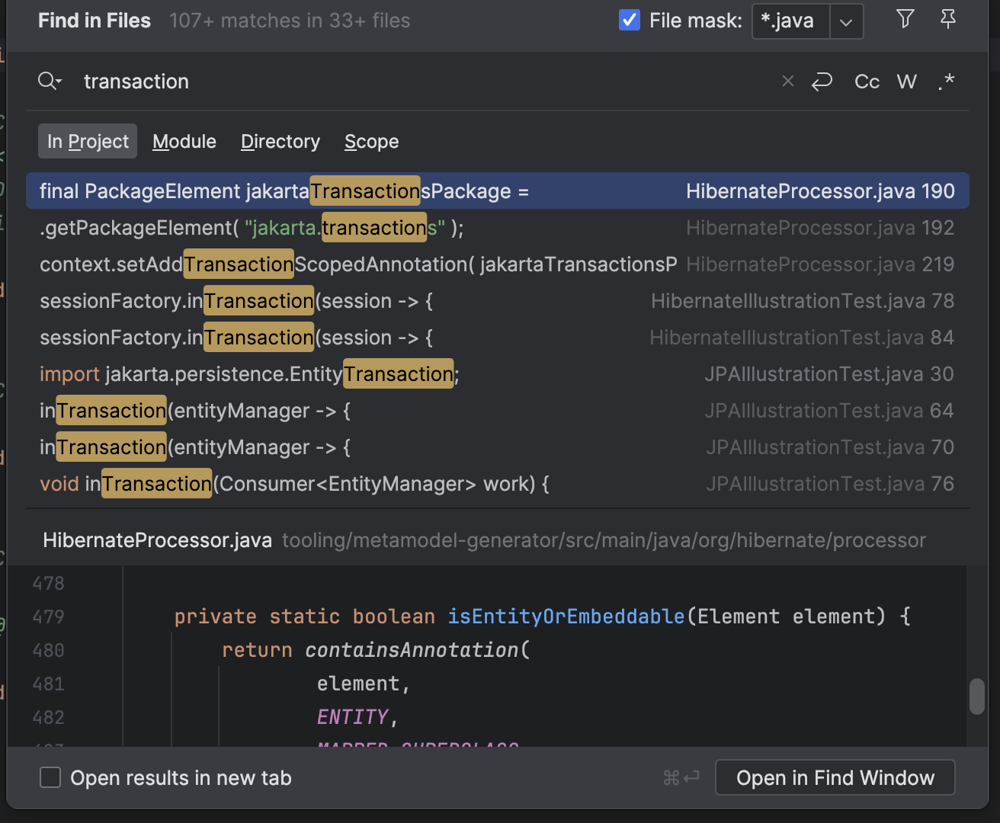

Transaction이라는 키워드가 107개가 넘게 사용되었네요. 역시 너무 많으니 interface로 범위를 한정해보겠습니다. 

<br/>

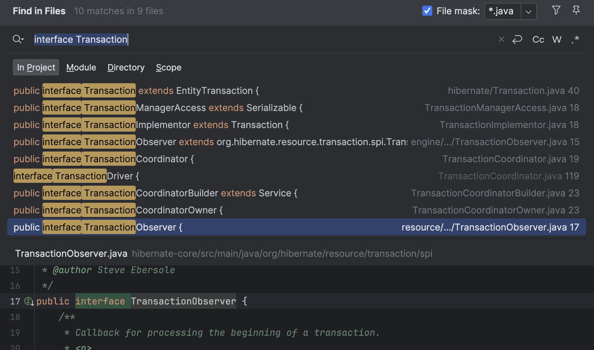

가장 의심스러운 인터페이스를 찾았습니다. TransactionObserver… 이름만 봐도 해당 인터페이스를 상속한 구현체가 트랜잭션의 상태를 확인하는 역할을 수행할 것 같네요. 이름 참 잘 지었습니다.

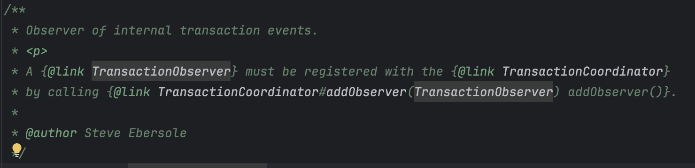

압도적인 분량에 주눅들지 않고 천천히 읽어보면 클래스에 대한 설명도 꽤 친절합니다. 침착하게 탐험을 계속해보겠습니다.

<br/>

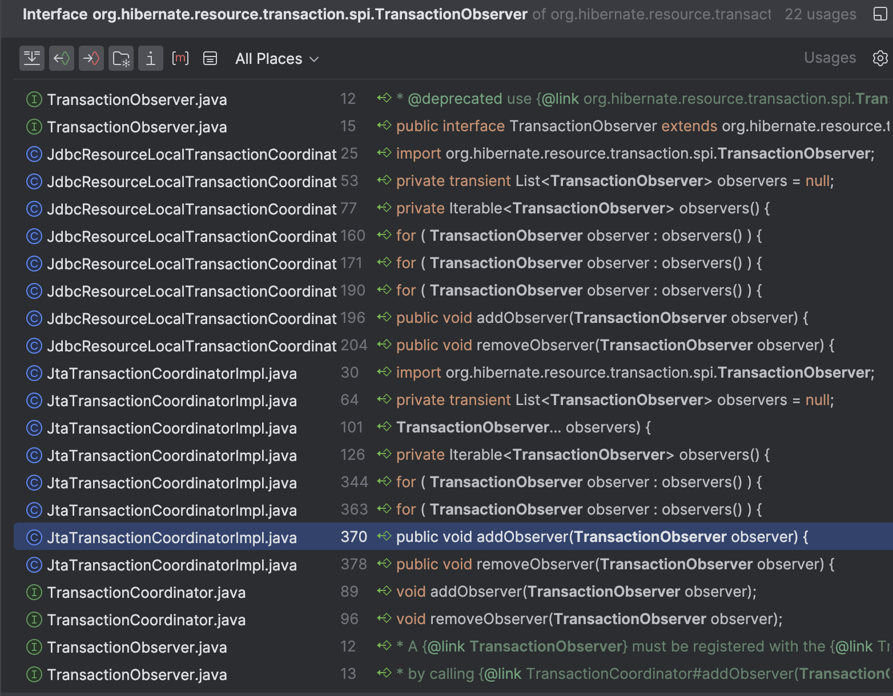

<br/>

TranactionObserver를 사용하는 사례입니다. `JdbcResourceLocalTransactionCoordinatorImpl` 혹은 `JtaTransactionCoordinatiorImpl`에서 주로 사용합니다. DB에 대한 접근을 담당하는 클래스에서 경우에 따라 다른 TransactionObserver를 주입하여 사용할 수 있도록 유연하게 설계한 것으로 보입니다.

	- `TransactionCoodinator`는 트랜잭션 상태 및 커밋 절차를 담당하는 인터페이스로 보입니다. 즉, 트랜잭션 전반을 담당하는 `Coordinator`에서 생성자를 통해 전달받은 `TransactionObserver`를 통해 트랜잭션 전후의 상태를 파악한다 볼 수 있을 것 같습니다.

다만 이 시점에서 궁금한 것은, ***어째서 Usage에 TransactionObserver를 상속한 다른 구현체 클래스가 나오지 않는가*** 인데… 일단 마저 탐색해봅니다. 방향은 제게 조금 더 친숙한 JDBC쪽으로 잡겠습니다.

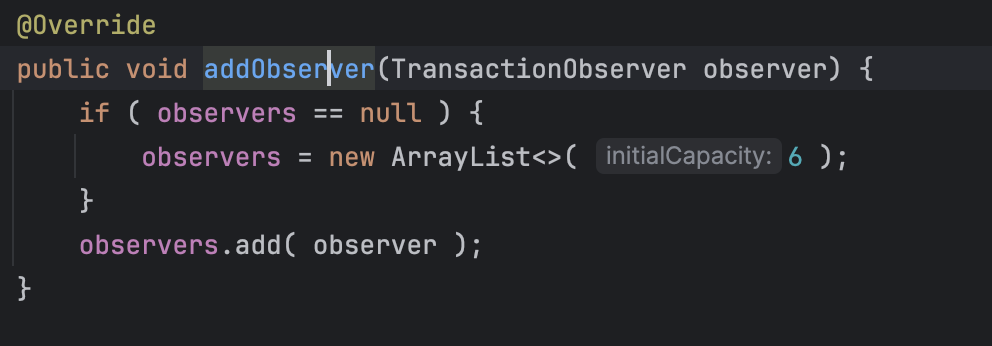

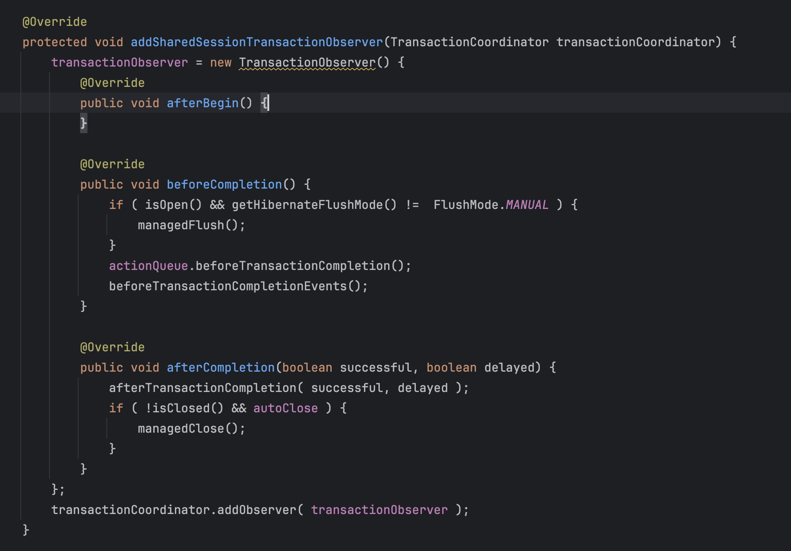

<br/>

Hibernate는 Session Interface을 통해 JPA 표준 인터페이스와 Hibernate Persistence Entity에 대한 구체적인 동작 방식, 규칙을 정의합니다. (예, 엔티티 매니저의 생명 주기, 엔티티 객체 프록시 전략, Dirty Check 유무 , 명시적인 Lock Level 결정 등…) 해당 클래스는 AbstractSharedSessionContract를 확장하여 구현하는데, 해당 클래스는 또 엔티티 생명 주기를 결정하고 이를 데이터베이스에 반영하는 역할을 수행합니다.

<br/>

따라서 Hibernate에서 어떻게 트랜잭션의 Commit, Rollback 시점에 어떤 동작을 수행하는지 알아내기 위해선, `Session` 구현체 →  `TransactionCoordinator` 구현체에서 어떤 `TransactionObserver`를 사용하는지, 해당 `TransactionObserver`의 동작은 어떻게 정의되어 있는지를 확인하면 되는데, 이 때 Observer에서 수행할 역할을 정의하는 주요 클래스가 AbstractSharedSessionContract 라고 봐주시면 될 것 같습니다.

- `TransactionObserver`와 유사한 뉘앙스의 `Interceptor` 인터페이스도 별도로 존재합니다. 해당 인터페이스는 <span style='color:pink'>**영속성 객체의 상태**</span>에 따른 이벤트를 감지하고 동작하도록 구성되어있습니다.

<br/>

하지만 이상하리만치 Transaction의 Commit, Rollback 등을 감시하고 있는 클래스나 코드는 찾아볼 수 없었습니다. 문맥상 TransactionObserver가 트랜잭션을 감시하고 있어야 할 것 같은데 말이죠…!

<br/>

---

## 하지만 사실 말이죠…

그리고 탐험 끝에 알아낸 사실은… 딱히 Hibernate는 Transaction이 언제 시작하고 끝나는지 관찰하고 있지 않다는 것이었습니다…! 이 부분은 꽤 충격이었던 게 

<span style='color:blue'>**Hibernate는 Transaction Commit 시점에, 영속성 컨텍스트에 속한 엔티티 중 내용에 변경이 발생한 엔티티를 감지하고 이를 데이터베이스에 반영한다.**</span>

이 명제에 따라 Transaction commit 시점을 감지하는 주체가 Hibernate이며 이 과정에서 어떤… Observer나 Interceptor가 Transaction의 상태를 감시하고 있을거라 생각했지만,

실제로는 Spring을 비롯한 어떤 실행환경이던, 외부에서 **Hibernate에서 제공하는 Entity Manager가 Transaction 상태에 따라 영속성 객체를 관리할 수 있도록 호출하는 방식이었습니다.**

<br/>

실제로 동작하는 방식을 알고나니 뭔가 허탈하면서도 그럴 법 했습니다. Transaction이 시작하고 종료되는 방식은 사용하는 DataSource의 벤더사, 제품, 사용중인 라이브러리나 프레임워크에 따라 달라질 가능성이 무궁무진한데 Hibernate가 모든 동작 방식에 대해 의존성을 가지고 상태를 체크한다는 것은 비효율적인게 당연한데도 말이죠…

- 굳이 제가 트랜잭션 감지 주체를 반대로 생각했던 이유를 찾자면 아마 너무 쉽게 사용할 수 있어서 그랬던 것 같아요. @Transactional 어노테이션만 달면 Hibernate가 트랜잭션 상태에 따라 영속성 컨텍스트를 관리해주니, Hibernate는 시스템에서 사용중인 트랜잭션을 감시하고 있으리라 생각했죠. 

<br/>

틀린 점을 알게되었으니 제가 사용하던 환경에서 어떻게 Hibernate에게 트랜잭션 상태를 전파하는지 알아보기 위해 Spring-boot에 포함된 autoConfigure 관련 항목을 살펴보기로 했습니다. 

<br/>

### 한 번도 눈여겨 본 적 없던 패키지…

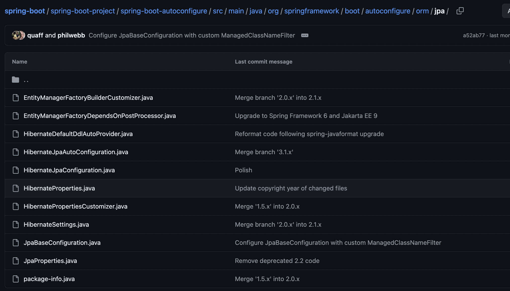

<br/>


```java
/*
 * Copyright 2012-2023 the original author or authors.
 *
 * Licensed under the Apache License, Version 2.0 (the "License");
 * you may not use this file except in compliance with the License.
 * You may obtain a copy of the License at
 *
 *      https://www.apache.org/licenses/LICENSE-2.0
 *
 * Unless required by applicable law or agreed to in writing, software
 * distributed under the License is distributed on an "AS IS" BASIS,
 * WITHOUT WARRANTIES OR CONDITIONS OF ANY KIND, either express or implied.
 * See the License for the specific language governing permissions and
 * limitations under the License.
 */

package org.springframework.boot.autoconfigure.orm.jpa;

/**
 * {@link EnableAutoConfiguration Auto-configuration} for Hibernate JPA.
 *
 * @author Phillip Webb
 * @author Josh Long
 * @author Manuel Doninger
 * @author Andy Wilkinson
 * @since 1.0.0
 */
@AutoConfiguration(
		after = { DataSourceAutoConfiguration.class, TransactionManagerCustomizationAutoConfiguration.class },
		before = { TransactionAutoConfiguration.class, DataSourceTransactionManagerAutoConfiguration.class })
@ConditionalOnClass({ LocalContainerEntityManagerFactoryBean.class, EntityManager.class, SessionImplementor.class })
@EnableConfigurationProperties(JpaProperties.class)
@Import(HibernateJpaConfiguration.class)
public class HibernateJpaAutoConfiguration {

} // 매우 수상하다.
```

<br/>

네, 이렇게 보니 아주 유력한 용의자가 보입니다. `HibernateJpaAutoConfiguration.java` 라… 해당 클래스는 Hibernate JPA를 위한 Spring-Boot의 AutoConfiguration 클래스입니다. 여기서 주목해야 할 부분은 `@Import(HibernateJpaConfiguration.class)로 HibernateJpaConfiguration.class`의 설정을 확장함을 의미합니다.  `HibernateJpaConfiguration` 은 `JpaBaseConfiguration`을 확장하는 클래스입니다. 

그리고 저는 JpaBaseConfiguration 클래스에서 주목할만한 부분을 찾게 됩니다. 

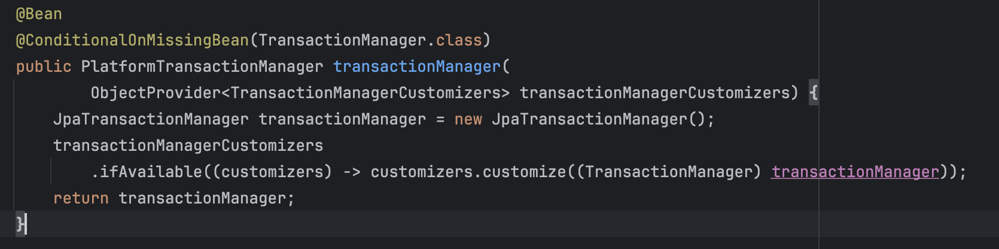

요약하자면 현재 등록된 TransactionManager 클래스의 Bean이 존재하지 않으면 JpaTransactionManager를 transactionManager Bean으로 등록한다는 얘기인데… 냄새가 납니다… ~~끝도 없이 길어지는 포스팅이 끝날 냄새가 나요…! ~~

<br/>

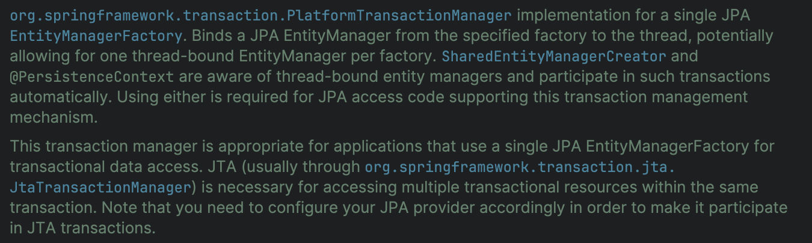

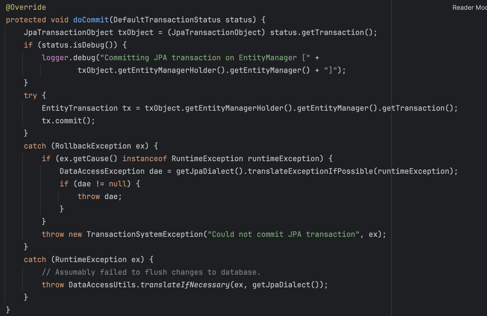

<br/>

# 찾았다!!


<br/>

네…!! 드디어 찾았습니다…!! **Transaction 상태에 따라 EntityManager에 Commit 되었으니 다음 동작 수행해! ** 라고 전달하는 클래스는 transactionManager Bean으로 등록된 `**JpaTransactionManager**` 클래스였습니다!

요약하자면 제가 사용하던 환경에선 다음과 같이 설정이 이뤄졌습니다.

Spring Boot AutoConfiguration 

→ (Spring Data JPA 사용 시) `HibernateJpaAutoConfiguration` 이 등록된다.

→ 이 때, `HibernateJpaAutoConfiguration` 은 `HibernateJpaConfiguration` 를 포함한다. 

→ `HibernateJpaConfiguration`는 `JpaBaseConfiguration` 을 확장한다.

→ `**JpaBaseConfiguration**`은 별도의 TransactionManager Bean으로 등록된 것이 없다면, JpaTransactionManager를 TransactionManager Bean으로 등록한다.

**→** `**JpaTransactionManager**`** 는 트랜잭션 상황에 따라 commit, rollback 상황 등을 EntityManager에 전달한다.** 

<br/>

이후의 상황은 사용되는 JPA 구현체에 따라 다르겠지만, 저희는 Hibernate를 사용하니 엔티티 매니저가 설정에 따라 열일할 것을 예상할 수 있을 것 같습니다.

<br/>

---

## <span style='color:pink'>Summary</span>

오늘은 잘 알려진 명제가 어떻게 동작하는지 직접 확인해보고자 하는 가벼운 계기로 포스팅을 시작했는데 생각보다 소요 시간도, 알아가는 것도 많은 시간이었습니다. ~~사실 좀 힘들었어요.~~

특히 Hibernate, Spring Boot와 같은 큼직한 프로젝트를 제 로컬 환경에서 뒤적여가며 찾아나서는 과정에서 얻은 것이 많았던 시간이었습니다. 배운 점들은 크게 다음과 같습니다.

<br/>

- Hibernate는 생각했던 것보다 굉장히 거대한 프로젝트고, 압도적인 분량과 기여자 수를 자랑한다.

	- 기여자 500+, 테스트는 core 모듈만 한정해도 1만이 훌쩍 넘깁니다. M1 맥에선 다 돌아가지도 않았어요.

- 다만 거대한 분량은 내부적으로는 굉장히 섬세하고 친절하게 구성되어 있다. 특히 외부 기술의 변화에 잘 대응할 수 있도록 SOLID 원칙으로 대표되는 객체지향 설계가 곳곳에 녹아있었으며, 코드 자체가 책임에 따라 굉장히 잘 나눠져있어서 하나의 기능과 구조를 이해하는데 들어가는 피로도는 낮았다.

- 독자의 피로도를 낮추는데는 여러 방법이 있겠지만, Hibernate에선 특히 
- Naming이 잘 갖춰져 있어 이름만 보고도 역할을 어느 정도 짐작할 수 있으며, 이 짐작이 크게 빗나가지 않도록 작성된 점 
- 클래스의 역할에 따라 분리가 잘 이뤄져 단일 기능을 파악하는데 확인해야할 코드가 많지 않은 점이 특히 좋았던 것 같습니다.

- Spring Boot는 대단히 유용하고, 개발자가 비즈니스 로직을 구현하는데 집중할 수 있도록 만드는 좋은 기능이지만, 제가 모르는 사이 굉장히 많은 설정을 자동으로 수행했으며, 이런 부분에 대해 인지해두고 있지 않는다면 문제가 발생했을 때 원인과 해결책을 찾는데 시간이 소요되겠다 하는 생각이 들었습니다.

- 특히 다른 TransactionManager가 기존에 빈으로 등록되어 있다면 JpaBaseConfiguration은 JpaTransactionManager를 빈으로 등록하지 않을텐데 이 경우에 발생할 수 있는 문제점들이 있을테니 이 부분 역시 신경을 써야겠다는 생각이 들었습니다.

	<br/>

오늘의 포스팅은 여기까지입니다. 끝까지 읽어주셔서 감사합니다!

혹시 틀린 점이나 보완하면 좋을 것 같은 점이 있다면 언제든 sjn3649@gmail.com으로 부탁드립니다!

<br/>

<br/>

