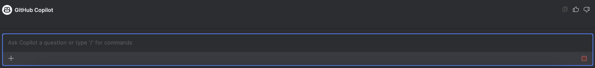
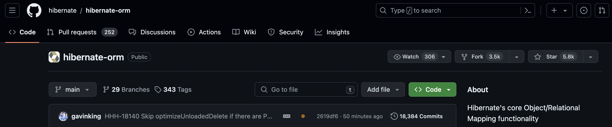
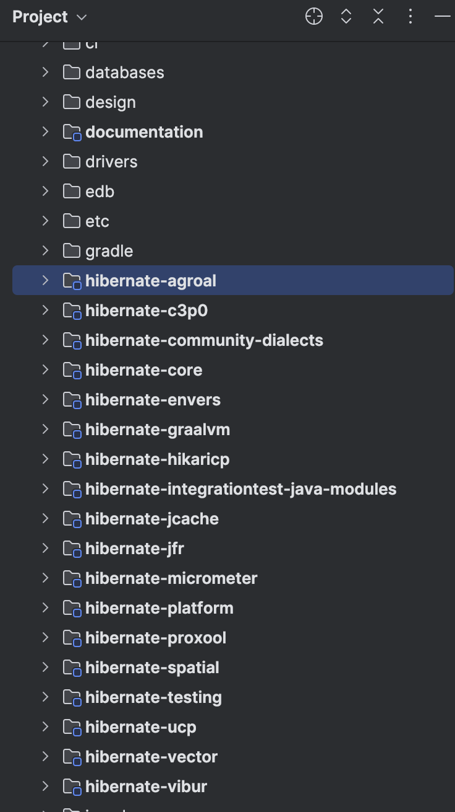
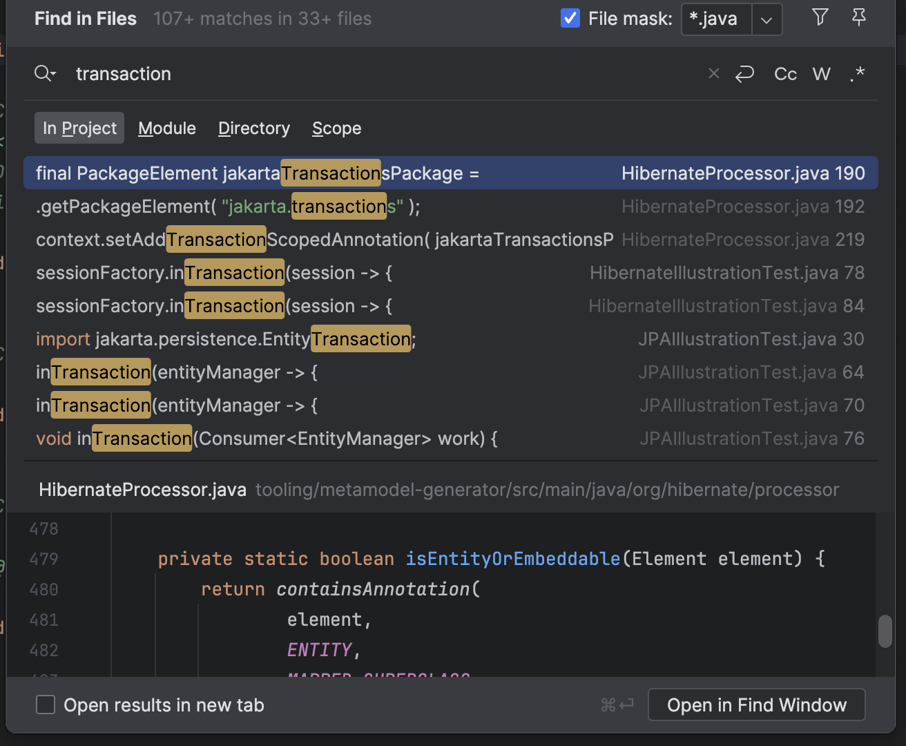
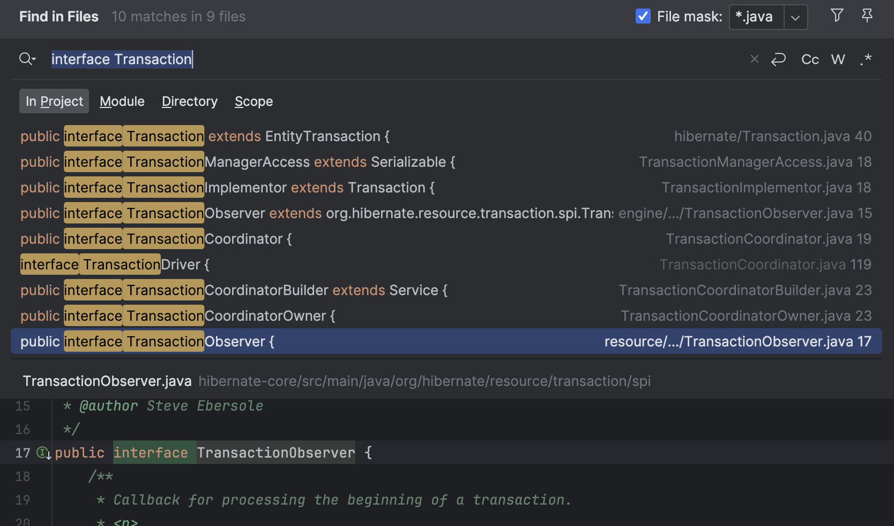
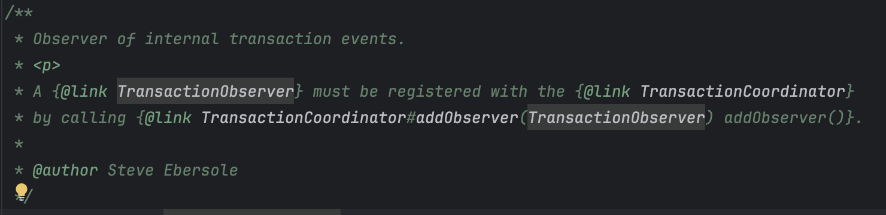
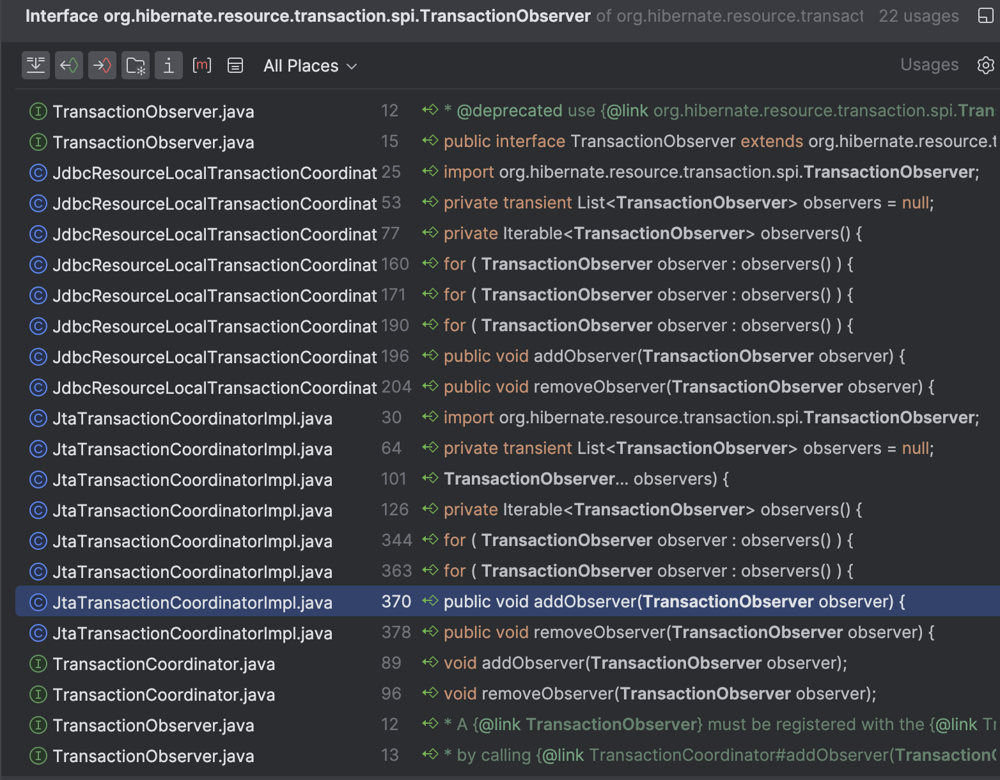
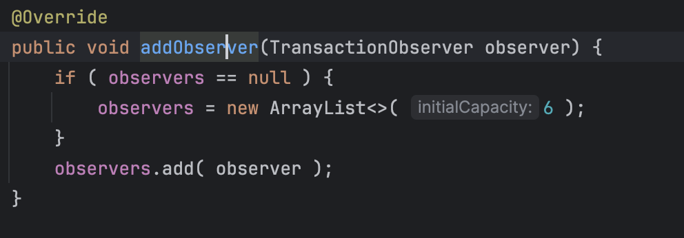
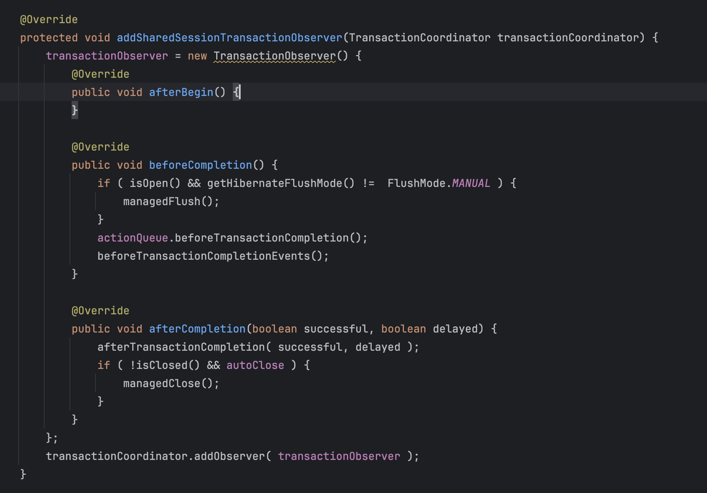

<br/>

Hibernate, 내지는 JPA를 사용하는 개발자들에겐 한 가지 유명한 명제가 있습니다.

### Hibernate는 Transaction Commit 시점에, 영속성 컨텍스트에 속한 엔티티 중 내용에 변경이 발생한 엔티티를 감지하고 이를 데이터베이스에 반영한다.

<br/>

때문에 영속성 컨텍스트에 영속 상태로 저장된 데이터는 변경이 발생했을 때 별도의 `save()` 없이도 데이터베이스에 변경사항을 저장할 수 있습니다.

그리고 Spring Framework이 제공하는 선언적 트랜잭션 어노테이션과 함께 아래와 같이 사용할 수 있습니다.


```javascript
@Transactional
public void updateUserLastLoginAt(Long id){
	User user = ...
	user.updateLastLogin()
}
```

<br/>

`user` 객체 내부에선 단지 객체의 속성 일부를 변경하였을 뿐, 이를 데이터베이스에 반영하는 코드가 없음에도 JPA는 user 엔티티의 속성의 변화를 감지하고 이를 데이터베이스에 반영합니다.

마법같은 일이지만, 이 판에서 마법은 없고 Hibernate는 오픈소스이며, 저는 시간이 넉넉한 관계로 어떤 코드가 실제로 Tranaction을 감시하고 있다가 변경사항을 반영하는지 찾아보기로 했습니다.

<br/>

먼저, 최근 유용하게 사용중인 Copilot에게 물어봤습니다. 일단 Hibernate는 오픈소스고 Github에 등록되어 있으니 뭐라도 알지 않을까요?

<br/>

음… 별로 영양가있는 정보는 아닌 것 같습니다. 저는 Spring Framework에서 제어하는 Transaction을 어떻게 Hibernate가 감지하는지가 궁금했거든요. 추가 질문을 해봅시다.

<br/>

<br/>

결과는?



선 채로 죽었다.

<br/>

네… AI는 분명 굉장히 유용하지만 일정 수준 이상의 데이터나 정보는 잘 모르는 경향이 있습니다. 또한 줄어들었다고 해도 거짓말이나 부정확한 정보들도 있으니 더 괴롭히지 말고 직접 찾아보기로 합니다.



Hibernate는 굉장히 사랑받는 Java ORM Framework다.

<br/>



시작부터 쉽지않네요. 수 백명의 기여자가 존재하는 Java 대표 ORM 프레임워크인만큼 분량부터 압도적입니다. 400MB 가량의 코드 뭉치를 냅다 다 읽어가는 건 역시 무리니 Transaction 키워드로 검색부터 해봤습니다.

<br/>



Transaction이라는 키워드가 107개가 넘게 사용되었네요. 역시 너무 많으니 interface로 범위를 한정해보겠습니다. 

<br/>



가장 의심스러운 인터페이스를 찾았습니다. TransactionObserver… 이름만 봐도 해당 인터페이스를 상속한 구현체가 트랜잭션의 상태를 확인하는 역할을 수행할 것 같네요. 이름 참 잘 지었습니다.



압도적인 분량에 주눅들지 않고 천천히 읽어보면 클래스에 대한 설명도 꽤 친절합니다. 침착하게 탐험을 계속해보겠습니다.

<br/>



<br/>

TranactionObserver를 사용하는 사례입니다. `JdbcResourceLocalTransactionCoordinatorImpl` 혹은 `JtaTransactionCoordinatiorImpl`에서 주로 사용합니다. DB에 대한 접근을 담당하는 클래스에서 경우에 따라 다른 TransactionObserver를 주입하여 사용할 수 있도록 유연하게 설계한 것으로 보입니다.

	- `TransactionCoodinator`는 트랜잭션 상태 및 커밋 절차를 담당하는 인터페이스로 보입니다. 즉, 트랜잭션 전반을 담당하는 `Coordinator`에서 생성자를 통해 전달받은 `TransactionObserver`를 통해 트랜잭션 전후의 상태를 파악한다 볼 수 있을 것 같습니다.

다만 이 시점에서 궁금한 것은, ***어째서 Usage에 TransactionObserver를 상속한 다른 구현체 클래스가 나오지 않는가*** 인데… 일단 마저 탐색해봅니다. 방향은 제게 조금 더 친숙한 JDBC쪽으로 잡겠습니다.





<br/>

Hibernate는 Session Interface을 통해 JPA 표준 인터페이스와 Hibernate Persistence Entity에 대한 구체적인 동작 방식, 규칙을 정의합니다. (예, 엔티티 매니저의 생명 주기, 엔티티 객체 프록시 전략, Dirty Check 유무 , 명시적인 Lock Level 결정 등…) 해당 클래스는 AbstractSharedSessionContract를 확장하여 구현하는데, 해당 클래스는 또 엔티티 생명 주기를 결정하고 이를 데이터베이스에 반영하는 역할을 수행합니다.

<br/>

따라서 Hibernate에서 어떻게 트랜잭션의 시작과 끝을 알아내는지를 옅보려면, Session 구현체 →  TransactionCoordinator 구현체에서 어떤 TransactionObserver를 사용하는지, 해당 TransactionObserver의 동작은 어떻게 정의되어 있는지를 확인하면 되는데, 이 때 Observer에서 수행할 역할을 정희하는 주요 클래스가 AbstractSharedSessionContract 라고 봐주시면 될 것 같습니다.

- `TransactionObserver`와 유사한 뉘앙스의 `Interceptor` 인터페이스도 별도로 존재합니다. 해당 인터페이스는 <span style='color:pink'>**영속성 객체의 상태**</span>에 따른 이벤트를 감지하고 동작하도록 구성되어있습니다.

<br/>

그리고 탐험 끝에 알아낸 사실은… 딱히 Hibernate는 Transaction이 언제 시작하고 끝나는지 관찰하고 있지 않다는 것이었습니다…! 이 부분은 꽤 충격이었던 게 

### Hibernate는 Transaction Commit 시점에, 영속성 컨텍스트에 속한 엔티티 중 내용에 변경이 발생한 엔티티를 감지하고 이를 데이터베이스에 반영한다.

이 명제에 따라 Transaction commit 시점을 

<br/>

