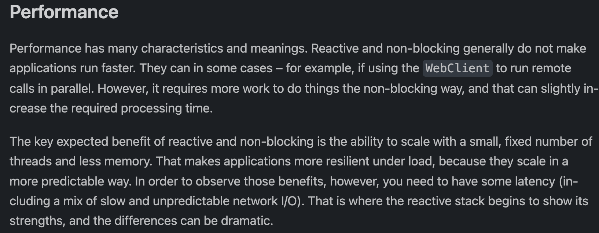
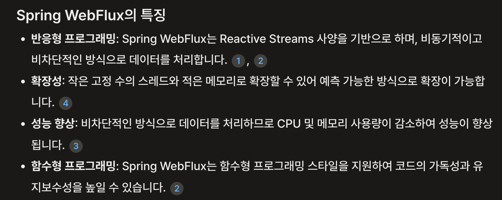

# 궁금해 시리즈 2편. Spring WebFlux 성능에 대한 사실과 오해

\


#### Spring WebFlux는 무엇일까?

Spring WebFlux는 비교적 최근, 정확히는 Spring Framework 5 후반부터 공개된 Non-blocking 프레임워크입니다. `Spring Framework`의 일부로 배포되었고, 기존의 Spring MVC가 Blocking 방식으로 동작하여 발생하는 문제점들을 해소하기 위해 출시되었습니다.

그리고 제가 예상했던 것보다 빠른 시간 내에 꽤 많은 시스템에서 도입을 시작했습니다. 국내의 IT 기업들이 2020년을 기점으로 급격히 성장하여 레거시 시스템에 비해 변화가 쉽게 이뤄질 수 있는 점, Spring 진영이 갖는 기술적 신뢰도로 인하였다고 생각합니다.

또 예전에 비해 외부 시스템과의 연동이 많은 현대 프로그래밍의 특성도 반영되었을 것 같아요. 예컨데 비즈니스 상황에서 발생하는 데이터를 저장/분석하기 위해 `Definery`, `Amplitude`, `Datadog` 등 서버에서 비즈니스 로직을 처리하면서 동시에 시스템 외부에 요청을 보내는 빈도가 증가하였고, 대형 IT 기업을 중심으로 **MSA** 구조가 늘어나면서 시스템 간 Call이 증가하여 Blocking 방식을 채택했을 때 지연 시간이 증가하기도 했으니까요.

\


다만 언제나처럼 블로그나 웹 등지에서 잘못된 정보들이 전파되는 것도 문제가 되는 것 같습니다. WebFlux가 MVC 모델에 비해 성능적인 우위가 있다는 정보가 심심치않게 보이는데요. 비록 한 문장이라도 이런 잘못된 정보들이 갖는 파급력은 참 큽니다. MVC 모델보다 WebFlux가 **우월**하며 기존의 시스템은 WebFlux에 비해 **열등**한 것이 되어버리거든요. 정말 그럴까요?

***

#### 이는 Spring WebFlux 공식문서를 통해 이는 사실이 아님을 쉽게 알 수 있습니다.

\




[Spring WebFlux Official Docs - Overview](https://docs.spring.io/spring-framework/reference/web/webflux/new-framework.html#webflux-performance)

\


> 성능에는 많은 특징과 의미가 있습니다. 반응형 및 비차단형은 일반적으로 애플리케이션을 더 빠르게 실행하지 않습니다. 예를 들어 웹 클라이언트를 사용하여 원격 호출을 병렬로 실행하는 경우와 같이 일부 경우에는 그럴 수 있습니다. 그러나 비차단 방식으로 작업을 수행하려면 더 많은 작업이 필요하므로 필요한 처리 시간이 약간 늘어날 수 있습니다.

```
반응형 및 비차단 방식의 주요 기대 이점은 적은 수의 고정된 스레드와 적은 메모리로 확장할 수 있다는 점입니다. 따라서 애플리케이션은 보다 예측 가능한 방식으로 확장되므로 부하가 걸렸을 때 복원력이 향상됩니다. 그러나 이러한 이점을 누리려면 느리고 예측할 수 없는 네트워크 I/O가 혼합된 경우 등 지연 시간이 어느 정도 발생해야 합니다. 바로 이 지점에서 반응형 스택의 강점이 드러나기 시작하며, 그 차이는 극적일 수 있습니다.

*- DeepL 번역*
```

\


즉, Spring WebFlux과 Spring MVC 간에는 Non-blocking, Block 간의 차이가 존재하여 그로인해 결과적인 차이가 발생할 수 있다는 점이지 둘 간의 명시적인 성능 격차가 존재하는 것을 의미하지 않습니다. 그렇다면 왜 잘못된 정보가 전파되고 있었을까요?

\


***

#### 찾았다 범인

사실 이 포스팅을 작성하기 전, AI Chat을 통해 Spring WebFlux에 대해 물어본 적이 있었습니다. 그리고 답변 중 일부는 다음과 같았습니다.



프로그래머에게 성능은 아주 중대한 이슈입니다. 높은 QPS를 갖는 서비스들은 한번의 트래픽을 처리하는데 들어가는 효율성이 결과적으로 큰 차이를 발생시키기 때문에 더더욱 중요합니다. 때문에 **성능 향상** 과 같은 키워드는 더 없이 매력적으로 동작합니다. 저만해도 공식문서가 아닌 AI답변을 통해 WebFlux를 접했다면 Spring WebFlux가 Spring MVC에 비해 성능상 우위를 갖는다는 명제를 의심없이 받아들였을 것 같으니까요.

***

#### Spring WebFlux의 실제적인 장점은?

제가 생각하기에 Spring WebFlux는 좋은 점은 Spring MVC에 비한 성능 우위가 아닙니다. (동일한 작업을 수행할 때 WebFlux가 성능적으로 더 좋은 모습을 보인다고 하더라도) 적은 스레드 풀을 이용한 효율적인 병렬 처리이죠.

Spring MVC도 당연히 병렬적 처리를 지원합니다. 단, 이 과정에서 하나의 병렬적 처리마다 하나의 스레드가 별도로 할당되어야하며, 스레드는 자원이고, 또 thread pool size에 따른 **한정된 자원**입니다. 때문에 MVC에서 지원하는 병렬적 처리는 비교적 낮은 고점을 가지고 있다고 볼 수도 있습니다.

반면 Spring WebFlux는 어떨까요? Spring WebFlux는 일반적인 서버가 Block을 수행하지 않는다고 가정합니다. (때문에 JDBC와 JPA와 호환성이 좋지 않습니다. `JDBC/JPA`에서 수행하는 일반적인 `Select` 기능은 DB에서 결과를 가져온 후 반환하는 `Blocking 모델`로 동작하기 때문이죠.)

다만 비즈니스 로직에서 수행되는 작업들을 `Non-Blocking`으로 구성할 수 있다면 MVC에 비해 훨씬 적은 스레드로 빠르게 요청을 처리할 수 있으며, 전반적인 Ratency의 감소를 기대해볼 수 있을 것 같습니다. 또한 Spring WebFlux 기술 자체도 장점을 갖지만, 예전에 비해 시스템을 구성하는 대부분의 요소 (`Cache, Database, Data warehouse, File Storage...`)가 Cloud 환경에서 서로 분리된 환경에서 구동하는 것 또한 이러한 장점을 부각하는 요소라고 볼 수도 있겠네요.

\


***

#### 단점은 없는가?

포스팅을 작성하는 2024년 6월을 기점으로 JDBC는 Non-Blocking 처리를 지원하지 않습니다. 때문에 Spring Data JPA 역시 Non-Blocking 처리를 지원하지 않습니다. Hiberante Reactive나 coroutine 같은 대안이 없지 않지만 아직 미흡합니다.

**즉, Spring 5에 출시된 프레임워크라** `**아직 환경적 성숙도가 낮습니다 (물론 제 사견입니다)**`**.** 저는 사실 기술 선택에 꽤 보수적인 편이라 이런 단점이 조금은 크게 다가오기도 합니다. 지금 당장이라면 쓰지 않을 가능성을 염두에 둘 것 같아요.

다만 이 부분은 일시적일 것이라 생각합니다. 현재 Spring의 최신 버전은 6.12 입니다. 아직 Reative programming paradigm이 JVM 진영에 도입된지 얼마 되지 않은 시기인 점을 눈 여겨 봐야할 것 같아요. 새로운 기술들(eg.R2DBC)이 성장하거나, 기존에 출시된 기술들(JDBC)이 변화에 적응할만한 시간이 충분치 않았을 뿐 분명 기존 프로그래밍 방식처럼 Reactive Programing 역시 발전할 것이라 믿어 의심치 않습니다.

또 다른 부분은 신기술의 고질점인 약점인 `**레퍼런스의 부족**`일 것 같습니다. 이 역시도 시간이 해결해줄 문제 혹은 개발자의 역량에 따라 극복이 가능한 부분이라고 봅니다. 사실 기술적 성숙도가 낮은 개발자들은 구글링 혹은 AI가 작성한 코드에 의존하는 경우가 많은데 레퍼런스의 양이 절대적으로 부족한 상황에서 좋은 선택을 내리기 어려운 것이 사실입니다. 숙고해서 내린 선택을 검증할 방법도 초기에는 부족한 것이 사실이기도 하고요.

이 부분 역시 시간이 많은 부분을 해결해줄 것이라 봅니다. Kotlin+Spring 조합도 예전엔 레퍼런스가 참 부족했지만 지금은 꽤 많은 부분이 개선되었고, JVM 진영의 기술들도 Kotlin 지원을 늘린만큼 지금은 부족한 Spring WebFlux 관련 데이터 역시 시간이 지남에 따라 많은 부분 개선되지 않을까 생각합니다.

\


***

\


오늘의 포스팅은 여기까지입니다. 사실 WebFlux에 대해 잘 알거나 사용해본 경험이 없음에도 이런 포스팅을 쓰게 된 건 `WebFlux가 대용량 트래픽 대상으로 성능이 좋다.`혹은 `WebFlux가 Spring MVC보다 성능적으로 좋다.` 같은 이야기에 반신반의하면서 작성하게 된 것인데요. 덕분에 공식문서와 레퍼런스를 참고하면서 어떤 부분이 오해였고, 어떤 부분에서 명확한 강점이 있는지 확인할 수 있는 시간이었습니다.

되도록 공식문서를 근거로 작성하였지만 제 사견이 많이 포함된 포스팅이라 더러 틀린 점이 있을 수 있을 것 같습니다. 보완이나 수정이 필요해 보이는 부분은 제 이메일로 보내주시면 포스팅에 반영하도록 하겠습니다!

긴 글 읽어주셔서 감사합니다!

\
