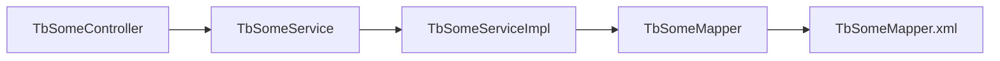
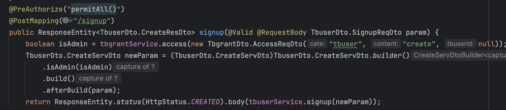
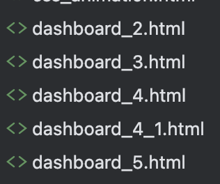
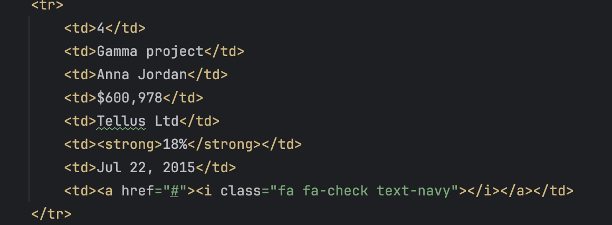

Spring Framework는 제가 사용해본 프로그래밍 프레임워크 중 가장 친숙하고 선호하는 프레임워크입니다. 여러 이유가 있겠지만, 일단 레퍼런스도 참 많고, 리팩토링하기도 편하고, 무엇보다 약간 정석적인 Controller - Service - Repository 형태가 잡혀있어서 어느 프로젝트를 봐도 혼란스러운 느낌이 잘 없거든요.

하지만 한 외주 결과물은 달랐습니다. 

제가 만난 최악의 코드들 2편 시작합니다.

<br/>

---

### 일단 작동이 안 돼요…

우리는 프로젝트의 외주를 맡길 때, 그래도 완성도 있는 결과물을 원합니다. 프로그래밍을 하실 수 없는 분이 외주를 맡긴다면 더더욱 코드 자체보다 프로그램이 정상적으로 동작하는 것에 집중할 수 밖에 없죠.

그렇지만 저희 회사가 약 2달 간의 기간을 제공하고 돌려받은 코드는 전혀 정상적으로 동작하지 않았습니다. 

[//]: # (column_list is not supported)

	[//]: # (column is not supported)

		

		

	[//]: # (column is not supported)

		<br/>

**실제로 동작하지 않던 부분들** 

- 게시물을 만든다고 가정할 때, 특정 필드는 필수값이 아님에도 필수적으로 넣도록 구현

- 해당 오류가 사용자에게 보이지 않음. 개발자 도구에서 API Response로 확인해야 함.

- <u>페이지 형태로 구성된 모든 페이지에 페이징 기능이 구현되지 않음. 1페이지만 존재</u>

- 요청한 API가 전혀 구현되어 있지 않은 채 다른 API로 땜빵되어 있음.

- 너무 많은 나머지 하자들…

<br/>

하지만 이 상황을 개선할 수 있는 Java개발자는 회사에 오로지 저 하나 뿐이었습니다. 긴급히 대책 회의가 열렸고, 저는 소방수로 투입되어 최소한 프로젝트의 핵심 기능들만큼은 정상적으로 동작할 수 있는 정도까지 개발하기로 결정되었고 프로젝트 소스 파일을 인계받았을 때, 저는 경악을 금할 수 없었습니다.

---

### 대체 뭘 어떻게 해야 이렇게 개발하는거야

사실 프로젝트 구동 전에 미리 전달받은 DB 테이블 스키마도 굉장히 기괴했습니다. 테이블명부터 tbcrew, tbcrew_user, tbcrew_time 등이었죠. (추후 알아보니 저 테이블들은 각각 <u>리뷰, 유저, 상품</u> 테이블이었습니다. 뭘 대체 어떻게 테이블명을 짜야…)

<br/>

전반적인 동작 프로세스는 더더욱 이상했습니다. 특히 List 형태로 데이터를 조회할 때 상당히 기괴하고 비효율적인 구조로 동작했는데, 플로우는 다음과 같습니다.




일단 모든 클래스명이 항상 TbTableName으로 시작하는 부분은 차치하더라도, 모든 서비스 클래스가 Service Interface + 구현체 형식으로 되어있는 부분부터 작업에 차질을 빚었습니다. 또한 전혀 그럴 이유가 없음에도 모든 인터페이스가 거의 동일한 형태로 아래와 같이 구성된 상황이었습니다.


```java
@Service
public interface TbSomeService {	
	TbSomeDto.CreateResDto create(TbSomeDto.CreateServDto param) throws IllegalAccessException;

	TbSomeDto.CreateResDto update(TbSomeDto.UpdateServDto param);

	TbSomeDto.CreateResDto delete(CommonDto.DeleteServDto param);

	TbSomeDto.SelectResDto detail(CommonDto.SelectServDto param);

	List<TbSomeDto.SelectResDto> list(TbSomeDto.ListServDto param);

	List<TbSomeDto.SelectResDto> moreList(TbSomeDto.MoreListServDto param);

	CommonDto.PagedListResDto<TbSomeDto.SelectResDto> pagedlist(TbSomeDto.PagedListServDto param);
}
```

<br/>

<u>서비스 클래스는 생각보다 많은 함수가 필요합니다.</u> 특히 읽기 좋은 코드를 작성하기 위해선 주요 비즈니스 로직이 동작하는 Service 클래스에서 메서드들이 작은 단위로 잘 쪼개지는 상태를 유지하는 것이 소프트웨어 유지 보수, 추가 개발, 테스트 코드 추가 등에 유리하기 때문이죠.

모든 서비스 클래스 메서드를 Controller에서 호출하는 것은 아니지만, Service의 메서드가 분할되면 Controller에서 Service 클래스의 메서드를 작은 단위로 호출하는 경우도 많아집니다. 
하지만 외주 사나이들이 작성한 코드에선 모든 Controller가 Serivce Interface를 참조하고 있으니, 구현체에서 새로운 함수를 추가하는 경우에도 인터페이스에 해당 함수를 추가하지 않으면 Controller에서 호출할 수 없었습니다. 사소한 불편이지만, 모든 서비스 클래스가 위와 같이 동작하니 동일한 작업을 수행할 때도 몇 배는 더 시간이 소요되는 문제가 발생했습니다.

비즈니스 로직의 수행 방식도 크게 이상했는데, 일반적으로 스프링에서 페이지 형태의 엔티티 리스트를 조회한다면 Respository에서 특정 엔티티와 함께 fetchJoin()을 수행하거나, ArrayList 형식으로 필요한 엔티티를 조회하는 상황이 일반적입니다. 일반적인 상황에서 N+1 문제는 겪고 싶지 않은 문제니까요.

하지만, 외주 사나이들은 그런 건 신경 쓰지 않습니다… 위에 적힌 list나 morelist처럼 N개의 엔티티를 기준으로 동작하는 메서드의 경우 mapper.mlist() 같은 함수를 통해 id 리스트만 조회하고, 해당 id 리스트를 기준으로 mapper.detail()을 통해 모든 레코드를 다시(!) 데이터베이스에서 조회하여 반환하도록 구현되어 있었습니다. `list()에서 detail()에서 반환하는 필드를 조회하는거나, IN(idList) 같은 방식은 사나이들의 방식이 아니었던 것 같습니다.` 즉, 사나이 개발자들은 깍쟁이 개발자들이 N+1 문제를 회피하기 위해 고민할 때, 1개의 엔티티 클래스 리스트를 조회하기 위해 N+1 쿼리를 작성하고 있었습니다. **다시 말하지만 참조 관계 없이 하나의 엔티티 리스트를 조회하는 로직에서 N+1 로직을 강제하고 있었습니다.** 깍쟁이들이 고민하는 사이에 사나이 개발자들은 다음 클래스를 만들고 있던 것 같습니다. ~~개같은 인터페이스 참조해서요~~

---

### 사실

위에 적은 문제들은 굉장히 작은 영역에 속합니다. 솔직히 말하면 DTO 클래스도 이상하고, Parameter 전달방식도 이상하고, SpringDataJPA는 프로젝트에 포함되어 있는데, MyBatis 위주로 개발된 것도 이상하고 다 이상하며, 거의 동일한 내용의 HTML이 몇 개씩 복사되어 있는 것도 이상했거든요. (~~제발…~~)



[//]: # (column_list is not supported)

	[//]: # (column is not supported)

		

	[//]: # (column is not supported)

		

		<br/>

이 프로젝트를 전달받은 `저는 제가 왜 벌써 도착했는지는 모르겠습니다만,` 개발 대충한 개발자가 가는 지옥이 어떤 모습인지 어렴풋이 알 수 있었습니다... 

그곳엔 주문한 적 없는 페이지와 다른 프로젝트에서 복붙한 코드, 그리고 퍼블리셔가 애써 만든 HTML을 부숴버린 ~~사나이~~ 개발자의 흔적, 미친듯이 많은 쓰레기 코드 ~~(와중에 주문한 페이지 목록을 주문하는 코드나 Parameter Validation 로직은 없고)~~ 이 상황을 수습할 수 있는 Spring MVC 경험이 있는 개발자가 <u>*팀 내에 저 한 명 뿐이라는 잔혹한 사실 *</u>이었습니다.

---

### 그래서 얼마나 고쳤냐면

 약 3주 동안 **557개의 파일이 수정**되었고, **27,000여 줄**이 새로 생겼고, **47,000여 줄**이 사라졌으며 (~~그럼에도 쓰레기 코드는 남아있습니다~~) <u>현재 서비스 운영중(!) 입니다. </u>


<br/>

물론 오롯이 저 혼자 작업한 것은 아니고, 외부에서 지원온 구원 투수(~~이자 범인~~), 새로 팀에 합류하신 프론트엔드 개발자 분의 도움을 받아 최대한 빠른 기간 내에 프로덕트를 정상화 시키고 운영에 돌입할 수 있었습니다.

굳이 3주간의 기여도를 따지자면 그래도 제 지분이 85% 이상이라고는 볼 수 있을 것 같네용…

사실 코드를 작성하거나 유지보수하는 난이도는 앞선 1편의 내용보단 쉬운 편입니다…! HTML과 JQuery를 정말 오랜만에 다루느라 진 뺀 것을 제외하면 손이 정말 많이 가긴 하더라도 IDE, AI의 도움을 어느정도는 받을 수 있으니까요. 

다만 이 프로젝트에서 정말 힘들었던 점은 <u>압도적으로 많은 쓰레기 코드의 양</u>이었던 것 같아요. 치우고 치워도 쓰레기 코드가 남아있고, `Controller → Service → ServiceImpl → Mapper(Interface) → MapperFile.xml` 로 이어지는 길고 불합리한 비즈니스 로직 전개 과정은 하나의 기능을 조금 수정하는데도 많은 리소를 요구했거든요. 그야말로 작동하는 쓰레기 코드 덩어리라고 할 수 있었습니다.

---

### Next?

만약 이 프로젝트를 정리한다면 어떤 방식으로 이 프로젝트를 개선할지 생각해봤습니다.

1. **E2E Test Code 작성**

	1. 주요 API들에 대해 일관적으로 동작하는 E2E 테스트를 최소 1개 이상 구현합니다. 테스트는 상세할 수록 잘 작동할 가능성이 높지만, 코드 개선에 투입할 수 있는 시간을 생각하여 가장 많이 호출되거나, 로직 상 중요한 테스트를 우선적으로 구현합니다.

	1. 또한 API Spec은 마음에 들지 않더라도 사실 잘 바뀌는 부분은 아닙니다. Spring MVC 프로젝트처럼 하나의 프로젝트를 배포할 때, Front-end, Back-end를 한번에 배포하는게 아니라면 꼭 필요한 경우를 제하고는 잘 수정하지 않습니다. 따라서 E2E Test Code는 상대적으로 다른 테스트 코드에 비해 수명이 깁니다.

1. **Service Interface Layer 제거**

	1. 불필요합니다. Controller, Service, ServiceImpl 파일이 1:1:1로 매칭되는 현 상황에서 더더욱 불필요합니다. 이런 걸 `**객체지향적**` 이라고 하면 안 되는 거라고 봅니다. ServiceImpl 파일을 Service 파일로 전환하고, Controller에서 DI하는 방식으로 개선할 것 같습니다.

1. **ClassName** `**Prefix**`** 제거**

1. **DTO 클래스 분리**

	1. 현재 대분류 DTO 클래스 파일 내에, 작은 분류의 DTO 클래스 여러개가 내부 클래스로 종속되어 있는 상태인데, 가독성과 작성 효율에서 큰 불편을 야기합니다. 
dto 패키지 > 특정 dto 패키지 > 개별 dto 클래스 파일 구조로 분리하여 관리할 것 같습니다.

1. **특정 부분에서 가장 비효율적인 N+1 로직 제거**

	1. 모든 서비스 클래스에 구현되어 있는 N+1 로직을 한번에 제거하는 것은 투자 시간 대비 효율이 낮을 수 밖에 없습니다. 가장 비효율적인 메서드들부터 차례로 N+1 로직을 제거합니다. 다만 이 과정은 개발 생명주기에 따라 반복적이고, 점진적으로 진행됩니다.

1. **Mybatis Mapper 방식으로 구현된 메서드** `**QueryDsl**`**로 전환**

	1. 이 부분에선 QueryMapper에서 ORM을 적극적으로 사용하는 방식으로 전환이 일어납니다. Spring Data JPA 프로젝트, QueryDSL에 포함된 기능을 적극적으로 사용하여 QueryMapper 기능을 걷어냅니다. 다만, 이 작업 역시 N+1 로직을 제거하는 방식과 마찬가지로 한 번에 모든 로직을 걷어내는 방식보다, 개발 과정 전반에서 짬짬히 일어납니다. 특정 기능을 수정하거나, 새로운 기능을 만들 때는 항상 ORM으로 전환하는 작업을 수행하는 방식으로!

1. **앞 선 과정을 통해 어느정도 코드가 정리되었다면, Method 순으로 Test Code를 추가합니다.**

	1. 불필요한 Service Interface Layer를 제거하고, mapper를 걷어내는 시점이라면 Service Layer의 Method Test를 추가하더라도 테스트 코드로 인한 작업 상의 불편은 잘 일어나지 않는다고 생각합니다.
만약 해당 작업은 대대적인 리팩터링 이전에 이뤄질 시, 테스트 코드와 함께 변해야하는 부분이 많아지기 때문에 + 또한 기존에 프로젝트에 포함된 쓰레기 코드가 많은 프로젝트 상황을 고려하여, 리팩터링이 선행적으로 진행되는 것이 Metod Test 추가보다 중요하다고 생각하여 상대적으로 후순위에 작업을 배치했습니다.
(해당 작업이 중요치 않다는 의견은 전혀 아니며, 작업의 순서를 후순위로 배치한 이유입니다.)

---

### Summary

이로써 올해 만난 2개의 쓰레기 코드 덩어리들에 대해 이야기 나눠봤습니다. 개인적으로 2024년 가장 처음 읽은 책이 <u>클린코드</u> 였다는 점을 생각한다면 참으로 아이러니한 일이 아닐 수 없는데, 좋게 생각하면 배운 것을 써먹을 상황을 많이 마주한 셈이고 나쁘게 말하면 쓰레기 코드에 질식할뻔한… 한 해였던 것 같네요. 

2025년엔 좀 더 잘 다듬어진 코드를 만들고, 또 동료들에게서 배우는 한 해가 되었으면 좋겠습니다.

긴 포스팅 읽어주셔서 감사드리고, 다음번에 좀 더 재밌는 포스팅으로 돌아오겠습니다. 안녕!

