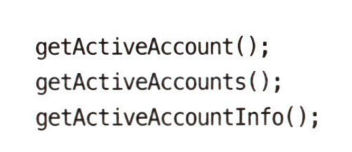

- 의도가 분명한 이름을 지어야 한다. 

- 따로 주석이 필요한 코드라면 의도를 분명히 드러내지 못한 거다. (그… 다 그런 건 아니라고 생각한다. 다만 마땅히 지향할 관점이라고는 생각함)

- 그릇된 정보는 피해라. 무의미한 약어의 남발은 코드를 읽는 독자에게 의미를 전달하지 못하게 막는 장벽이 된다. 

- 되도록 흡사한 이름을 사용하지 않도록 주의해야한다.

- 의미있게 구분해야한다.

	- 컴파일러를 통과시킬 목적으로 class 대신 klass 같은 변수를 사용하는 사람은 자격이 없다.

- 불용어의 사용도 그렇다. `UserData`나 `UserInfo`는 `User`에 비해 어떤 것도 더 설명하지 못한다. 

	

- 프로그래밍은 사회 활동이다. 발음하기 쉬운 변수명이 더 좋다. `genymdhrns` 이딴걸 `GeneratedDate` 대신 썼다면 볼기짝을 맞아야한다.

- 검색하기 쉬운 이름이 좋다.

	- 이 경우 이름이 긴 편이 1,2 글자인 편보다 좋다. `int i` 처럼 금방 사그라지는 변수는 알파벳 한 글자여도 괜찮다. 단, `int JWT_TOKEN_TTL = xxx` 처럼 넓은 범위에서 사용되는 변수/상수에는 생명 주기에 걸맞는 명확한 이름이 있어야 한다. 그래야 의미를 이해하기도, 검색으로 찾아내기도 쉽다.

- **명료함이 최고의 미덕이다.** `String ``*r*`* 이 호스트와 프로토콜을 제외한 소문자 URL이라는 사실을 언제나 기억한다면 확실히 똑똑한 사람이다. (유능한 프로그래머는 아니다) - 31page*

- 클래스 이름은 명사 혹은 명사구가 적합하다. 솔직히 잘 모르겠다. 

- 하나의 개념에 하나의 단어를 사용하다. find, get, fetch를 혼용해서 사용하는 것은 지양해야 한다.

- 의미있는 맥락을 추가하는 것이 좋다.

	- firstName, lastName, street, houseNumber, city, state, zipcode 이렇게 모여있으면 주소체계라는 것을 이해하기 쉽지만, 다른 곳에서 state만 사용한다면 추론하기 어렵다. 이 경우엔 addrFirstName, addrLastName, addrState 라고 쓰면 이해를 도울 수 있다.

	- 물론 위와 같은 케이스엔 Address 클래스를 생성하는 것이 더 좋다.

	 

