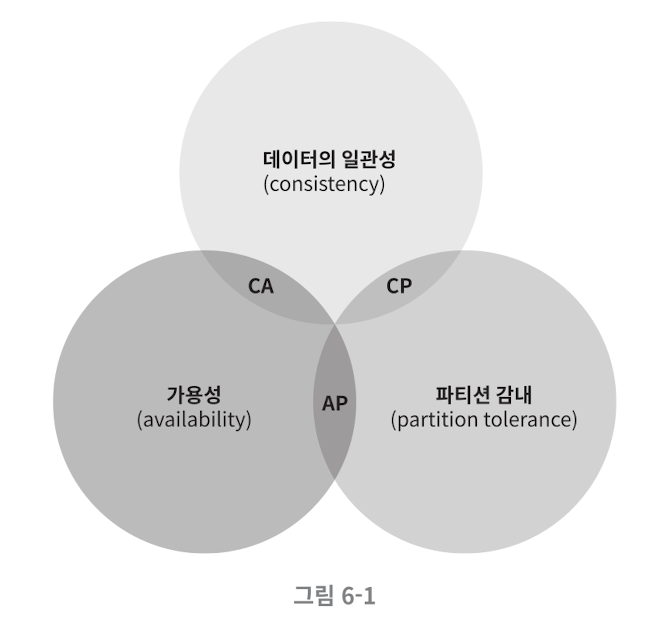

# Chapter6. Key-Value 저장소 설계 (작성중)

단일 키-밸류 저장소는 만들기 쉽지만 금방 한계가 찾아온다. 데이터 압축이나 자주 활용되는 데이터만 메모리에 저장하는 방식으로 타이밍을 늦출 수는 있지만 한계가 명확하다.

### 분산 키-밸류 저장소

#### CAP 정리

*   cap 정리란, 일관성(`consistency`), 가용성(`availability`), 파티션 감내(`partition tolerance`) 라는 분산 시스템의 핵심 요소들을 모두 만족하는 설계란 불가능하다는 정리다. 간단하게 얘기해서, 완벽한 분산 설계란 불가능하다는 뜻

    <figure><figcaption></figcaption></figure>
* 따라서 분산 키-밸류 저장소는 CP, AP, CA 등 요구 사항 가운데 두 가지를 만족하느냐에 따라 분류할 수 있다. (단, CA 저장소는 실제로 존재하지 않는다. 파티션 감내는 가장 중요한 요소이기 때문)
* 따라서 분산형 저장소의 타입은 고가용성과 가용성 중 무엇을 더 우선시 하느냐에 따라 달라진다.
* n1\~ n3, 3개의 서버가 분산된 네트워크 환경에선 가용성과 일관성을 선택해야 하는데, 은행권처럼 수치 즉, 일관성이 매우 중요한 서비스의 경우엔 3개의 서버 중 하나만 다운되더라도 쓰기 작업이 불가능해지더라도. 즉, 가용성을 포기하더라도 CP 구조를 선택하는 것이 좋다. 반대로 커뮤니티나 고가용성이 중요한 경우라면 AP구조를 선택하는 것이 적합할 것이다.

***

### 시스템 컴포넌트

#### 데이터 파티션

* 대용량 데이터는 하나의 스토리지에 넣고 관리하는 것이 사실상 불가능하기 때문에 파티셔닝을 통해 데이터를 분산하여 저장해야 한다. 이 때 중요한 것 두 가지가 _1. 데이터가 균등하게 분배될 수 있을 것인가, 2. 노드가 추가되고 삭제될 때 데이터의 이동을 최소화 할 수 있을 것인가_ 이다.
* 따라서 이를 해소하기 위해 5장에서 설명한 안정 해시 방식이 사용된다.
* 안정 해시 방식의 장점은 규모의 확장과 축소가 비교적 적은 비용으로 짧은 시간 안에 이뤄질 수 있으며, 각 서버의 용량에 맞게 가상 노드를 설정하여 환경에 적합한 파티션 세팅을 수행할 수 있다는 점이다.

#### 데이터 다중화

* 고가용성과 안정성을 위해선 동일한 데이터를 하나의 파티션이 아닌 N개의 파티션에 저장해야 할 수도 있다.
* 같은 데이터 센터에 속한 노드는 정전이나 천재지변으로 인한 재해에 동시에 영향을 받을 수 있다. 따라서 데이터 분산을 위해선 지리적으로 분리된 위치에 데이터를 저장하는 것이 낫다.

#### 데이터 일관성

* 여러 노드에 다중화된 데이터를 읽고, 쓰는데에는 적절한 동기화가 필요하고 이를 위해 정족수 합의 프로토콜을 사용한다.
* 간단히 설명하자면 최소한 W,R개의 서버에 데이터가 쓰기 읽기 완료 처리되는지를 지정하는 프로토콜로, W 혹은 R이 1이라면 단 하나의 서버에 읽기/쓰기가 완료되는 것을 보장한다. 따라서 가장 빠른 읽기/쓰기 성능을 나타내지만 일관성은 떨어질 수 있다. W,R이 전체 서버 수와 가까울 수록 일관성과 지연 시간은 증가한다.
* 요구되는 일관성 수준에 따라 W,R,N의 값을 조정하면 된다.

#### 일관성 모델

* 강한 일관성 모델: 모든 읽기 연산은 가장 최근에 갱신된 결과를 반환한다. 클라이언트는 절대 낡은 데이터를 확인할 수 없다. 이를 위해 모든 쓰기 작업이 종료될 때까지 해당 데이터에 대한 읽기/쓰기는 금지된다. 로우락인 셈
* 약한 일관성 모델: 읽기 연산이 가장 최근 데이터를 반환하지 못할 수도 있다.
* 최종 일관성 모델: 읽기 연산이 가장 최근 데이터를 반환하지는 못할 수 있지만, 최종적으로는 모든 사본에 변경 사항이 반영된다.

#### 장애 처리 - 장애 감지

* 분산 시스템 환경에선 하나의 서버가 다른 서버의 이상을 감지한 것 만으로는 해당 서버에 이상이 있다고 판단하지 않는다. (네트워크 오류로 인한 일시적인 장애일 수 있기 때문) 따라서 둘 이상의 서버가 동일한 서버의 장애를 제보하면 해당 서버가 문제가 생겼음을 인지한다.
* 따라서 일반적으로 사용되는 가십 프로토콜과 같은 분산형 장애 감지 솔루션을 채택하는 경우가 많다. 각 노드는 리스트로 서버 클러스터 멤버의 ID와 카운터를 가지고 있다가, 특정 서버의 카운터가 일정 시간 이상 증가하지 않으면 해당 서버를 장애 서버로 지목하고, 다른 서버에도 이를 전파하여 점점 더 많은 서버가 해당 서버의 장애 여부를 판단하도록 구성한다.

#### 장애 처리 - 일시적 장애 처리

* 특정 서버의 상태가 나빠져서 작업을 수행할 수 없을 경우 건강한 서버가 대신하여 읽기,쓰기 처리를 수행하고 추후 서버가 정상화 되었을 때 그동안 발생한 쓰기 연산을 동기화 처리하며 이를 위해 힌트를 남겨둔다.

#### 장애 처리 - 영구적 장애 처리

* 영구적 장애가 발생하여 신규 데이터 간 동기화가 필요한 경우에는 해시 트리(책에선 머클 트리)라고 불리는 방식을 사용해 데아터 정합성을 비교한다. 간략히 설명하자면 리프 노드에 저장된 값 혹은 자식 노드들에 보관된 값의 해시를 라벨링하여 저장하는 방식으로, 문제가 발생한 데이터를 빠르게 탐색하기 위해 수행할 수 있다. (정상 데이터와 해시 값이 다른 노드만 탐색하면 되기 때문에)
* 단, 실제 데이터를 다루는 환경에선 하나의 버킷이 꽤 크기 때문에 작업에 시간이 소요될 수 있다는 점은 알아두어야한다.
