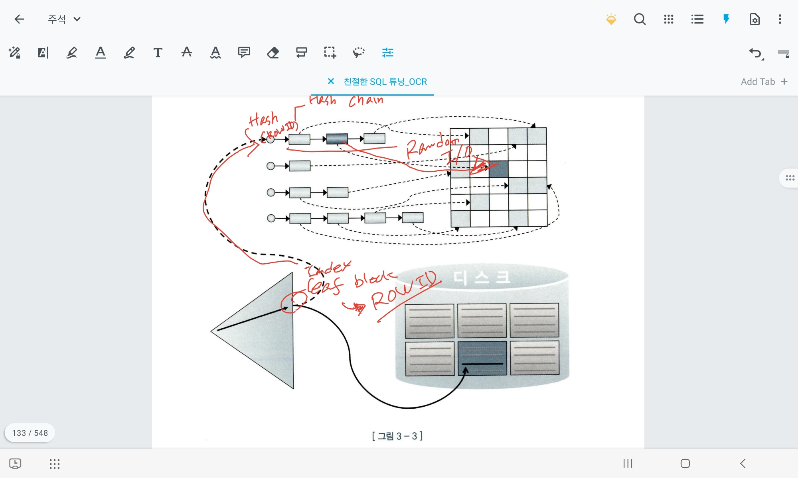

## 3.1 랜덤 I/O 최소화

### 3.1.1 테이블 랜덤 액세스

- 인덱스 리프 블록에서 얻은 ROWID를 통해, 테이블 데이터를 조회하는 과정

- ROWID는 DBA(Data block Access), 블록 번호, 데이터 파일 번호 등 저장된 데이터로 접근하는 경로를 포함한다.

- Hash알고리즘을 통해 메모리 버퍼의 해시체인에 접근하고, 찾는 정보가 있다면 버퍼에서 조회 / 없다면 데이터 파일 - 블록에 접근하여 물리적으로 데이터를 조회한다. 

### Table Random Access와 Single Block I/O의 차이

	RowID를 이용한 테이블 랜덤 액세스와 Single Block I/O는 밀접하게 관련되어 있지만, 동일한 개념은 아닙니다. 여기 두 용어에 대한 간단한 설명과 차이점이 있습니다:

	1. **RowID를 이용한 테이블 랜덤 액세스**:

		- RowID는 데이터베이스 내의 특정 행을 고유하게 식별하는 식별자입니다.

		- RowID를 이용한 랜덤 액세스는 쿼리 실행 시 특정 행을 직접 찾아가는 방식을 의미합니다. 이는 특히 인덱스 조회 후 해당 행의 데이터를 검색할 때 사용됩니다.

		- RowID를 사용하면 데이터베이스는 테이블의 물리적 저장 위치를 정확히 알 수 있으며, 이를 통해 특정 행에 대한 직접적이고 빠른 액세스가 가능합니다.

	1. **Single Block I/O**:

		- Single Block I/O는 데이터베이스가 디스크에서 단일 블록(데이터의 기본 저장 단위)을 읽거나 쓰는 작업을 의미합니다.

		- 이는 한 번의 I/O 작업으로 하나의 블록만을 처리할 때 발생하며, 효율적인 데이터 접근 방식으로 간주됩니다.

		- 인덱스 조회나 특정 작은 범위의 데이터를 요청할 때 Single Block I/O가 자주 발생합니다.

	**차이점**:

	- RowID를 이용한 랜덤 액세스는 특정 행을 찾아가는 방법을 설명하는 반면, Single Block I/O는 데이터베이스가 데이터 블록을 디스크에서 어떻게 읽고 쓰는지에 관한 더 낮은 수준의 작업을 설명합니다.

	- RowID를 이용해 특정 행에 접근할 때 Single Block I/O가 발생할 수 있습니다. 즉, RowID로 특정 행을 빠르게 찾아가면, 해당 행이 포함된 데이터 블록을 읽기 위해 Single Block I/O가 일어날 수 있습니다.

	두 개념은 데이터베이스 내에서 데이터를 효율적으로 접근하고 관리하는 방식과 관련이 있지만, 각각 다른 측면을 다룹니다. RowID는 데이터 위치를 식별하는 데 초점을 맞추고, Single Block I/O는 데이터 접근의 물리적 작업에 중점을 둡니다.

 

### 3.1.2 Index Clustering Factor

- 인덱스 내의 데이터가 물리적으로 얼마나 뭉쳐있는지를 나타내는 정도

- 클러스터링 팩터가 높으면 인덱스 탐색 효율이 좋다

 

### 3.1.3 인덱스 손익 분기점

- 10만건 ~ 100만건이 저장된 일반적인 테이블에서 손익분기점은 5~20% 정도. 조회 대상이 되는 레코드 비율이 더 높으면 Table Full Scan이 오히려 낫다.

- 단, 테이블에 저장된 레코드가 많으면 많을 수록 효율성은 낮아진다. 카디널리티가 낮아도 절대적인 블럭이 갯수가 많기 때문인데, 최근의 DB가 버퍼캐시에 수백만 개의 블럭을 저장한다고 해도 모든 테이블의 블록을 저장하는 것이기 때문에 대용량 테이블의 경우 인덱스 효율이 더 떨어지는 셈. 

