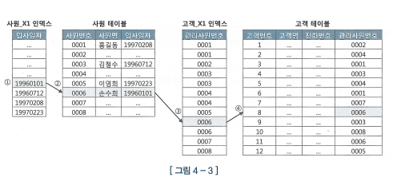

# 4. 조인 튜닝

\


### NL 조인

* 조인은 기본적으로 NL 조인
* NL조인은 인덱스를 이용한다. 그렇기에 선행 테이블의 조인 컬럼에 인덱가 안 걸려있으면 아주 개같이 느리다.
*

```sql
select e.사원, c.고객명, c.전화번호
from 사원 e, 고객 c
where e.입사일자 >= '19960101'
    and c.관리사원번호 = e.사원번호
```

```
대강 이런식이라면, 사원 테이블의 관리사원번호 컬럼엔 인덱스가 걸려있어야 한다는 뜻. 
```

* 또한 B 테이블의 사이즈가 크지 않다면 Table Full Scan을 수행할 수도 있다. 어차피 한 번 읽기 때문
*

```

```

*

```sql
select /*+ ordered use_nl(c) index(e) index(c) */
    e.사원번호, e.사원명, e.입사일자, 
    c.고객번호, c.고객명, c.전화번호, c.최종주문금액
from 사원 e, 고객 c
where c.관리사원번호 = e.사원번호
    and e.입사일자 >= '19960101'
    and e.부서코드 = 'Z123'
    and c.최종주문금액 >= 20000

* 사원_PK : 사원번호
* 사원_X1 : 입사일자
* 고객_PK : 고객번호
* 고객_X1 : 관리사원번호 
* 고객_X2 : 최종주문금액
```

\


* 이런 식이라면 실행순서는 다음과 같다.

1. 사원\_X1 인덱스를 기반으로 Index Range Scan
2. 인덱스 ROWID를 기반으로 얻어낸 데이터 중, 부서코드가 ‘Z123’인 레코드 필터링
3. 해당 레코드의 관리사원번호로 고객\_X1 Index Range Scan
4. 마찬가지로 ROWID를 기반으로 얻어낸 데이터 중, 고객 테이블에 접근해서 최종 주문 금액이 20000 이상인 레코드를 조회한다.

\


#### NL 조인 포인트


* 섣부르게 Hash 조인이나, Sort Merge 조인으로 변경하는 것은 권장되지 않는다.
* 가장 먼저 사원\_X1 인덱스에서 결정되는 데이터가 결국 데이터의 총량을 결정하기에, 이 단계에서 최적화가 우선시되어야 한다.
* 그 다음은 고객X1 인덱스에 액세스 할 때
* 그 다음은 고객,사원 테이블에서 필터링 할

\
\


#### 올바른 조인 메소드

* Onlin Trasactional Program에선 일차적으로 NL조인을 고려한다.
* NL 조인 튜닝 포인트에 따라 과도하게 병목이 발생하는 부분을 찾아낸다. 이후 최적화한다.
* 조인 순서를 변형해서 개선한다.
* 더 나은 인덱스가 있을지 파악한다.
* NL조인이 비효율적이라 판단되면 다른 조인 방식을 검토한다.

\


#### NL 조인의 특징

* 랜덤 액세스(Index 접근) 위주의 조인 방식 - 따라서 대용량 조인엔 별로
* 하나의 레코드씩 반복해서 진행하므로, 대용량 데이터인 경우에 따라 굉장히 빠르게 일부 쿼리에 대한 응답을 줄 수 있다. (하나씩 수행하기 때문에 작업이 모두 종료될 때까지 기다릴 필요 X)

\


#### NL 조인 확장 매커니즘

* 테이블 prefetch
  * 인덱스를 이용해 테이블에 액세스하다가, 디스크 I/O가 필요해지면 다음에 읽게될 블록까지 버퍼 캐시에 적재하는 기능
*   배치 IO

    * 디스크 IO를 미뤘다가, 일정 블록이 쌓이면 한번에 처리하는 기능
    * inner 쪽 인덱스만으로 조인하고, 테이블과의 조인은 나중에 일괄처리하는 매커니즘

    \


\


### Sort Merge 조인

*

\
