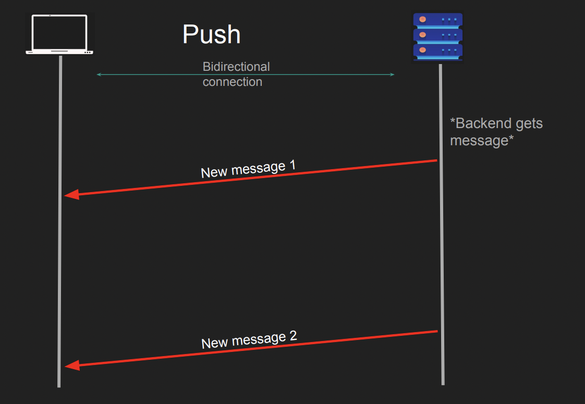
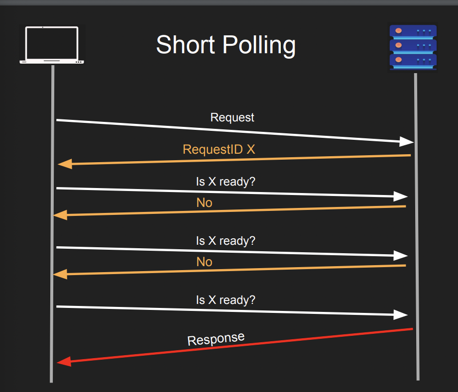
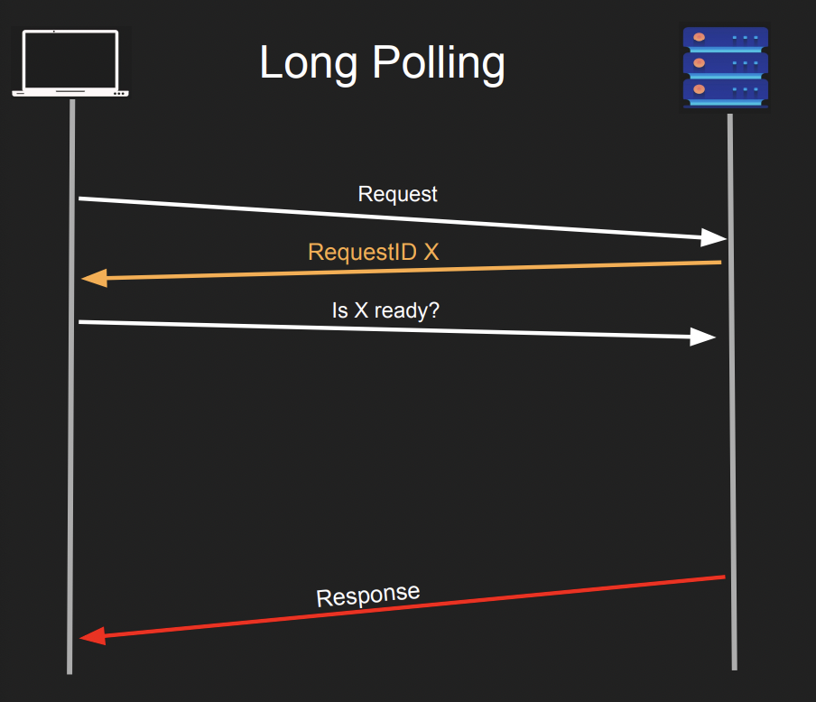
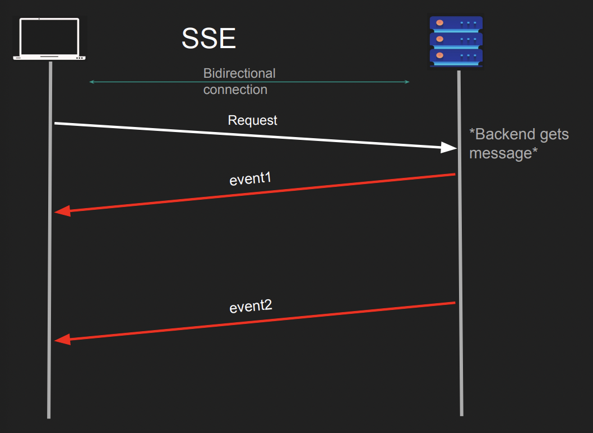
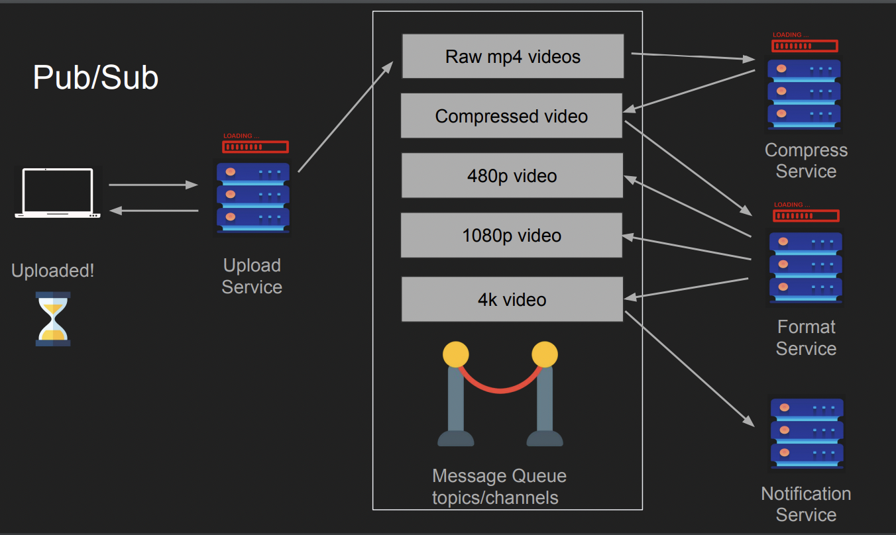

## 왜 요청은 비동기과 동기 처리로 나뉘는가

- 동기/ 비동기 호출은 딱히 클라이언트,서버 사이에서만 발생하는건 아니고, 운영체제 레벨에서부터 사용된다. 모든 쓰레드가 동기식이라면 운영체제는 지금보다 훨씬 느렸을 것이다.

- 오늘날 대부분의 클라이언트는 대부분 비동기적으로 동작한다.

- 백엔드 서버 내부적으로 비동기적 요청은 일종에 큐에 저장되고, 실행 이후 작업 ID를 저장해두고 있다가 주기적으로 완료 여부를 확인한다. 

- RDBMS에 비동기 커밋이라는 동작이 있다. 포스트그레스는 기본적으로 비동기적 커밋으로 동작하는데, 이 과정이 동기적으로 동작한다면 메모리 버퍼가 아닌 디스크 쓰기가 일어날 때 지연시간이 증가할 것이 자명하기 때문. 하지만 이러면 커밋 성공 응답이 반환된 다음 디스크에 쓰기 작업에 실패할 수도 있긴하다.

- 생각해보면 DB에 데이터를 삽입할 때도 모든 과정이 동기적이지 않다. 데이터베이스가 데이터 파일에 기록하는 것도 버퍼 캐시에 저장된 데이터를 한번에 밀어넣기 때문이다. 그럼에도 디비는 트랜잭션 로그에 이벤트가 성공적으로 기록되고 OS 캐시에 저장되면 사용자에게 성공 응답을 보낸다. 똑같은 디스크에 쓰기 작업 횟수가 많아지면 물리적으로 SSD가 금방 고장난다.

 

## 왜 Request - Response은 범용적으로 사용되는가

- 요청이란 무엇인가, 요청은 어디에서 시작되고 어디에서 끝나는가. 요청을 처리하는 것 역시 당연히 중요하다. 응답이 어디에서 시작하고 어디서 끝날까.

- 직렬화와 역직렬화애는 비용이 소요된다. XML보다 JSON이 많이 사용되는 이유 중 하나는 직렬화 비용 자체가 적기 때문, protocol buffer는 훨씬 더 빠르다.

- 요청 -응답 프로토콜은 Web, HTTP, DNS, SSH 등 다방면에서 이용된다. 

- 백엔드 엔지니어링에서 순서는 믿을 수 없는 존재다.

- Remote Procedure Call (RCP)는 고전적인 프로그램이 스타일이며, 기술적으로는 요청-응답이다. 메서드는 로컬 머신이 아니라 원격에 존재하고 이걸 호출하는 방식이다.

- SQL도 응답-요청 프로토콜이다.

- 즉, 응답-요청 프로토콜은 엄청나게 범용적이다. 단순하고 효율적이니까.

- 이 프로토콜은 주요한 특징이 있는데, 응답과 요청이 어떻게 시작하고 끝나는지 서버와 클라이언트 사이에 협의된 일정한 포맷이 존재한다는 것이다. (ex HTTP)

- 당연히 모든 시스템에서 동작하지는 않는다. 예를 들어 배치 작업 서버라면 요청과 응답 형태로 동작하지 않는다. 그냥 서버가 실행하지.

- 채팅 서버도 마찬가지다. 폴링으로 구성할 수 있지만 효과적일 이유는 없다.

- HTTP에선 헤더를 먼저 받고, 나머지를 받는다. 

 

## Push 패턴은 왜 사용되는가?

- 모든 경우에 요청-응답 패턴이 적합하진 않다. 요청 없이 동작해야하는 경우에 가장 적합하다.

- RabbitMQ애서 사용된다. RabbitMQ는 큐에 메시지에 입력되자 마자 컨슈머에 메시지를 푸시하기에 이런 모델로 동작한다. 

- 따라서 푸시 프로세스는 실시간으로 이뤄지며, 연결이 되어있다는 가정하에 클라이언트로 즉시 데이터를 밀어넣는다. 

- 단점도 있는데, 일단 클라이언트가  온라인일 경우에만 푸시 모델이 정상적으로 동작한다는 것이며, 서버는 클라이언트의 상황을 전혀 모르기 때문에 클라이언트의 부하가 과중한 상황에서도 메시지를 보낸다는 것

- 채팅 프로그램이 대표적인 Push 패턴 프로그램인데, N 개의 클라이언트가 서버에 연결되어있고 (클라이언트들 끼리는 연결되어 있지 않다.) 채팅창에 메시지를 전송하면 서버에서 다른 클라이언트들로 메시지를 Push 하기 때문

 

## Short Polling이란 무엇이며, 왜 사용되는가?

- 예를 들면 유튜브 동영상 업로드 같은 맥락이다. 업로드는 한 번의 request와 response로 이뤄지지 않고, 여러번 진행도를 확인할 수 있다. 즉, 한번 요청하고 시간이 지난 뒤 여러번 다시 확인하는 방식

- 클라이언트가 요청을 보내고 즉시 백엔드가 핸들을 생성하고 진행하는 방식. 클라이언트는 이 핸들을 확인하면서 진행도를 확인하고 완료 여부를 확인한다.

- 기술적으로 좁게 보면 폴링은 요청-응답 모델의 한 갈래다. 하지만 전체적으로는 여러 개로 분리된 하나의 리퀘스트가 된다. 큰 요청 안에 작은 요청 여러개가 포함되어 있는 형태로 첫 요청에서 request ID가 할당되고, 이후 클라이언트는 서버에 해당 request ID의 완료 여부를 확인한다.

- 구현 자체는 클라이언트, 서버 모두 쉬운 편이다. 실행 전체에 걸리는 시간이 길 때 고려할 수 있다. 다만 네트워크 트래픽이 일반적인 요청-응답 모델보다 많을 것이다. 강사는 수다스럽다고 표현한다. 결국 백엔드 리소스의 지출이 요청-응답 모델보다 증가한다.

 

## Long Polling이란 무엇이며, 왜 사용하는가, Short Polling과는 어떤 차이가 있는가?

- Polling과 동일하지만 작업이 완료되지 않는다면 딱히 아무런 작업도 하지 않는다. 짧은 폴링은 효과적이지만 너무 많은 네트워크 트래픽을 호출한다. 롱 폴링은 반대로 작업이 완료될 때까지 아무런 응답도 보내지 않다가 작업이 완료되고 해당 요청에 대한 응답을 전송한다. Kafka의 컨슈머가 토픽을 구독하는 방식이다. 

- 오히려 Push 모델과의 차이점을 생각해볼 수 있다. 푸시 모델의 대표적 단점 중 하나는 서버가 클라이언트의 상태에 대해 알 수 없다는 점이었다. 반면 Long polling 모델의 경우 한번의 네트워크 콜이 더 발생하긴하지만 네트워크 제어권이 클라이언트에 남아있기 때문에 더 안정적으로 트래픽을 제어할 수 있다는 장점이 생긴다. 이 점이 Kafka와 RabbitMQ의 차이점이다.

- 단점으로는 실시간이 아니라는 점인데, 클라이언트 요청에 따라 메시지를 전달하는데 이 부분에서 클라이언트의 상태가 좋지 않다면 자연스럽게 메시지 전달이 지연될 것이라는 점이다.

 

## Server Sent Events, SSE 패턴은 무엇이며, 사용하는가

- HTTP에서만 동작하는 프로토콜. HTTP 를 스트리밍 서버 모델로 발전시킨 형태이다. 한번의 요청이 있고, 아주 오랫동안 응답하는 형태로 클라이언트가 스트리밍의 청크를 이해하고 이를 파싱하는 작업이 필요하다.

- 소켓 방식이랑 어떤 차이가 있지…?

	- 소켓 방식은 연걸 이후 지속적으로 데이터를 주고 받을 수 있다는 점이 있지만, SSE는 한번의 요청과 다수의 지속적인 응답이 발생한다. 즉, 근본적으로 Request-Response 모델이며 한번의 요청만 받는다는 점이 소켓 방식과의 차이점이 될 것이다.

- Push 방식과는 어떤 차이가 있는가?

	- Push 방식에선 Server-client 간 연결이 생성된 이후, Server의 결정하에 단방향으로 메시지가 전달된다. 반면, SSE 방식은 최소한 1회 이상 client가 server에 Request를 전송한다. 따라서 클라이언트가 모든 응답을 처리할 거란 보장은 없으나, 최초 요청시에는 원활한 상태라는 것을 의미한다.
즉, 일단 클라이언트가 요청해야 메시지를 전송한다는 점에서 Push 방식과 차이점이 발생한다.

- 웹 소켓 서버가 필요하지 않고, 거의 모든 HTTP 서버가 이런 방식을 지원한다.

- 각 응답들은 끝나지 않지만 작은 단위로 나뉘기 때문에 경계에 대한 바이트는 항상 같이 전달된다.

- 실시간적으로 동작하지만, 클라이언트가 항상 온라인이어야 하며, 메시지를 핸들링하지 못할 수도 있다. 서버가 클라이언트의 상황을 알지 못하니까. 또한 HTTP 1.1에서 SSE에 대한 제한이 좀 있다. 크롬에서 도메인에 연결되었을 때 해당 도메인에 대해 총 6개의 TCP 연결만 허용한다. 따라서 도메인이 연결되어있고 6개의 SSE 요청이 진행중이라면 다른 작업들은 보류될 것이다. 따라서 이 점을 방지하기 위한 멀티플렉싱이나 HTTP/2의 사용이 요구된다.

 

## PUB/SUB 모델은 메시지 큐 외에 어떤 부분에서 사용되는가. 왜 사용되는가

- 클라이언트끼리의 상호 연결이 아키텍쳐를 너무 복잡하게 만드는 문제를 해결하기 위해 구성되었다. 펍섭 모델은 중앙에 브로커를 둬서 클라이언트와 다른 서버 간의 연결을 약화시킨다. N개의 서버가 모두 상호 연결을 유지하고 있는 상황을 생각하면 끔찍하다.

- 단순화하자면 서비스를 수행하는 과정에서 수신자가 여럿이 생기는 경우에 서비스들 간의 결합이 강해지기 때문에 펍섭 모델을 적용했을 때 이점이 생긴다. 

	- `A Database, B Database, C Redis, D Nosql` 등 수신자가 여럿 생길 때, 또한 이러한 서비스가 N개로 확장될 때 유용한 모델이 된다.

- 장점이라면 여러 수신자에 대해 확장이 쉬워지며, 여러 수신자에 대해 결합성을 낮춘다. 클라이언트가 온라인이 아니더라도 사용이 가능하다. 일단 퍼블리싱하면 되니까.

- 단점은 소비자나 구독자가 실제로 메시지를 받았는지 확인하는게 힘들다. 최소한 1회 이상 메시지 수신을 보장하는 것을 목표로 하는 경우가 많다는 점과 다수의 클라이언트가 폴링을 수행하는 경우 네트워크 트래픽이 증가하는 점이다. 또한 강의에서는 언급되지 않았지만, 데이터를 중계하는 브로커도 서버기 때문에 문제가 발생할 수 있고, 이 때 단일 장애 지점이 될 수 있다. 항상 이 부분이 Pub/Sub 모델의 치명적인 단점이라 생각한다.

 

## Multiplexing VS Demultiplexing

- 멀티플렉싱은 N개의 커넥션을 하나로 연결하여 백엔드로 전달하는 일

- 3개의 다른 연결 혹은 요청으로 이뤄진 하나의 데이터를 다시 N개의 클라이언트에게 나눠서 보내는 일이 역멀티플레싱이다. 

- 왜 이런 일들을 수행하는 걸까. HTTP 1.1과 2의 차이에서 찾을 수 있다. SSE 섹션에서 다뤘던 것처럼 크롬 브라우저는 최대 6개의 TCP 연결만을 허용한다. 즉, 멀티플렉싱되지 않은 요청은 최대 6개가 한계지만, 멀티플렉싱을 거친다는 가정하에 그 이상으로 증가할 수 있다. 아니 근데 그럼 그냥 크롬이 최대 허용수를 증가시키면 되지 않을까 

- HTTP1.1에선 요청들이 수행될 때 TCP 연결이 6개로 제한되기 때문에 이후의 작업들은 Block처리된다. 이건 서버의 핸들링이 아니라 클라이언트의 제한 사항이기때문에 서버는 알지도 못한다. 

### Connection Pooling

- 여러개의 서버 간 연결을 효율적으로 관리하는 기술. N개의 연결을 준비된 상태로 대기 시켜놓고 필요시 연결을 제공한다.

 

## Stateless와 Stateful에서 발생하는 각각의 사이드 이펙트는 무엇이있는가

- 둘 간의 차이는 결국 **서버가 클라이언트의 상태를 메모리에 저장하고 있는가** 여부로 나뉜다. 또한 서버가 그 정보에 의존하는가의 여부다.

- 무상태는 클라이언트의 상태를 메모리에 저장하지 않고, 모든 요청마다 클라이언트의 상태(데이터)를 전송한다.

- 아주 간단하게 백엔드 어플리케이션의 상태/무상태 여부를 확인하기 위해선 서버를 내렸다가 재시작했을 때 아무런 차이 없이 다시 시작할 수 있는가에 달려있다.

- 예를 들어 TCP 프로토콜은 완벽하게 stateful하다. 다시 연결하더라도 이전의 커넥션과 동일하지는 않기 때문에. UDP는 아무 상태도 저장하지 않기 때문에 Stateless하다.

- 단, 프로토콜 간에 무상태 프로토콜 위에 상태 프로토콜을 만들 수 있고, 그 반대도 가능하다. ~~어렵네~~. HTTP는 TCP 위에서 구현되었지만 무상태하다. 

- 완벽한 무상태 시스템은 흔치 않다. 생각해보자면 완전히 모든 것을 입력에 의존하는 백엔드 서비스가 아니면 좀 힘들다. 적어도 DB 정도는 다들 의존하지 않는가. 다만 강사도 이 부분에 있어서 무상태 아키텍쳐를 완벽히 정의하는데는 난처함을 보였다. 아직 논란의 여지가 많은 이론인듯하다. 

- JWT는 무상태를 유지하기 위해 사용하고 사용도 간단한 편이지만, 그렇게 안전하지 않다. 무상태기 때문에 JWT 토큰 안에 필요한 모든 것들이 포함되어 있기 때문에 토큰을 탈취되었을 때 곤란함이 크다.

 

