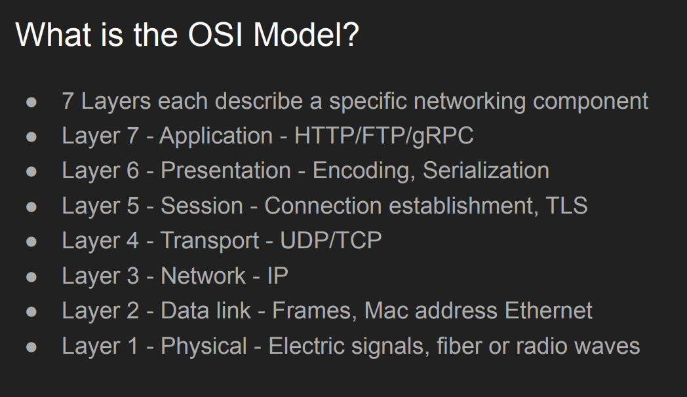
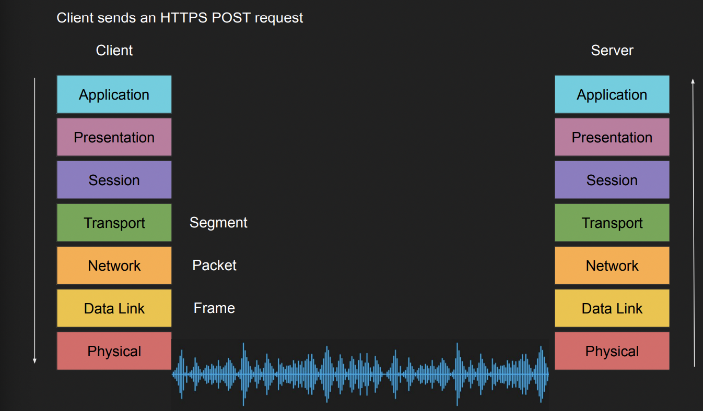
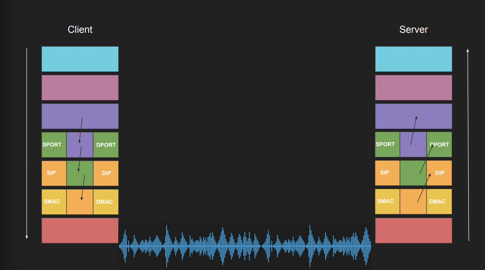

## OSI 모델은 왜 만들어졌는가?

- 질문에 답하기 위해선 프로토콜이라는 것이 왜 만들어졌는가? 하는 질문에서 시작해야 한다.

- 프로토콜은 서로 다른 애플리케이션이나 시스템 간의 통신을 위해 고안되었다. 즉, 일관화된 전송 방식을 채택하여 N개의 시스템이 상호작용하기 위해 만들어졌다. 다만 이런 프로토콜들에 대한 명확한 규격이 없을 때 발생하는 혼란(`어떤 서비스는 Binary로 통신하고, 어떤 서비스는 Text로 통신하고, 누군가는 암호화를 거치는 등의 혼잡함`)을 잠재우기 위해 OSI 모델이라는 7개의 계층으로 이뤄진 표준 모델이 **협의에 걸쳐 만들어졌다.**

 

## OSI 모델은 어떻게 생겼는가?

- OSI 모델은 프로토콜 전송 모델이기 때문에 Client, Server가 어떤 계층에서 요청을 보내는지에 따라 수신자의 계층도 달라진다. 일반적으로 Backend 어플리케이션이 위치하는 계층은 7계층, 즉 꼭대기이기 때문에 중간 주요 계층에 대해 이해하는게 좋을 것 같다.

- Application 계층에서 전송된 요청은 Presentation 계층에서 Byte String 형태로 직렬화된다. 

- Session 계층에선 Client-Server간 연결 상태를 확인하며 (UDP 요청이라면 Stateless하기 때문에 연결과 5계층의 역할이 없다.) 

- Transport 계층에서 출발 Port와 도착Port를 추가하여 Segment 단위로 데이터를 가공하고

- Network 계층에서 출발 IP와 도착 IP를 추가하여 Packet 단위로 가공한다.

- Data Link계층에서 출발/도착 MAC주소를 포함하여 Frame 단위로 가공한다.

- 마지막 물리 계층에서 Frame을 0,1로 이뤄진 전기적 신호로 변환하고 이를 광섬유, Wi-Fi, Radio wave등으로 변환하여 전송한다. 

- 데이터의 수신은 정확히 반대의 순서로 이뤄진다.

- OSI 7계층을 지나며 데이터는 위와 같이 변모한다. 직관적으로 생각했을 때 낮은 계층의 프로토콜일 수록 더 빠르게 통신할 수 있으리라 추측할 수 있다. 

- 예를 들어 방화벽은 3,4계층과 7계층에서 동작하는데 4 계층에서 작동하는 방화벽은 IP와 PORT를 기반으로 동작하고, 3계층에서 동작하는 방화벽은 IP를 기반으로 동작한다. 때문에 각 방화벽은 굳이 상위 계층이나 하위 계층에서 동작할 이유가 없다.

- 같은 이유로 7계층에서 동작하는 어플리케이션 방화벽은 역직렬화된 데이터(`Virus`), 보안 연결(`SSL, TLS`), 고급 보안 정책 등을 기준으로 악의적인 동작을 판별하는 것을 유추할 수 있으며, 당연히 더 오래 걸릴 것이라는 것을 추론할 수 있다. (그게 milli, nano Second 단위라고 해도)

