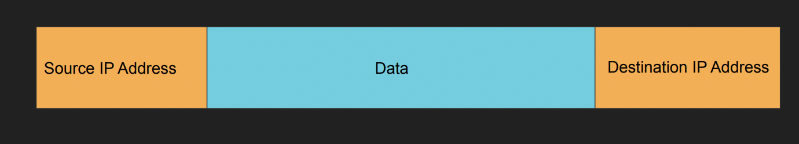
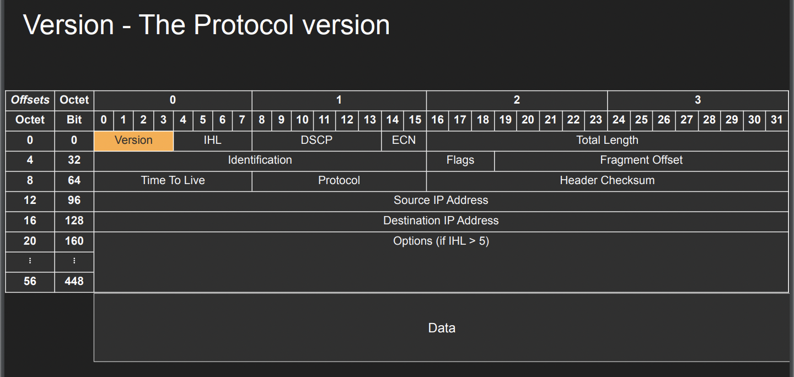

 

## IP 패킷은 무엇으로 정의되는가

- IP 패킷은 기본적으로 헤더와 데이터 섹션으로 나뉜다. 헤더는 20byte (옵션에 따라 최대 60byte까지 증가 가능하다.)를 차지한다. 각 행을 4byte를 차지하고, 총 5개 행이 헤더로 사용되며 나머지는 데이터 섹션이 된다.

- 모든 요청에 20byte하나를 보내는 것은 꽤 큰 비용이 되기 때문에 이를 압축하는 방식이 또한 중요하다. IP 패킷의 크기는 총 65,000 바이트 즉 64킬로 바이트 정도가 된다. 이는 1행의 Total Length를 통해서도 알 수 있는데, Total length는 총 16개의 bit를 차지한다. 하나의 bit는 byte 길이를 의미하기 때문에 헤더와 데이터섹션을 포함한 최대 길이는 `1024*64 = 64KB`가 되는 셈

- 기본적으로 IP패킷은 단일 프레임 크기에 적합하게 맞아야 한다. 그렇지 않으면 일단 쪼개야 하니까. 분할되는 조각들은 Fragment 로 나뉘고 이는 헤더에 포함된 Offset과 ID를 통해 조합할 수 있다.

---

## IP 패킷 헤더 설명

- Version: IP Protocol이 어느 버전인지 나타내기 위한 블록. 4bit 크기이므로 총 15까지 표현할 수 있지만 IP 체계는 4버전 아니면 6버전만 사용한다.

- IHL: Internet Header Length의 약자로 IP 헤더의 기본 길이인 20비트보다 얼마나 더 큰 헤더를 갖는지를 의미한다.

- Total Lenght: IP패킷의 총 길이로, 16bit로 표현되며 하나의 비트 당 1byte를 의미한다. 즉 IP패킷의 최대 길이는 총 64KB가 된다.

- DSCP: Differentiated Service Code Point의 약어로, 패킷이 DiffServ 모델에 따라 받게될 서비스 품질을 의미하며 트래픽에서 가지는 중요도라고 볼 수 있다. 

- Indentification: 단편화된 IP 패킷의 ID

- flags: 3비트로 구성된 필드로 0비트는 사용되지 않고, 1비트는 분할 여부를 나타내며, 2비트는 이 다음에 더 분할된 패킷이 있는지를 나타낸다. 2비트가 0이라면 이후 추가적인 분할 패킷이 없다는 이야기가 된다.

- Flagment Offset: 분할된 패킷들 가운데 해당 패킷이 몇 번째 패킷인지를 나타낸다. 

- Time to alive: 패킷의 최대 수명으로 라우터를 건널 때마다 1씩 감소한다.

- Protocol: IP 패킷이 어느 프로토콜을 통해 생성되었는지를 나타낸다. 이는 총 255개의 프로토콜을 나타낼 수 있으며, TCP, UDP 외의 IGMP, ICMP, MPLS 등 다양한 프로토콜을 나타내고, 확장성을 위해 3~4비트가 아닌 8비트를 할당하였다.

---

## 결론적으로 IP Packet이라는 단위는 왜 중요한가.

- 가장 우선적으로 OSI Layer 3계층에 위치해있기 때문에 어지간한 통신 프로토콜(적어도 HTTP, HTTPS, TCP, UDP)은 IP Packet으로의 변환과정을 거친다. 즉, 통신 프로토콜에서 사람이 이해하기 간편한 동시에 가장 범용적인 데이터 형식이라고 할 수 있기 때문

- 또한 IP Packet에 대해 어느정도 이해하게 된다면 다양한 프로토콜들이 Layer 4 이상에서 어떤 식으로 추상화되는지만 이해하면 이해할 수 있는 프로토콜의 범위가 방대해진다는 점에서 IP Packet의 구조와 쓰임을 이해하는 것은 중요하다. 

