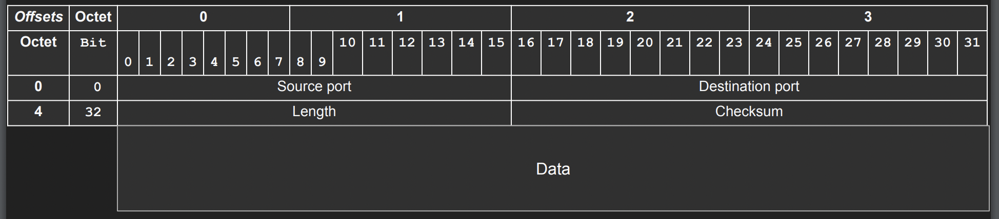

 

## UDP가 갖는 특징은 무엇인가?

- OSI 4Layer에서 동작한다. 즉, IP+Port 쌍으로 통신 주체를 결정한다.

- 8Byte의 경량 헤더를 갖는다. 

- 비연결적 프로토콜이다. Stateless하며, 통신을 위한 인증 과정이 없고 이로 인해 보안적 측면에선 좋지 않으나 반복적인 Connection HandShake가 없으므로 지연시간에서 이점을 갖는다.

- 흐름 제어, 혼잡성 제어가 없다. 즉, 수신자의 상태를 전혀 알지 못한다.

- 메시지의 순서도 보장하지 않는다.

- 헤더에 체크섬이 포함되어 있어 아주 경량의 손실 확인 기능은 제공한다. 단, 고수준 프로토콜에 비하지는 못하며 통신 과정에서 변조되는 정도만 확인이 가능하다.

- 100% 일관성을 포기하더라도 빠르게 데이터를 보내기에 적합하다.

 

---

## UDP 헤더는 어떻게 생겼는가? 

- 먼저 살펴봤던 IP Packet 에 비해 매우 간결하고, 작은 헤더를 갖는다. 단순히 출발지의 port와 도착지의 port, 메시지 총 길이와 Checksum을 갖는다. 

- 흐름제어, 혼잡제어 등은 제공하지 않지만 통신 과정 중에 메시지 변형을 확인하기 위해 Checksum을 제공한다. 이는 IP와 UDP 헤더를 기반으로 생성되며 빠르게 메시지 변형 여부를 확인한다.

 

---

## UDP는 잘 알려진 결점들이 있다 그럼에도 쓰이는 이유는 무엇인가?

- TCP, HTTP 프로토콜에서 반드시 이뤄져야 하는 규격이나 규칙이 정의되어 있지 않다. 즉, 선이 하나도 없는 도화지같은 상태로 UDP 위에서 별도의 프로토콜을 정의할 수 있다.

- HTTP, TCP 같은 프로토콜에 비해 빠르다. 즉, UDP의 대표적인 단점들을 극복하거나 혹은 감내할 수 있는 서비스라면 UDP를 사용하는 것이 장점이 된다.

	- 대표적으로 동영상 스트리밍, VPN, DNS 같은 서비스가 UDP 프로토콜을 사용한다. 특히, 동영상 스트리밍이 UDP를 사용하는 대표 사례로 자주 등장하는데, 이유는 전송 중 일부 데이터 프레임이 손상되더라도 복구할 수 있기 때문이다. 

- 프로토콜에서 자체적으로 재전송이나, 패킷 손실에 대한 복구처리를 지원하지 않더라도 애플리케이션 레벨에서 이에 대한 대책이나 방지책을 만들 수 있다.

 

 

