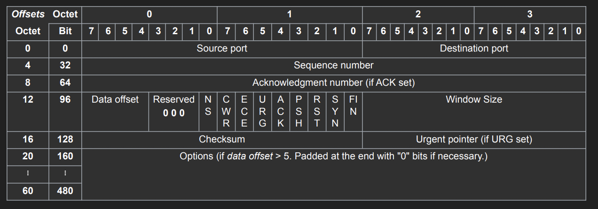
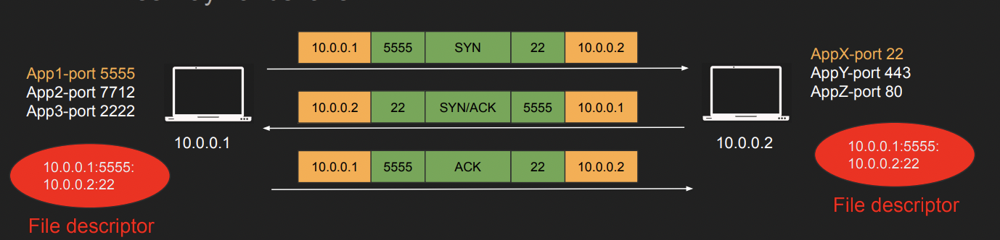
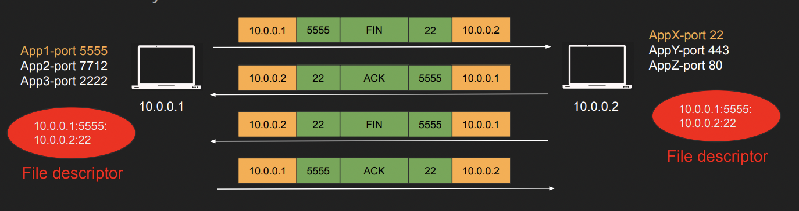
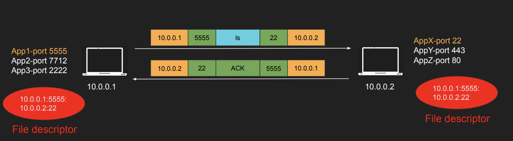

 

## TCP가 갖는 주요한 특징은 무엇인가?

- TCP에서 데이터는 스트리밍되는 형식이고 세그먼트 단위로 데이터를 분할하여 전송한다.

- TCP는 전송을 제어하는 부분에서 의미가 있다. 

- Server - Client 간의 상태가 저장되는 Stateful 모델이다.

- 20Byte의 헤더 사이즈를 갖고 최대 60byte까지 증가 가능하다. 즉, 최악의 경우에 TCP/IP 전송에서 헤더만으로 120바이트까지 증가 가능하다.

- TCP 세그먼트는 각자의 순서를 포함하고 있다. 즉, IP Packet으로 변환되는 과정에서 세그먼트들은 각자의 순서에 따라 재정렬되고 Packet으로 변환되어 전송된다. 

- 잃어버린 세그먼트는 재전송된다.

- 메시지의 전송은 반드시 연결이 살아있는 상태에서만 진헹된다.

- 최대 세그먼트 사이즈는 MTU가 얼마만큼이냐에 따라 달라지며,  최대 MTU 크기는 1500byte, 여기서 tCP, IP의 헤더 사이즈 (각 20byte)를 빼면 1460byte가 나온다. 즉, Single TCP segment의 크기는 1460byte가 된다.

 

## TCP의 헤더는 어떻게 생겼는가?

- UDP 헤더보다 확실히 더 큰 사이즈를 차지하며, Sequence number는 순서를 정렬하는데 사용하고, Acknowledment number는 수신을 확인하기 위해 사용한다. 

- Window size는 클라이언트가 처리할 수 있는 데이터의 양을 표현하기 위해 사용한다.

- SYN, ACK 플래그는 3-Handshake를 위해 사용하고, FIN은 연결을 종료하기 위해, RST는 연결을 재시작하기 위해 사용한다.

 

## TCP의 장점은 무엇인가?

- 메시지의 수신 여부를 확인한다. 이 과정은 client의 ACK 요청이 반환되는 것으로 보장할 수 있다. 해당 응답이 누락된 경우 메시지가 정상적으로 전송되지 않은 것으로 판단해 일정 시간이 경과하면 동일한 세그먼트를 다시 전송한다.

- 메시지의 순서를 보장하고, 흐름과 트래픽을 제어할 수 있다.

- TCP는 기본적으로 Stateful Protocol이기 때문에 메시지 송수신에 반드시 연결이 요구되며, 연결되지 않은 클라이언트로부터 수신된 메시지는 처리하지 않는다. 즉, 일단 메시지를 수신했다면 연결을 맺은 대상으로부터 수신되었음을 보장한다.

 

## TCP Connection의 과정은 어떻게 수행되는가?

- 연결을 생성하기 위한 과정은 3 HandShake로 수행된다. 간단하게는 클라이언트가 서버에 SYN을, 서버는 답장으로 ACK/SYN 요청을, 클라이언트는 마지막으로 ACK 신호를 보낸다. 

	

	- 연결이 완료되면 각 서버는 연결의 상태, IP, Port를 Hash처리하여 메모리에 를 저장한다. 메시지가 수신되면 저장된 연결 대상에서 발송된 것인지 확인해야하니까

- 연결을 해제하기 위한 절차는 4-Handshake로 수행된다. 클라이언트와 서버가 각각 FIN 요청과, ACK 응답을 송신하면 연결이 해제된다. 

	

 

## TCP 프로토콜의 메시지 송신은 어떻게 수행되는가?

- UDP와 달리 수신 이후 전송자에게 ACK 응답을 돌려준다. 수신을 확인할 수 있지만 왕복 시간이 소요된다는 단점이 있다.

- 이 ACK응답을 받기 이전에 송신자는 다른 메시지를 전송할 수도 있지만 갯수엔 제한이 있다. 

 

