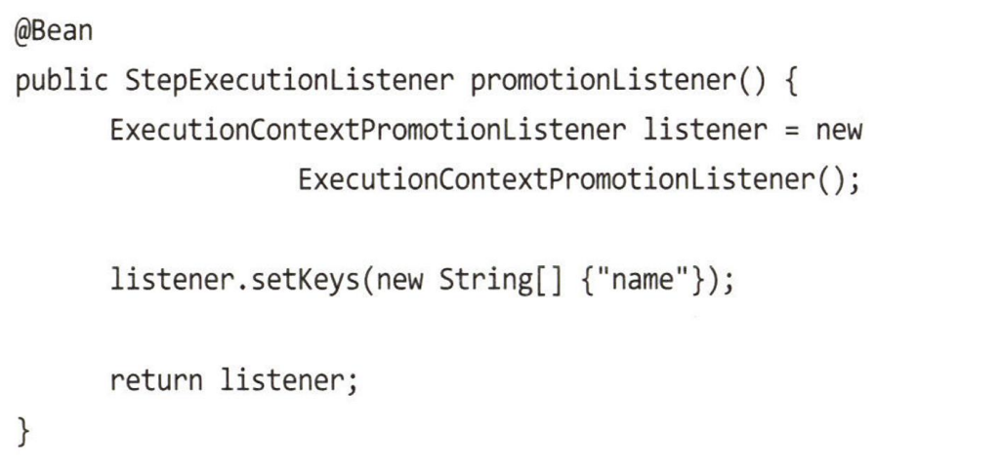
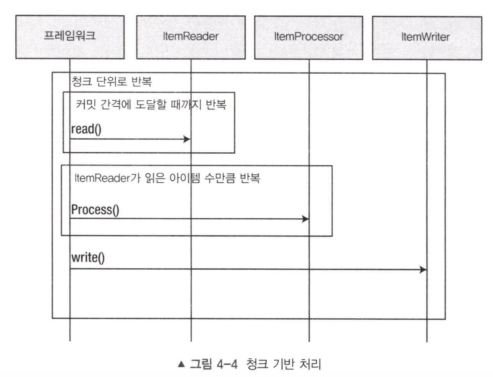

[//]: # (table_of_contents is not supported)

# 잡

**처음부터 끝까지 독립적으로 실행할 수 있는 고유하며 순서가 지정된 여러 스텝의 목록 **

 

## 잡 생명주기

1. `JobRunner`: JobName과 파라미터를 전달받아 잡을 실행시키는 역할. 스프링 배치에선 CLI로 실행하는 `CommandLineJobRunner`와 쿼츠나 JMX후크 같은 스케줄러를 통해 실행가능한 `JobRegistryBackgroundJobRunner` 가 있다. 이와 별개로 스프링 부트에선 `**JobLauncherCommandLineRunner**`라는 `CommandLineRunner` 구현체를 제공한다. 얘가 기동 시 어플리케이션 컨텍스트에 등록된 모든 Job 타입의 빈을 실행한다.

	1. 사용자가 잡 러너를 사용하긴 하지만 스프링 배치의 표준 모듈은 아니다. 실은 잡 러너들은 JobLauncher의 구현체고, 잡 러너가 표준 모듈이 아닌 이유는 시나리오에 따라 서로 다른 구현체가 필요하기 때문에 이걸 인터페이스화 하기 어렵기 때문

1. `JobInstance`: 잡 러너를 통해 잡이 실행되면 JobInstance가 생성된다. 2장에서 밝혔듯 동일한 잡 네임+ 동일한 파라미터 조합으로는 생성되지 않는다. 성공적으로 완료된 JobExecution이 있다면 완료된 것으로 간주되고 다시 실행되지 않는다.

	1. JobInstance의 상태는 `BATCH_JOB_INSTANCE` 테이블에 저장/조회된다. Job의 유일성을 식별할 때는 `BATCH_JOB_INSTANCE` 테이블과 `BATCH_JOB_EXECUTION_PARAMS` 테이블을 참조한다. 특히 `BATCH_JOB_INSTANCE.JOB_KEY`는 잡 네임과 파라미터의 해시 값으로 구성된다.

1. `JobExecution`: 잡 실행의 실제 시도 자체를 의미한다. 하나의 잡 인스턴스에 여러 execution이 포함될 수 있다. 실행할 때마다 `BATCH_JOB_EXECUTION` 테이블에 레코드가 저장되고, `BATCH_JOB_EXECUTION_CONTEXT` 테이블에 잡의 상태가 저장된다. 만약 실패한 잡이 있다면 이 정보를 통해 올바른 지점에서부터 다시 잡을 시도한다. 

 

## 잡 파라미터

- JobInstance가 동일한 잡 네임과 파라미터로 식별되므로 동일한 JOB_KEY가 중복되면 스프링은 `JobInstanceAlreadyCompleteException`을 반환한다.

- JobRunner마다 파라미터를 전달하는 방식은 다양하다. 스프링 부트에선 기본적으로 JobLauncherCommandLineRunner를 사용하므로 해당 러너를 기준으로 설명하자면 키/밸류 형식으로 전달되는게 전부다. `java -jar demo.jar name=Michael `같은 방식.

	- 해당 방식으로 값을 전달하면, JobParameters 객체가 전달되는데 이는 사실 Map<String, JobParameter> 객체의 래퍼일뿐이다. 스프링 배치는 파라미터의 타입을 전환하는 기능을 제공하고, 필요시 키 뒤에 (데이터 유형) 형식으로 타입을 명시할 수도 있다.

- 잡에 전달한 파라미터를 확인하기 위해선 JobRepository의 BATCH_JOB_EXECUTION_PARAMS 테이블에서 확인 가능하다. 타입과 keyName 등이 저장된다.

- 경우에 따라 특정 필드는 잡의 유일성을 검증하는데 사용되지 않도록 설정할 수도 있다. 예를 들어 잡 수행시간은 거의 늘 변하는 필드인데, 이런 경우 식별에 사용하지 않도록 키 앞에 `-` 를 붙이는 방식으로 제외할 수 있다.

- 커스텀 스텝 스코프와 잡 스코프를 사용하면 Late Binding 기능을 쉽게 사용할 수 있다. 예를 들어 스프링을 구동하는 시점엔 빈이 정의되지 않다가 잡의 실행범위에 들어가는 시점에 잡 파라미터를 주입할 수 있다. 솔직히 이해 못했는데 넘어가야할 듯싶다. 빈 정의 시점에서 바인딩 되지 않은 파라미터를 실행시 동적으로 주입할 수 있다는 점만 알고 넘어가면 될듯

 

## 잡 파라미터 유효성 검증

- `JobParametersValidator` 인터페이스 구현체를 통해 잡의 파라미터를 검증할 수 있다. 해당 인터페이스는 `validate(Jobparameters parameters)` 함수를 포함하고, `JobParametersInvalidException` 예외를 발생 시킬 수 있게 구성되어 있다. 반환값이 없는 일반적인 유효성 검증 함수로 볼 수 있음

- `DefaultJobParametersValidator`를 통해 필수값과 선택값의 검증을 수행할 수도 있다. 해당 클래스는 필드로 `requiredKeys`와 `optionalKeys` 필드를 갖는다. 둘 다 스트링 배열 필드이고, 이름에서 알 수 있듯 필수값 목록과 선택값 목록을 전달받아 null check을 수행한다. 해당 필드에 **배열로 포함되지 않은 필드가 전달되면 유효성 검증에 실패**한다.

- 더 구체적인 유효성 검증이 필요하다면 잡에서 해당 유효성 검증기를 사용하도록 직접 구성해야하는데, 기본적으로 유효성 검증기는 하나만 사용이 가능하기에 여러 검증기를 혼합해서 사용하려면 `CompositeJobParametersValidator`를 빈으로 등록하여 사용할 수 있다. 해당 클래스에선 validators 필드를 갖는데, 해당 필드에 N개의 validator를 등록하여 동작하게 하는 방식 

 

## 잡 파라미터 자동 증가

- 잡의 파라미터는 중복하여 사용할 수 없기에 특정 파라미터를 중복해서 사용하려면 자동적으로 증가하는 특정 필드를 혼용하는 것이 가장 쉬운 방식이 된다. 사용은 간단한데 Job을 정의하는 시점에 빌더를 통해
`new RunIdIncrementer()`를 `incrementer` 필드에 포함시키는 방식으로 사용이 가능하다. 이 때 `validator`에서 걸릴 수 있으므로 `run.id` 라는 필드에 대해 별도의 처리가 필요 할 수 있다. 

- 구성에따라 Long 타입으로 점진적 증가하는 것 말고, 타임 스탬프를 찍어버릴 수도 있다.

- 이런 경우엔 JobParametersIncrementer 인터페이스를 상속해서 증분 구현체를 제작한 다음 사용할 수 있다. 논리적인 문제가 없다면 뭐든 되는셈.

 

## 잡 리스터 적용하기

### 잡 실행 관련

- 잡의 실행과 관련 있다면 `JobExecutionListener` 구현체를 를 사용할 수 있다. 해당 인터페이스는 `beforeJob()`, `afterJob()`를 포함하고 있음. 네이밍 명확해서 너무 좋다.

- 주요 사용례는 알림, 초기화, 정리 등…

- afterJob()은 딱히 잡이 완료되었는지 여부에 상관없이 잡이 **종료**되면 수행한다. 필요하다면 리스터에 파라미터로 전달된 `jobExecution`에서 `jobInstance`를 꺼내고, 이를 통해 잡의 상태를 조회하여 분기처리 할 수 있다.

- 혹은 `JobExecutionListener`를 구현하지 않고, 일반적인 클래스에` @BeforeJob, @AfterJob` 어노테이션을 달아서 사용할 수도 있다. 단 이 경우 `JobListenerFactoryBean`을 통해 래핑 과정을 거쳐야만 리스너로 등록할 수 있다. 잘 모르겠지만, 해당 클래스를 통해 `JobExecutionListener` 구현체로 래핑하는듯

- 등록은 언제나처럼 잡 빌더에서 `listener`에 구현체를 등록하는 방식. 스프링 배치는 커스텀한 로직을 구현하는데 있어서 사용성이 되게 좋은 것 같다.

 

## ExecutionContext

- 잡 상태는 JobExecution의 ExecutionContext에 저장된다. 스텝도 마찬가지로 StepExecution의 ExecutionContext를 가진다. 즉, 특정 상태 데이터가 적절한 바운더리 내에서 저장되고 공유되는 셈이다.

	

- 때문에 ExecutionContext에서 데이터를 보려면 먼저 어떤 Execution에서 데이터를 뽑아올지를 정하고 접근해야한다. 잡 내에서 전역적인 필드로만 볼 수 없는 셈.

	

- 특정한 상황에서 스텝의 데이터를 Job 내에서 전역적으로 공유해야 할 수도 있는데 이런 작업은 `ExecutionContextPromotionListener`가 담당한다. ~~이게 클래스 이름이여 문학작품이여~~

	

- 해당 빈에선 Step의 name 를 Job의 ExecutionContext에 등록한다.

 

## ExecutionContext 저장

- 스프링 배치는 잡이 처리되는 동안 각 청크를 커밋하면서 잡과 스텝의 상태를 저장한다. 정확히는 잡과 스텝의 현재 `executionContext`를 DB의 `BATCH_JOB_EXECUTION_CONTEXT`에 저장한다.

- 해당 테이블 레코드는 ID를 제외한 컬럼들에 대해 불변성을 보장하지 않는다. 즉 잡과 스텝이 진행되면서 상태가 변경된다.

 

# 스텝

**스텝은 잡의 구성을 담당하는 독립적인 작업 단위이다. 각 스텝은 서로 독립적이고, 자체적인 입력기, 처리기, 출력기를 갖는다. 스프링 배치에서 스텝은 의도적으로 상호간섭이 없이 설계되었다.**

 

## 태스클릿, 청크 기반 처리 모델

### 태스클릿 처리 모델

- `Tasklet` 모델은 `Tasklet` 인터페이스를 사용하여 `Tasklet.execute` 메서드가 `RepeatStatus.FINISHED`를 반환할 때까지 트랜잭션 범위 내에서 반복적으로 실행되는 코드 블록을 설계한다.

- 태스클릿 스텝을 구성하는 방식은 크게 두 가지로, `MethodInvokingTaskletAdapter`를 사용하여 사용자 코드를 태스클릿 스텝으로 정의하던가, `Tasklet` 인터페이스를 구현하여 스텝을 정의할 수 있다.

- 혹은 CallableTaskletAdapter를 사용하여 새 스레드에서 실행되는 태스클릿을 정의할 수 있다.

### 청크 기반 처리 모델

- 청크 기반 스텝은 최소 2~3개의 `reader, processor, writer`컴포넌트로 구성된 작업 모델이다. 이러한 작업은 Chunk라는 단위로 나눠져 수행되며 실패시 마지막으로 성공한 트랜잭션 이후부터 다시 시작할 수 있다.

- `ItemReader`는 청크 단위로 처리할 모든 데이터를 반복적으로 메모리로 읽어온다.

- `ItemProcessor`는 청크 단위의 모든 데이터를 반복적으로 처리한다.

- `ItemWriter`는 한번에 모든 데이터를 기록한다. 얘는 물리적 I/O를 한번에 처리하여 시스템 비용 자체를 절감하는 효과를 낸다.

- 청크는 잡을 생성하는 시점에 정의되는 `chunkInterval`에 의해 정의된다. 만약 청크 인터벌이 50이라면 잡은 50개의 아이템을 읽고, 50개를 처리하고, **한 번에 **50개의 아이템을 기록한다.

- 청크 단위를 1로 설정할 수도 있다. 이 때는 아이템 기반 처리 방식이 될텐데, 트랜잭션이 빈번하여 비즈니스 레이어 상의 성능이 낮아지는 점도 있지만, 잡과 스텝의 상태도 `JobRepository`에 저장되기 때문에 생각보다도 더 느려질 가능성이 높다. 따라서 청크 사이즈는 어느 정도 빵이 좀 있는 쪽이 좋다.

### 청크 크기 구성

- 청크 크기는 정적으로 지정할 수도 있지만, `CompletionPolicy` 구현체를 통해 지정할 수도 있다.

- 예를 들자면 외부에서 데이터를 받아 처리하는데, 이 때 한번에 처리되어야 하는 청크의 크기가 동일하지 않은 경우가 있을 수 있다. 스프링 배치는 이와 관련한 구현체들을 다수 제공하는데, 가장 흔히 쓰는 것은 `SimpleCompletionPolicy` 클래스이다.

- 이는 두개의 `isComplete` 함수와 `start`, `update` 함수로 이뤄져서 `start`를 통해 청크 단위 생성 조건을 초기화하고, `update`를 통해 청크의 진행 상태를 갱신하며, `isComplete` 함수를 통해 청크 완료 여부를 판단한다.

### 스텝 리스너

- 잡 리스너와 유사한 기능을 수행하지만, 스텝 하나 혹은 청크의 생명주기에 따라 동작하는 점이 다르다. 

- `StepExecutionListener`, `ChunkListener` 모두 `before@@`, `after@@` 메소드를 제공한다.

- 이 중 afterStep 메소드는 `ExitStatus` 객체를 반환한다. (나머지는 전부 void) 리스너가 스텝이 반환한 ExitStatus를 잡에 전달하기 전에 수정할 수 있기 때문이다. 필요시 명시적으로 잡을 종료시킬수도 있다는 뜻

 

### 스텝 플로우

- 한 줄 서기: 모든 스텝이 순차적으로 처리되는 형태

- 조건 로직: 잡이나 스텝이 스프링 배치에 반환하는 ExitStatus에 따라 후행 스텝을 정하는 방식. on메소드를 통해 ExitStatus에 접근할 수 있다.

- Decider: JobExecutionDecider 인터페이스는 decide(JobExecution, StepExecution)을 포함하는데, 이로인해 잡과 스텝에서 발생하는 모든 데이터에 접근 가능하다. 특정 데이터를 기준으로 다음 스텝을 임의 결정 할 수 있단 얘기

	

 

### 잡 종료 상태

- `Completed`: 성공적으로 배치 처리가 종료된 케이스. 빌더를 통해 end() 메소드를 호출하게 하면 잡의 상태가 `Completed`로 전환된다. 

- `Failed`: 잡이 성공적으로 완료되지 않아,  동일한 파라미터로 다시 잡을 실행할 수 있는 케이스. 스텝의 결과에 대해 `on(”FAILED”).fail()`같은 방식으로 호출할 수 있다.

- `Stopped`: 명시적으로 중단되어, 중단 위치에서 다시 잡을 시작할 수 있는 케이스. `on(”FAILED”).stopAndRestart(successStep())` 과 같은 방식으로 사용할 수 있다. Failed케이스와 동일하게 잡이 종료되지만, successStep에서 다시 시작할 수 있다는 차이가 있다.

- 이러한 상태는 스프링 배치가 JobRepository에 저장할 BatchStatus를 판별할 때 Step의 ExitStauts를 평가하면서 식별된다.

 

### 잡 플로우 별도 관리

- 스텝의 시퀀스를 독자적인 플로우 객체로 구성하여 관리하는 방법

	- 거의 잡과 유사한 플로우를 만들어 빈으로 등록하고 이를 잡에서 호출하여 사용하는 방식.

		

- 플로우 스텝을 사용하는 방법

	- 플로우 방식과 유사하지만, 플로우를 별도의 스텝으로 래핑하여 전달하는 방식. 플로우 스텝을 사용하면 JobRepository에 추가적인 모니터링과 리포팅에서 이점을 얻을 수 있다고 한다. 이유는 잘 모르겠다. 설명을 좀 더 자세히 써주지…

- 잡 내에서 다른 잡을 호출하는 방법

	- 상위 잡에서 하위 잡을 호출하는 방식. JobParameterExtractor를 사용하여 파라미터를 추출하고 하위 잡에 전달한다. 언뜻 괜찮아보이지만 잡 사이의 결합이 강해지고, 배치 작업 중 중지나 스킵 관리가 어려워지며, 잡 관리 기능은 단일 잡 수준에서 이뤄지기 때문에 관리가 빡세진다. 되도록 지양해야 하는 패턴 중 하나.

 

