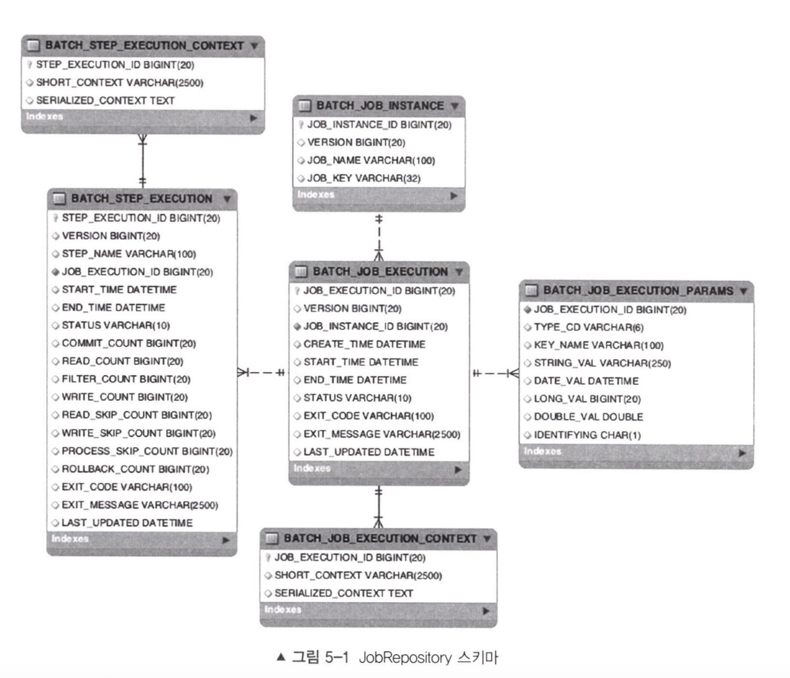
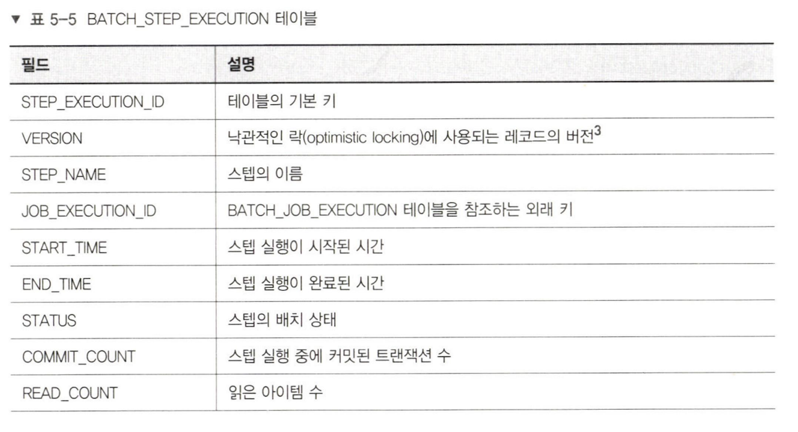
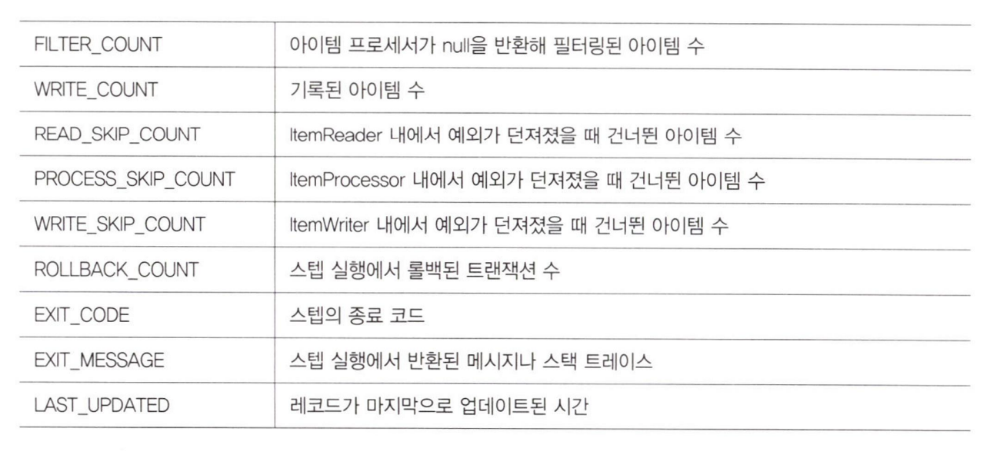
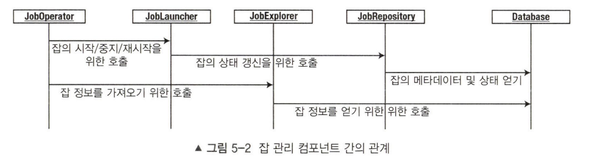
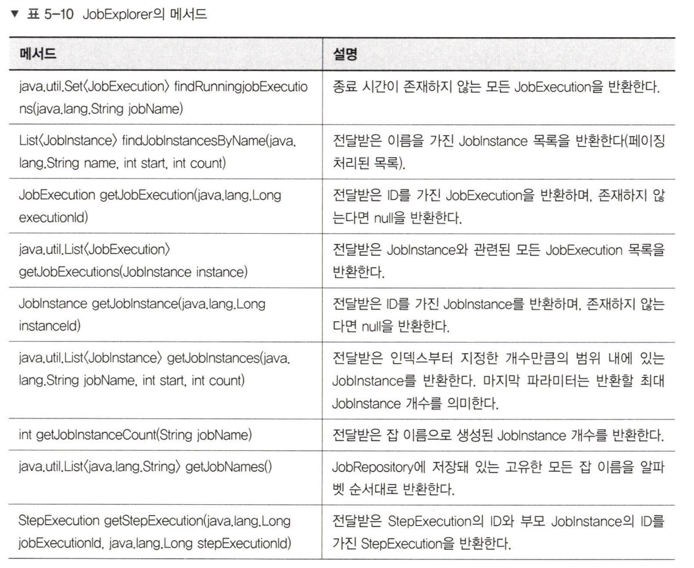
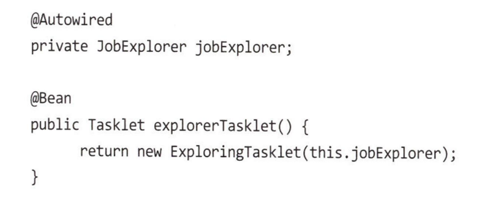

## JobRepository 관리

### RDBMS 기반 Repository 관리 방식

- 스키마의 시작은 `BATCH_JOB_INSTANCE`. 파라미터와 잡 네임을 저장한다. VERSION 컬럼은 낙관락에 사용되는 레코드 버전이다.

- 이후 `BATCH_JOB_EXECUTION` 테이블에 잡의 실제 실행 기록을 나타낸다. 잡이 실행될 때마다 새 레코드가 생기고, 수행 정도에 따라 상태가 변경된다.

- 4장에서 봤던 `ExecutionContext`를 잘 활용하려면 잡과 스텝 수행에 따른 `Context`가 잘 저장되어야 하는데 이게 저장되는 위치가 `BATCH_JOB_EXECUTION_CONTEXT`. 여기에 `ExecutionContext`가 직렬화되어 저장된다.

- BATCH_STEP_EXECUTION 테이블엔 스텝의 시작, 완료, 상태에 대한 데이터와 읽기 횟수, 쓰기 횟수, 처리 횟수 등 스텝 분석에 필요한 데이터들이 저장된다.

	

	

- `BATCH_STEP_EXECUTION_CONTEXT`는 `BATCH_JOB_EXECUTION_CONTEXT` 처럼 스텝 처리에 포함된 Context를 저장한다.

 

### 잡 메타데이터 사용하기

- `JobRepository`는 배치 잡의 상태를 저장하고 조회할 수 있도록 API를 제공하지만, 읽기 전용으로 접근하고 싶을 땐 `JobExplorer`를 사용해야한다. 대부분의 컴포넌트는 `JobRepository`를 통해 메타데이터에 접근하지만, `JobExplorer`는 데이터베이스에 직접 접근하여 데이터를 읽는다.

	

	

참으로 야무진 함수들이 포함되어 있다. 배치에 포함된 잡이나 스텝의 상태를 확인하기에 좋아보인다.

	

의존성 주입을 통한 JobExplorer 접근 방식

