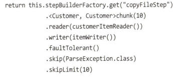

### 개요

- ItemReader 는 `T read() Exception UnexpectedInputException, ParseException, NontransientResourceException`라는 단일 메소드만을 가진 전략 인터페이스이다. 

	- 질문점

		- 전략 인터페이스는 무엇인가?

		- 하나의 메서드에 선언된 Exception들 간의 순서엔 의미가 존재하는가?

- Itemreader의  read()가 호출되면, 메서드는 처리할 아이템 **하나를 **반환한다

	- 질문점

		- 자바의 IO 성능은 다른 언어(C, C++, Java Script, Python)에 비해 좋은 편인가? 좋다면 어떤 이유로 좋은가?

 

### File Reader

- `FlatFileReader`는 줄 마다 다른 엔티티로 구분되는 파일 데이터를 읽기 위해 사용한다. 고정 너비 파일을 읽기 위해선 `FixedlengthTokenizer` 를 사용할 수 있고, 가변길이 레코드를 읽기 위해선 `DelimitedLineTokenizer `를 사용할 수 있다.  플랫파일을 읽기 위해 사용되는 요소는 크게 두 가지로, `LineMapper`와 `FieldSetMapper`가 있는데, 가변길이 혹은 고정길이 파일을 읽기 위해선 `FieldSetMapper`만 갈아끼우면 되는셈이다.

	- 이는 JDBC의 ResultSet의 메서드와 매우 유사하다. 생각해보면 JPA나 QueryMapper에서도 JDBC의 메서드를 기반으로 데이터를 호출할 것이다. 조사가 필요하다.

- 여러 레코드 포맷이 하나의 파일에 혼재되어 있을 수도 있다. LineTokenizer를 커스텀하게 만들어서 해결할 수도 있지만 비효율적이다. 따라서 이런 경우를 위해 PatternMatchingCompositeLineMapper를 이용하여 다양한 종류의 레코드를 처리할 수 있다. 다만 지금 단계에서 중요해보이지 않으니 있다는 것만 알고 넘어가기로…

 

### XML 리더

- XML 파일을 도메인 객체로 파싱하여 사용할 수도 있다. `XML 프래그먼트`란 시작 태그부터 종료 태그 까지의 XML 블록을 의미한다. 즉 하나의 레코드를 의미한다.

### JSON READER

- JSON을 파싱하는건 아주 맛도리다. 제발 개발자라면 JSON합시다. 스프링 배치에선 두 가지 종류의 JsonObjectReader를 제공한다. 하나는 `Jackson`, 다른 하나는 `Gson`을 사용한다. 

	- ItemReader의 saveState에 대해 알아보자. 상태를 저장한다? 어떻게?

	- @Value 어노테이션에 대해 알아보자

### JDBC

- JDBC는 좋은 입출력 수단이다. 적어도 Json이나 Xml보단 그렇다고 생각한다. 다만 배치 작업을 진행하면서 대상이 되는 수많은 레코드를 메모리에 한 번에 적재하는 것은 비효율적이니` 커서`와 `페이징 `기법을 사용해서 순차처리한다.

	- cursor는 DB에서 하나의 레코드를 스트리밍받을 수 있는 방식이다.

		- 쿼리에 파라미터를 전달하기 위해선 ArgumetPreparedStatementSetter를 통해 파라미터를 세팅할 수도 있다.

		- 하지만 레코드를 요청할 때마다 네트워크 비용이 소모되고, ResultSet은 Thread-safe하지 않기 때문에 멀티 쓰레드 환경에서 사용하기 곤란하다.

	- paging은 청크 단위별로 DB에서 레코드를 전달받는 방식으로 추가 설정이 좀 필요하다.

		- 페이징은 청크 단위로 DB에서 조회하여 처리하는 방식이다. (물론 이 경우에도 잡은 한 건씩 데이터를 처리한다.)

		- 단 데이터베이스 마다 개별적인 페이징 구현체를 작성하기 때문에 `SqlPagingQueryProviderFactoryBean`를 사용하여 사용중인 데이터베이스가 어떤것인지 자동으로 감지하여 `PagingQueryProvider`를 제공받는다.

		- PagingQueryProvider를 사용할 때 주의할 점은 `SortKey` 를 설정해야 하는 점이다. 만약 정렬 조건을 명시하지 않으면 각 페이지의 쿼리 정렬 순서가 보장되지 않을 수 있기 때문이다. 또한 ResultSet에서 키가 중복되면 안된다. (PK 컬럼이 가장 적절해보인다.)

	- 일단 두 기법 모두 도메인 클래스가 필요하다. 또한 ResultSet에서 매핑하기 위해 RowMapper를 구현할 필요도 있다.

### Hibernate

- 드디어 하이버네이트의 차례다. 내가 좀 사랑하긴 하지만, 배치 처리에서 하이버네이트는 배치 처리에서 대단히 효율적인 방식은 아니다. 배치 처리에서 하이버네이트를 그대로 사용하면 스테이트풀 세션 구현체를 사용하게 된다. 아이템을 처리할 때 세션 구현체에서 조회하고 처리가 끝나면 쓰기 작업을 진행하고 스텝이 끝나면 세션을 닫는다. 

	- 하지만 하이버네이트의 기본 세션은 스테이트풀이기 때문에 아이템 백만건을 읽고 처리한 뒤 동일하게 백만건을 쓰면 하이버네이트 세션이 데이터베이스를 조회할 때 아이템을 캐시에 쌓으면서 `OutOfMemoryException`이 발생한다. **이게 뭔말이지 스테이트풀에 대해서부터 공부해야한다.**

	- 또한 JDBC보다 큰 부하를 일으킨다. 당연한 사실이지.

	- 따라서 Spring Batch가 제공하는 ItemReader를 사용할 때 좀 더 괜찮은 추가기능들을 제공한다.

	- JDBC와 마찬가지로 커서와 페이징 기법을 모두 제공한다.

	- QueryName, QeuryString, QueryProvider, NativeQuery를 통해 NamedQuery, HQL, SQL로 데이터베이스에 접근할 수 있다. 단, 언급되지 않았지만 QueryBuilder를 통한 접근은 어렵다. 슬퍼…

	- 페이징 기법은 커서를 사용할 때와 거의 유사하지만 잡 구성 클래스에 HibernateCursorItemReader 말고, HibernatePagingItemReader를 사용하는 점이다. + 빌더에 size 추가하기

### JPA

- JPA를 사용할 수도 있다. 다만 JPA는 커서 기반 조회를 제공하지 않는다. 

	- **AbstractJpaQueryProvider를 사용하여 Entity 매니저를 가져올 수 있다. 요건 힌트가 될 것 같다. 공부해두자**

### Stored Processor

- Stored Processor를 사용하여 데이터를 조회할 수 있다. 다만 이건 비즈니스 로직에서 직접 호출해줘야 한다. 

 

## Spring Data

- 스프링 데이터는 “기본적인 데이터 저장소의 특징을 유지하면서도, 친숙하고 일관된 스프링 기반의 데이터 접근 프로그래밍 모델을 제공하는 것”. 

- 즉, 단일 데이터 저장소에 대한 접근이 아닌 여러 프로젝트의 포트폴리오인 셈. 각 프로젝트는 사용자가 개별 NoSql과 Sql DB의 고유 기능에 접근할 수 있게 하면서 일관화된 추상화의 집합을 제공한다 .( Repository 인터페이스)

- JPA에서 결과를 Page<Generic>으로 반환받을 수 있다. 해당 객체는 Repository에서 파라미터로 전달받은 Pageable 객체 정보와 조회되는 총 페이지 정보, 현재 페이지가 마지막 페이지인지 아닌지까지 포함되어 있다.

 

## 커스텀 리더

### ItemStream 

- 스프링 배치가 리더의 상태를 저장해서 이전에 종료된 지점부터 리더를 다시 시작할 수 있으려면 ItemStream 구현체가 필요하다.

	- ItemStream 인터페이스는 다음과 같은 세 가지 메서드를 포함합니다:

	- open: 리더를 초기화하고 리소스를 열 때 호출됩니다.

	- update: 리더의 상태를 저장하는 기능을 구현합니다. 주로 청크나 페이지 기반 처리를 위해 사용됩니다.

	- close: 리더를 종료하고 리소스를 정리할 때 호출됩니다.

- open(), update() 를 통해 ExecutionContext에 접근할 수 있다.

 

 

## 에러 처리

### 레코드 건너 뛰기

- 입력에서 에러가 발생한 경우 선택지가 몇 가지 있는데 가장 기본적으론 예외를 던져서 처리를 멈추는 방법이 있고, 하나 건너뛰어도 상관없는 경우엔 스킵도 가능하다.

- 건너뛰기에서 중요한건** 어떤 레코드를 건너 뛸 것인지(어떤 예외를 스킵할 것인지) ,얼마나 많은 레코드를 건너뛸 수 있게 할 것인지**다. 

- 이는 JobBuilder에서 skip, skipLimit를 설정함으로써 구성할 수 있다.

	

- 

 

