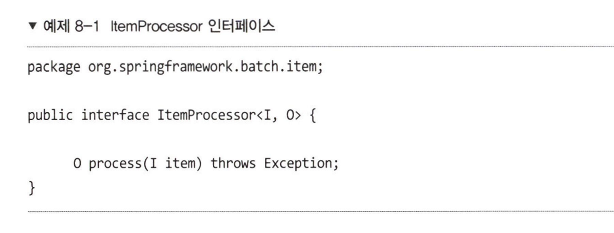
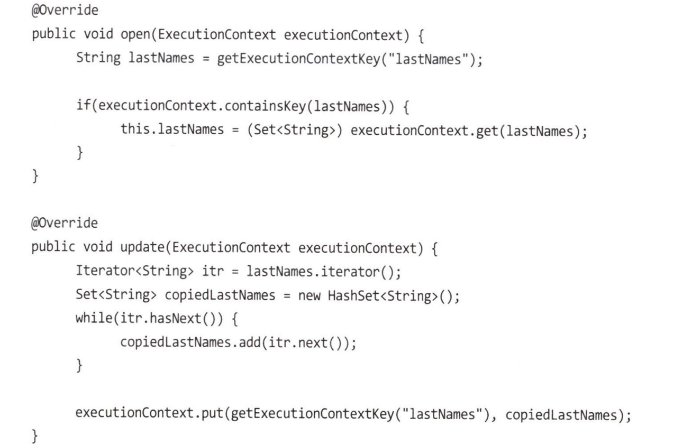
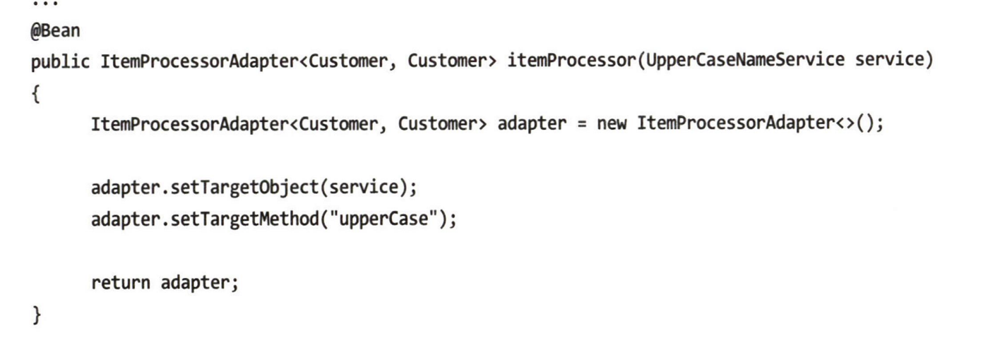
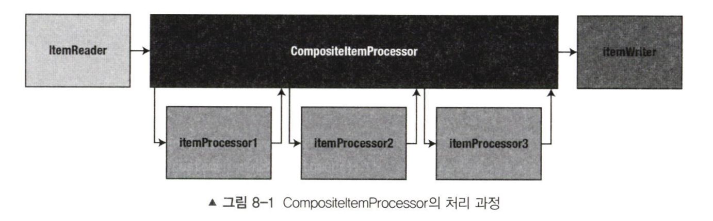
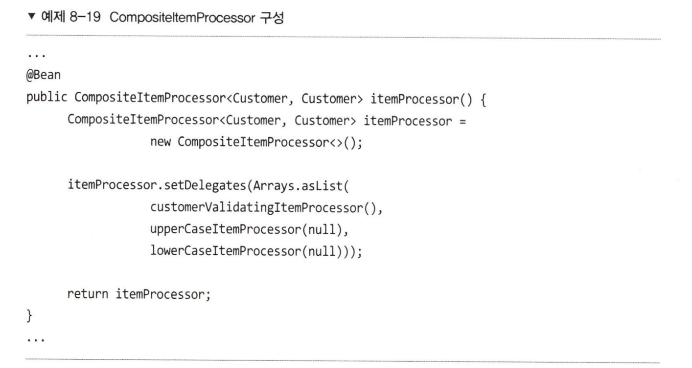
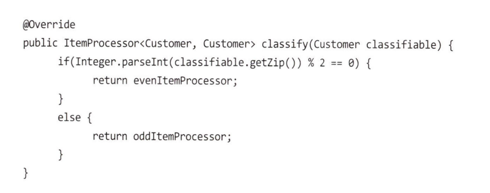
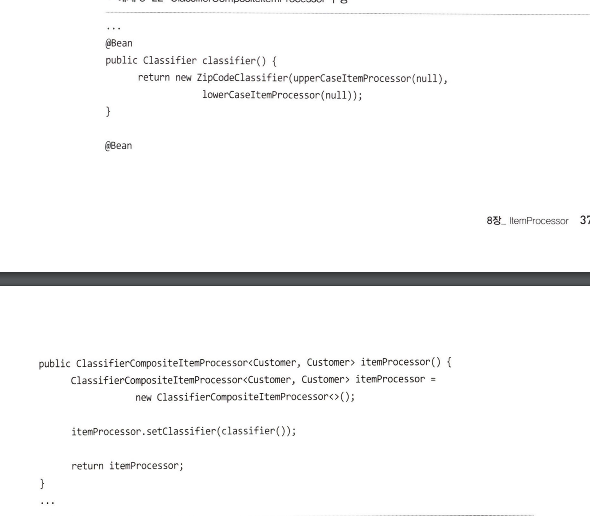

### 개요

- 입력 유효성 검증

	- ItemProcessor가 유효성을 검증하도록 수행하면, Reader/ writer/ processor의 역할 분담이 명확해진다.

- 기존 서비스 재사용

	- ItemReaderAdapter처럼 ItemProcessorAdapter를 제공한다. 즉, 기존에 사용하던 Method를 그대로 재사용할 수 있다.

- 스크립트 실행

	- 이건 뭔 말이지

- ItemProcessro Chain

	- 동일한 트랜잭션 내에서 아이템에 대해 여러 작업들을 연속적으로 수행하고 싶을 때가 있는데, 이 때 스프링 배치는 ItemProcessor를 순서대로 동작하도록 설정할 수 있다.

- read()라는 메서드 하나만을 가진 전략 인터페이스다. 단, 입출력에서 I,O를 받는데 이게 의미하는 것은 입력받는 데이터와 출력하는 데이터가 같은 클래스일 필요는 없다는 것이다. Writer에서 사용하기 위해 형변환하여 반환할 수 있다.

	

- ItemProcessor에서 null을 반환하면 이후 예정된 프로세서, writer의 작업은 캔슬된다. 다음 아이템으로 처리가 넘어간다. ItemReader에서 null을 반환하면 더 이상 읽을 데이터가 없다는 의미와는 상반된다.

- ItemProcessor는 멱등해야한다. 아이템은 내결함성 시스템에서 2번 이상 전달될 수 있기 때문이다. 재실행 과정에서 2번 이상 실행되더라도 동일한 결과를 보장할 수 있어야 한다.

 

## ItemProcessor 사용

- Reader는 표준화가 잘 되어 있다. 파일을 읽는 과정은 대체로 비슷하고, `RDBMS`나 `NoSql`에서 데이터를 읽는 방식도 대체로 비슷하다. 하지만 데이터를 변형하는 과정은 비즈니스 마다, 개발자마다 구현 방식이 다르다. 때문에 기능을 래핑하는 정도의 표준화 밖에 있을 수 없다.

- `ItemReader`에서 데이터 유효성을 검증할 수 있다. 단, 데이터 형식이 아닌 비즈니스 로직과 연계된 validation은 되도록 Processor 에서 수행되는 것이 유의미하다. 이런 이유로 `ValidatingItemProcessor`를 유효성 검증에 사용하곤 한다.

- JSR303 은 표준화된 유효성 검증 방식이다. 

- 스프링 배치는 자체적인 validate 패키지의 유효성 검증 방식을 사용한다. (Spring에 내장된 것과는 다르다.)

- `ValidatingItemProcessor` 은 `validate (T value)` 라는 메서드 하나만을 가지고 있으며, 데이터에 별 문제가 없다면 아무 일도 일어나지 않는다. 사용법은 `Processor`에서 사용되는 클래스에 `@NotNull, @Pattern` 등 스프링에서 제공하는 `Validate` 패키지 어노테이션을 사용하는 것이다. 마치 API의 입력값에 어노테이션으로 유효성을 검증하는 것과 동일하다.

- JobExecution 생명주기 동안 데이터를 저장하기 위해선 ItemProcessorSupport 를 상속하면 된다. 해당 클래스를 상속하여 ItemStream을 구현하면, 이전에 처리된 아이템의 상태와 필드를 저장할 수 있다.

	- ItemStream을 상속하여 `open`과 `update`를 구현할 수 있다. 이 과정에서 ExecutionContext에 접근하여 Job과 관련된 데이터를 저장/조회할 수 있다.

		

- 

- 해당 메서드에선 adapter 객체가 service 객체와 methodName을 전달받아 실행한다. 서비스 객체는 그렇다 치고, 메서드 이름으로 원하는 실행 메서드를 선택할 수 있는 것은 흥미롭다. 어떤 방식으로 실행되는걸까. 만약 클래스에 존재하지 않는 이름이 전달된다면? JS처럼 순수함수 형태로 전달할 수는 없는 것일까

### CompositeItemProcessor

- 해당 프로세서는 ItemProcessor를 상속하여 작동하고, 연결된 모든 프로세서들에 순차적으로 아이템을 전달한다. null 객체는 더 이상 처리되지 않고, 1번 프로세서의 리턴 타입과 2번 프로세서의 파라미터 타입은 동일해야 한다.

- 

 

### ClassifyierCompositeItemProcessor

- 단, 모든 아이템이 다음 프로세서로 전달되지 않고 분기하고 싶을 수도 있다. 이럴 때는 `ClassifyierCompositeItemProcessor`를 사용할 수 있다. 이쯤되면 이게 인터페이스인지, 시인지도 좀 헷갈리긴하지만 명확한 네이밍이니 오케이라고 생각한다. 

- `ClassifyierCompositeItemProcessor`를 사용하기 위해선 `Classifier` 인터페이스를 구현체가 필요하다. 해당 구현체에서 아래와 같이 classify 메서드를 오버라이딩하여 정의한다.

 

 

### 사용하지 않는 데이터 필터링

- 종종 어떤 데이터들은 이후 연결된 `Processor`나 `Writer`로 전달되지 않는 것이 좋을 수도, 혹은 전달되지 안항야 할 수도 있는데, 이 경우 `Processor`에서 `null`을 리턴하게 구성하면 된다. 이렇게 필터링된 레코드는 `JobRepository`의 `batch_step_execution`에 저장된다.

- 좀 넘어간 부분이지만 아이템 프로세서는 잘 표준화되지 않아 자체적으로 구성해야하며, 이는 의도된 사항이다. 입출력은 표준화할 수 있지만 데이터에 대한 비즈니스 로직을 표준화할 순 없으니까. 

 

