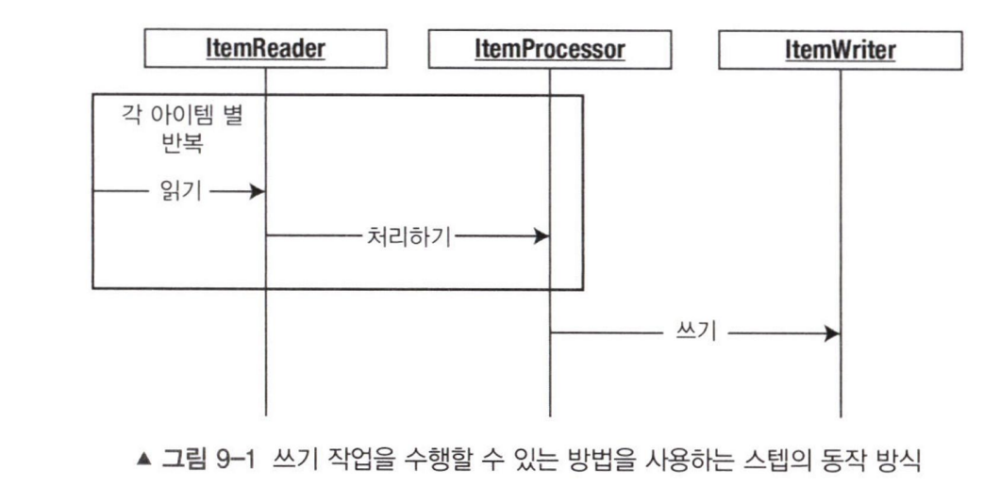

- ItemWriter는 데이터를 청크 기반으로 쓴다. 구버전에선 item 단위로 출력했지만, 청크 개념 도입 후엔 그럴 필요가 없어졌다. (네트워크 비용만 증가한다.)

- 때문에 `ItemWriter Interface`의 유일한 함수인 `write(List<? extends T> items)` 는 List 컬렉션으로 데이터 목록을 전달받는다. 아마 사이즈는 청크 사이즈와 동일하거나 작겠지

	

- 때문에 ItemReader는 Chunk 단위로 데이터를 가져와서 ItemProcessor는 하나의 아이템을 계속해서 처리하고, Writer에 청크 단위로 전달하는 방식으로 구동된다.

 

