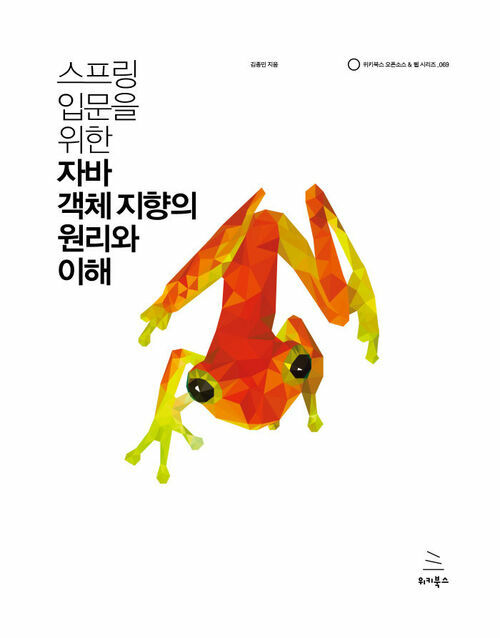

# 스프링 입문을 위한 자바 객체 지향의 원리와 이해

<figure><figcaption></figcaption></figure>

_작은 논리들이 모여 결국 큰 프로그램을 만들게 되는데 그 논리들이 인간적이면 더 좋지 않겠는가? 바로 그게 객체 지향인 것이다. - 112Page_

1줄 요약.

\-> 1\~2년차 Java 백엔드 개발자에게 추천하는 책. 피상적인 개념을 이해하기 쉬운 형태로 설명합니다.

외국에서 문자 그대로 들여온 번역들에 대해 깊게 통찰하고 실제로 의미하는 바가 무엇인지 낱낱이 해부하여 전달하는 점에서 굉장히 좋은 책이라고 생각한다.

예를 들어 객체 지향 프로그래밍에서 상속은 하위 클래스가 상위 클래스의 메서드와 필드를 재사용하고 확장하는 방식인데 이것을 **문자 그대로 상속의 의미로 받아들이면 안된다**는 설명이나, 추상화가 같는 의미를 실제로는 클래스 모델링 행위로 정의하고 큰 개념이 어떤 방식을 통해 추상화되는 지를 설명하는 부분들이 그러했다. (물론 추가적인 지면을 할애하여 상속이나 확장을 통한 다형성 역시 추상화임을 설명했다.)

또한 6장의 내용 역시 피상적으로 전달되기 쉬운 디자인 패턴을 상당히 쉽게 풀어서 설명하기에 독자가 이해하기 좋은 책이었다. 읽어본 중에 가장 정확하고 쉽게 디자인 패턴 사례를 설명한 지면이었다.

단, 제목과 달리 Spring Framework에 대한 내용은 거의 없다. 7장, 8장에서 조금의 예제와 함께 관련 내용이 나오긴 하지만 버전 이슈로 인해 따라하기 곤란하고 내용도 빈약하므로 Spring Framework에 대한 학습이 필요한 독자라면 다른 책을 추천한다.

또한 설명이 너무 자세한 나머지 _좀 과하지 않았나?_ 싶은 생각도 들었다. 하나의 개념을 설명하는데 너무 많은 비유와 해설을 달아, 핵심적인 내용이 가려지는 부분이 있어 다음 책에선 지금보다 담백하게 적힌다면 좋을 것 같다.
