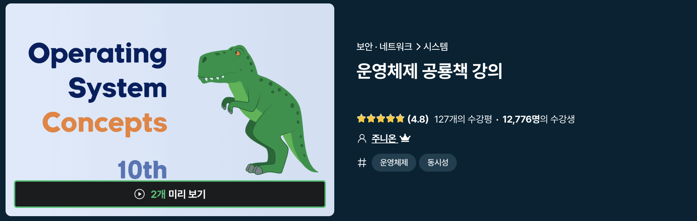
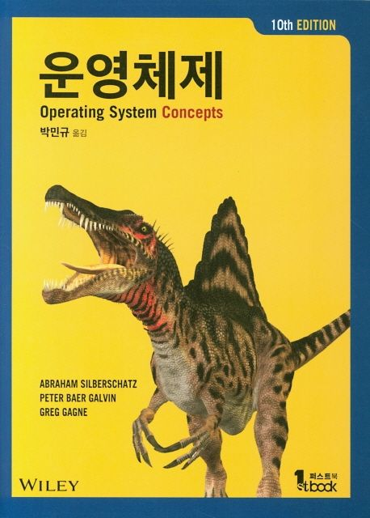

# Introduction

<figure><figcaption>
도서에 비해 난이도가 낮아진만큼 공룡도 귀여워졌다.
</figcaption></figure>

저는 커피챗 중 추천받은 운영체제 도서를 접하기 전 템퍼링 과정으로 선행하여 강의로 접했는데, 대표적인 운영체제 관련 내용들을 기본적인 내용 (ex 프로세스/쓰레드가 무엇인지, 커널은 무엇인지 등)에서부터 CPU Scheduling, Bankers' Algorithm, Process Syncronization 등 심화적인 내용까지 이해하기 쉽게 다뤄주셔서 덕분에 많은 부분을 배워갈 수 있었습니다.&#x20;

<figure><figcaption>
무시무시한 난이도를 자랑한다
</figcaption></figure>

운영체제 (2020, Abraham Silberschatz)가 워낙 어렵기로 악명 높은 책인지라 사전 준비를 하기에 적합했고, 학부생이나 취준생이라면 해당 강의만으로 운영체제에 대한 면접/학습을 위한 전반적인 준비를 마칠 수 있을 정도라고 생각합니다.

수준높은 강의를 무료로 배포하신 결정과 노고에 감사드립니다. 좋은 공부가 되었습니다!&#x20;

### [인프런 강의 URL](https://inf.run/Hr1b)
