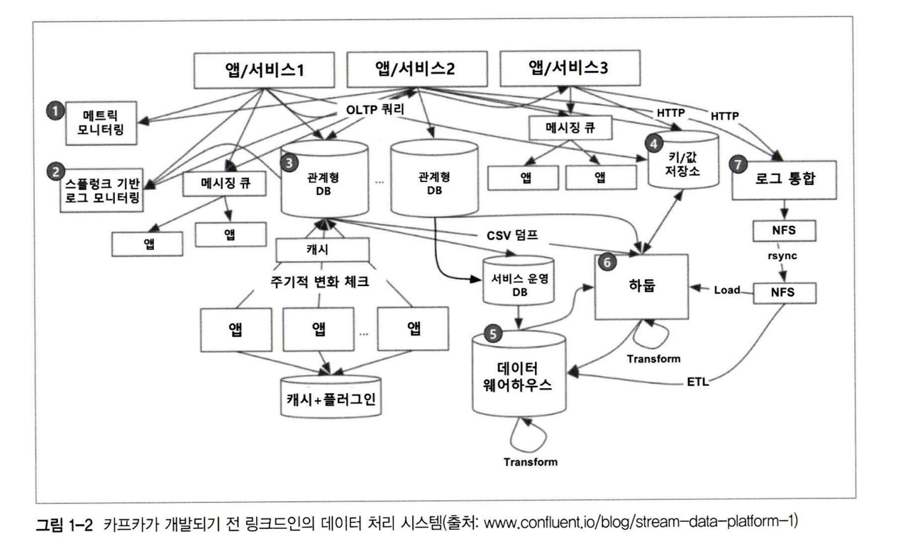
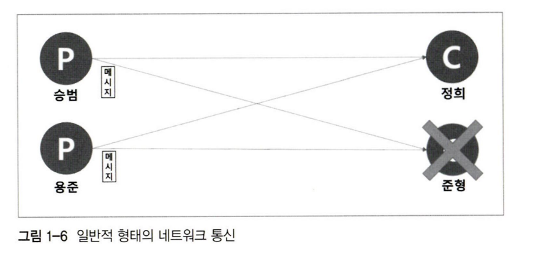
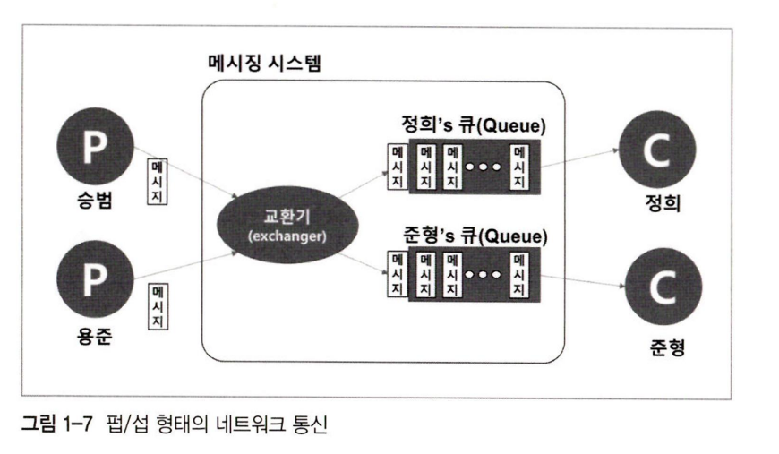
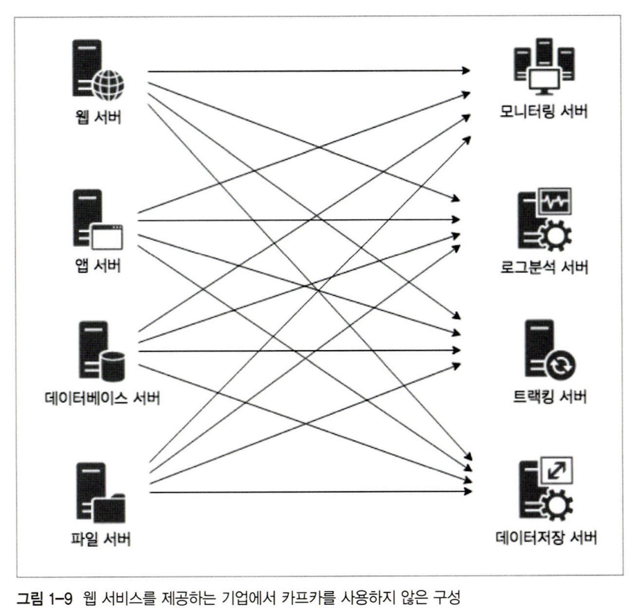
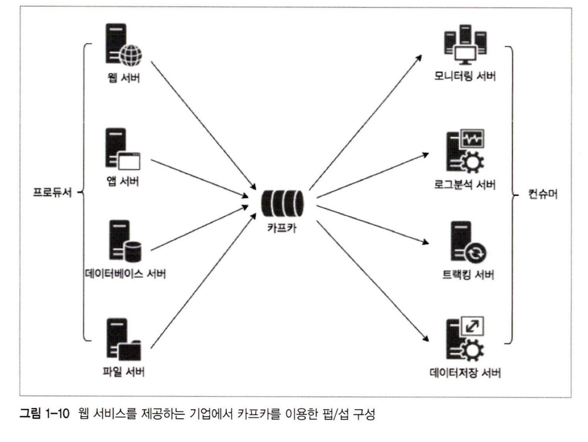
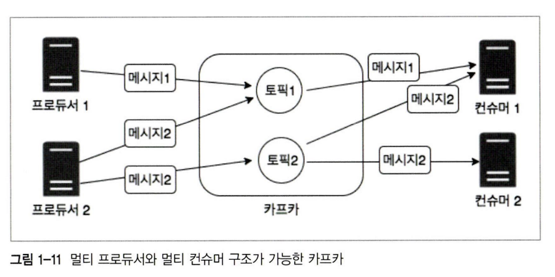
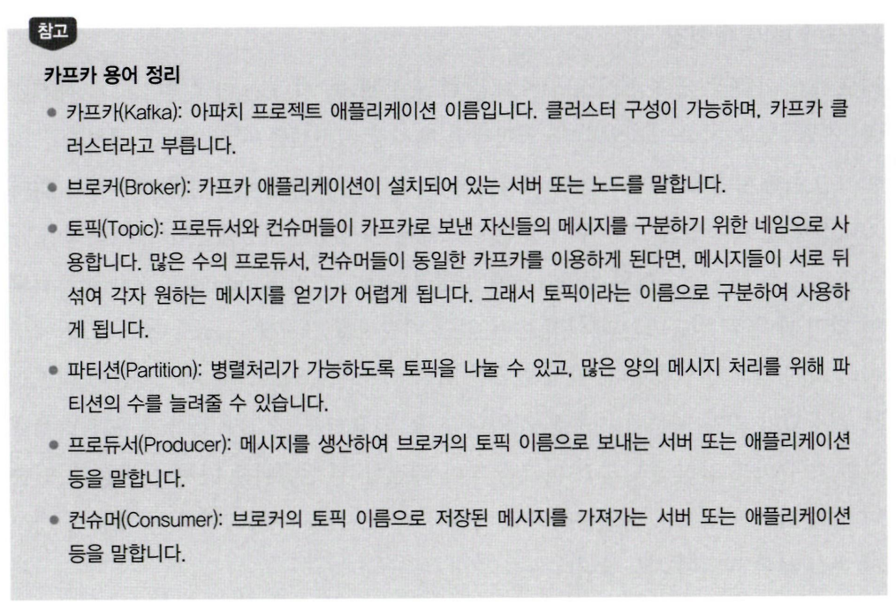

 

### 카프카 

---

대용량, 대규모 메시지 데이터를 빠르게 처리하도록 링크드인에서 개발한 오픈소스 소프트웨어

 

기존 End To End 아키텍쳐는 각 데이터 서비스 간의 결합성이 너무 강해서, 추가나 확장, 변경이 힘든 점이 문제였다. 또한 데이터 서비스 간의 포맷과 처리 방식이 달라 문제였다.

 

 

 

- Pub/Sub 모델은 메시지 생성자와 수신자가 중앙에 메시징 서버를 두고 통신하는 형태

- 비동기 메시징 방식이며, 발신자는 수신자의 정보를 정하지 않은 상태로 Publishing을 진행하고, 구독을 신청한 수신자만 메시지를 받는다.

 

- 다만 통신 과정에서 매개체가 추가되기 때문에 속도는 느렸고, 단건 당 5MB 쯤되는 대규모 데이터를 처리하기엔 성능상 부적합했다. 메시징 서비스에 대한 니즈는 메시지 보관과 교환, 전달 과정에서 신뢰성 보장이었다.

- 따라서 주로 간단한 이벤트를 서로 전송하는데 사용하였음

- 카프카는 이 점을 해결하기 위해 메시지 교환 전달의 신뢰성 관리는 프로듀서와 컨슈머가 수행하고, 교환기 기능은 컨슈머가 만들도록 함.

- 기존 메시지 큐 서비스에서 사용하던 폴링 방식은 주기적으로 데이터를 조회해야하기에 자원 소모가 크고, 데이터 소스의 상태나 네트워크 지연으로 인한 실시간성 저하가 발생할 수 있었다. 또한 데이터 변화가 적음에도 주기적 조회로 인한 낭비도 발생한다. 

 

### 카프카 특)

1. 멀티 Pub/Sub 구조임 N:N

1. 일정 주기 동안 디스크에 메시지를 저장함. 컨슈머가 먹통이어도 카프카 디스크에 손실없이 메시지가 저장됨

1. 확장성이 좋음. 클러스터는 3대의 브로커로 시작해 수십 대로 확장할 수 있으며, 확장 시 카프카 서비스 중단이 필요없음

1. 고성능

 

### 서비스 기반 아키텍쳐

---

- 업무를 서비스라는 단위로 쪼개고, 각 서비스 간의 연결은 엔터프라이즈 서비스 버스(ESB)를 통해 연결한다.

- 고로 ESB가 서비스 기반 아키텍쳐의 핵심 요소인 셈

1. 다양한 시스템과 연동하기 위한 멀티 프로토콜과 데이터 타입 지원

1. 느슨한 결합을 위한 메시지 큐 지원

1. 폴링 대신 이벤트 기반 통신 지원

