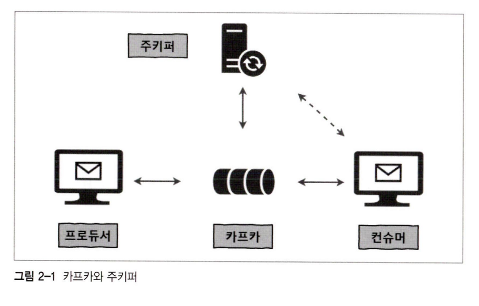
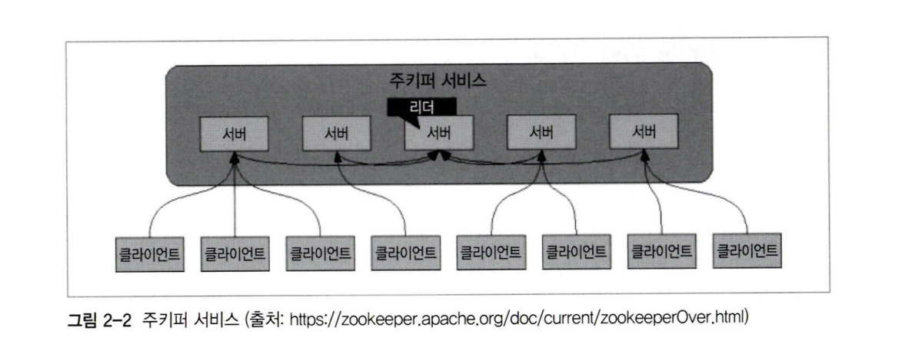
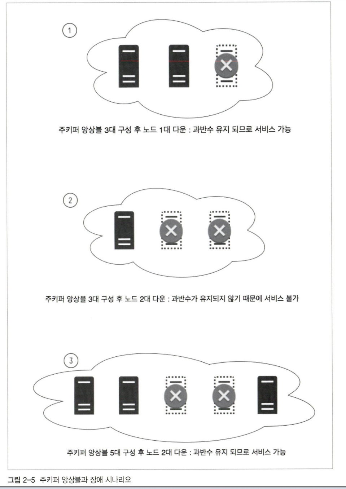

## 

- 프로듀서 : 데이터 생산

- 컨슈머 : 데이터 소비

- 주키퍼 ↔ 컨슈머: 오프셋 정보를 주키퍼와 카프카에 모두 저장할 수 있지만, 주키퍼에 오프셋 정보를 저장하는 기능은 이후 사라질 예정

- 주키퍼 ↔ 카프카: 카프카의 메타데이터 정보를 주키퍼에 저장하고, 카프카의 상태 관리 목적으로 주키퍼를 사용한다. 때문에 카프카를 위해선 주키퍼가 필수

 

### 주키퍼

- 분산 애플리케이션 관리를 위한 코디네이션 애플리케이션. 분산 애플리케이션이 안정적으로 서비스 할 수 있도록 각 애플리케이션의 정보를 중앙 집중하여 구성 관리, 그룹 관리 네이밍, 동기화등의 서비스를 제공함

- 클라이언트는 각 분산 애플리케이션.

- 클라이언트는 각 서버들(앙상블)과 커넥션을 맺어 상태 정보를 주고 받으며, 이 정보들은 주키퍼의 지노드에 키-밸류 형태로 저장됨

- 일반적으로 지노드에 저장하는 데이터 크기는 바이트에서 킬로바이트 정도로 작으며, 각 지노드는 데이터 변경에 대해 유효성을 판별하기 위해 버전 정보를 저장하며, 이 모든 데이터는 메모리에 저장됨

- 앙상블(클러스터)로 구성되어 있고, 이 중 과반수 방식에 따라 살아있는 노드가 과반수를 넘으면 지속적인 서비스 가능

	

- 노드가 많아지면 과반수 역시 증가하므로, 일부 노드에서 장애가 발생하더라도 끊임없이 서비스 제공이 가능

 

## 설치 실습

---

으 씨1발 좆같네 진짜

일단 Zookeeper랑 Kafka 별도로 돌리는건 ㄴㄴ 카프카에 포함된 주키퍼 쓰는게 맘 편하다.

교재에 사용된 버전과 현 릴리즈 버전은 커맨드 차이가 있다. +교재는 Centos, ubuntu 기준으로 작성되어서 커맨드가 다르다. 인생이 쉽지 않아…

간혹 에러 발생 후, log 폴더 내부에 mete.properties에 뭔가 기록돼서 kafka 기동이 안될 때도 있다. 이럴 땐 그냥 로그 폴더 싹 날리고 다시 만드는게 낫다

Topic 생성 시, Partitions를 1로 설정하면 Leader 설정이 안 돼서 Producer가 동작하지 않는다. 이 씨발

카프카와 주키퍼 모두kafka/bin/window 폴더 내부에서 실행한다. 

- **Windows Kafka commands**

