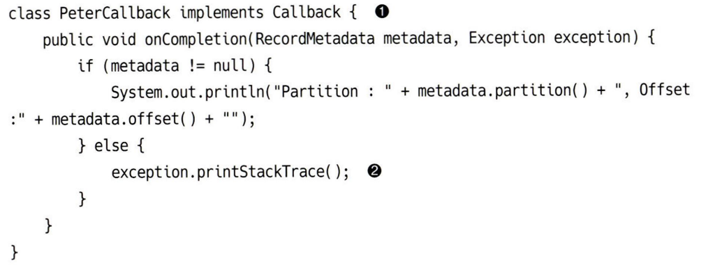
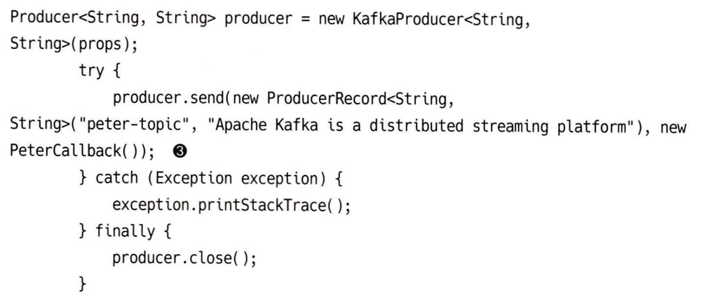
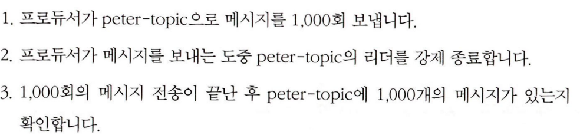
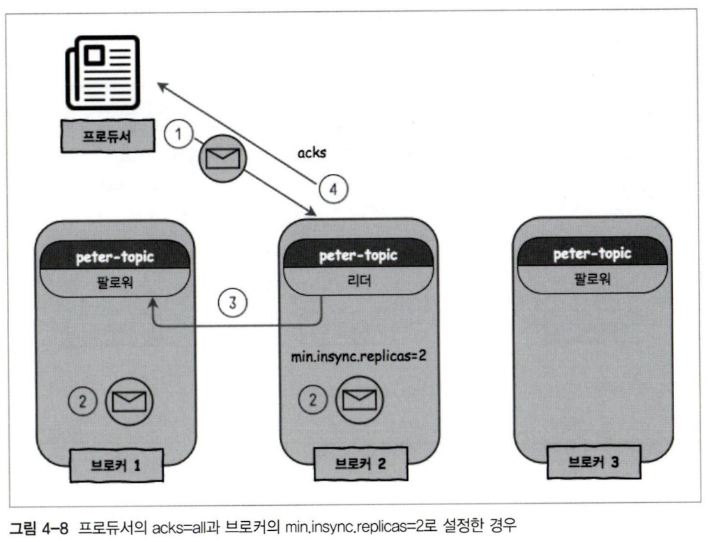

# 카프카 프로듀서

1. 전송 후 확인 하지 않음

1. 동기 전송 방식

	1. 전송 이후 반환 되는 Future 객체의 get()을 호출하여 결과값을 확인함

1. 비동기 전송

	

	

	1. 전송 이후 콜백 기능을 사용하기 위해 Callback을 implements한 클래스를 만들어야한다.

	1. send()에 해당 클래스 객체를 함께 포함하여 전송한다.

	 

### 주의점

- bootstrap-server 

 

### 프로듀서 주요 옵션

---

- bootstrap-server: 옵션엔 카프카 클러스터를 모두 추가하는게 좋다.

	- 이유는 대상 클러스터가 하나고, 해당 클러스터가 알아있다면 문제가 없지만, 그거 하나가 다운되면 에러가 발생하기 때문. 후보지를 늘려서 안정적으로 서비스가 이뤄지도록 해야한다.

- acks: 프로듀서가 카프카 토픽 리더에게 메시지를 보낸 후 요청을 완료하기 전 ack수. 옵션이 작으면 성능이 좋지만 유실 가능성이 있고, 크다면 성능이 구려짐. 성능과 신뢰성의 트레이드 오프를 조절한다.

	- acks = 0, 메시지를 브로커에 전송한 이후, 프로듀서는 브로커의 응답을 기다리지 않는다. 성능상 이점이 있지만, 신뢰성이 떨어진다.

	- acks =1, 프로듀서가 메시지를 전송한 이후 파티션 리더로부터 응답을 기다린다. 리더는 메시지를 받으면 저장하고, 리플리케이션 한 후 응답을 보낸다. 리더가 다운되면 메시지 손실이 발생할 수 있다.

	- acks=all | acks= -1, 프로듀서가 메시지를 보낸 후, 모든 ISR의 브로커들에서 복제가 완료된 이후 응답을 받는다. ISR의 모든 브로커들의 응답을 받기 때문에 안정적이지만, 성능은 상대적으로 불리하다. 완정성과 신뢰성이 매우 중요한 경우에 사용

- buffer.memory: 프로듀서가 카프카 서버로 데이터를 보내기 위해 담아둘 수 있는 메모리 바이트

- compression.type: 프로듀서가 데이터를 압축해서 보낼 수 있는데, 이 타입을 정할 수 있음. none, gzip,snappy,lz4…

- retrires: 일시적 오류로 인한 전송 실패 시, 재전송 횟수

- batch.size: 같은 파티션으로 보내는 여러 데이터는 묶어서 함께 전송하도록 설정하는 옵션. 다만, 데이터를 묶어놓고 있는데 클라이언트 장애 발생 시 배치는 초기화되고 메시지 손실이 발생할 수 있어서. 신뢰성이 중요할 때는 0으로 두는 것도 좋다.

- linger.ms: 배치를 모으는 최대 대기 시간. 배치 사이즈가 꽉 차지 않거나, linger.ms에 도달하지 않아도 둘 중 하나가 충족되면 발송한다.

- max.request.size: 프로듀서가 보낼 수 있는 최대 메시지 크기. 기본값은 1MB

 

### 메시지 전송 방식

---

**메시지 손실 가능성이 높지만, 빠른 전송이 필요한 경우**

- 프로듀서가 카프카 서버의 응답을 기다리지 않는다. acks=0

- 메시지 손실이 발생한다고 해서, 메시지의 막 90%가 사라지고 이런건 아니지만, 손실을 감안은 해야한다. 브로커가 다운되는 등의 상황에 가장 취약하다는 의미

 

**메시지 손실 가능성이 적고, 적당한 속도의 전송이 필요한 경우**

- 프로듀서가 리더 브로커의 응답을 기다린다. acks=1

- 리더의 응답을 기다리기 때문에 전송 시간은 다소 느릴 수 있지만, 꽤 높은 수준의 신뢰도를 얻을 수 있다. 리더 브로커가 다운되었을 때 낮은 확률로 메시지 일가 유실될 수는 있다.

- 리더가 메시지를 저장하고, acks를 보내서 프로듀서는 문제 없는 걸로 확인했는데, 다른 팔로워들이 리더의 새 메시지를 확인하기 이전에 리더가 다운되어버리면, 팔로워들은 이 메시지를 확인하지 못하고 새 리더가 선출되며 해당 메시지는 소실된다.

	

- 카프카, 데이터 플랫폼의 최강자 - 166~167페이지를 통해 해당 케이스의 실험 내용을 확인할 수 있다. 결국 리더가 바뀌는 아주 짧은 순간에 수신된 메시지는 유실될 수 있다는 것

- 때문에 리더가 바뀐다고 무조건 메시지 손실이 발생하는 것은 아니며, 아주 예외적인 케이스에서 유실될 수 있다는 것이다.

- 따라서 특별한 경우가 아니라면 acks를 1로 두는 것이 적당하다.

 

**전송 속도는 느리지만 메시지 손실이 없어야 하는 경우**

- 모든 팔로워에서 데이터를 저장한 이후, acks를 반환하는 방식. acks=all

- 이 경우 프로듀서 뿐 아니라 브로커의 설정도 확인해야한다.

- 브로커의 설정은 server.properties에서 확인할 수 있으며, 최소 리플리케이션 팩터가 1일 경우, 다른 브로커에 저장하지 않기 때문에 어차피 acks가 1인 경우와 동일하게 동작한다.

- 리플리케이션 팩터가 2인 경우, 리더가 데이터를 저장하고, 팔로워가 복제본을 가지고 있는게 확인되면, 리더가 클라이언트로 acks를 전송한다.

	

- 이 때, 브로커가 총 3개이더라도 min.insync.replicas는 2로 지정해주는게 좋다. 이유는 해당 설정값을 3(최대값)으로 설정해버리면, 하나의 브로커라도 다운되었을 때 프로듀싱이 불가능하기 때문

- 원래는 브로커 하나가 다운되더라도 정상적으로 동작하지만 불필요한 시스템 장애가 발생하는 것. 때문에 이런 경우엔 min.insync.replica는 2 정도로 유지하는 것이 좋다. 이 경우에도 신뢰성은 유지되기 때문에

 

