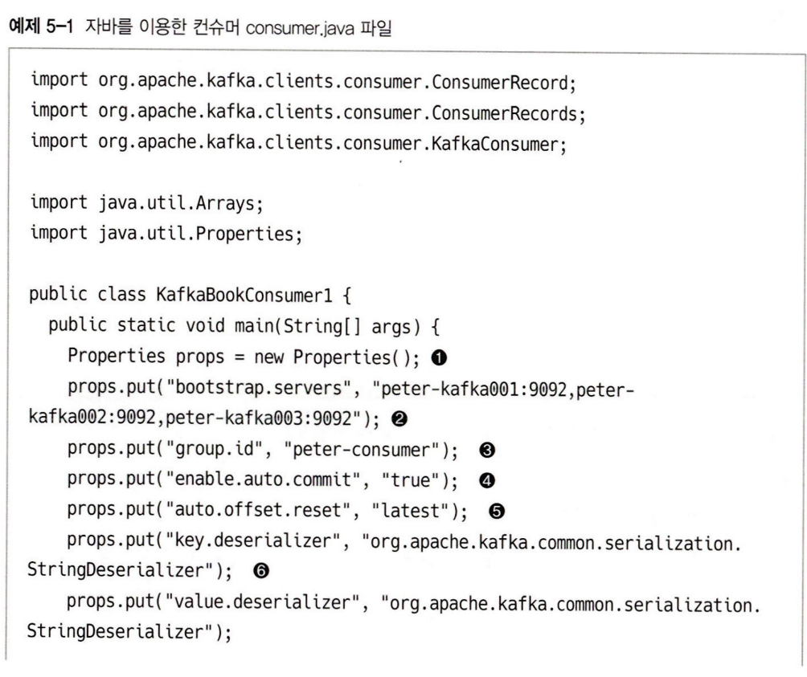
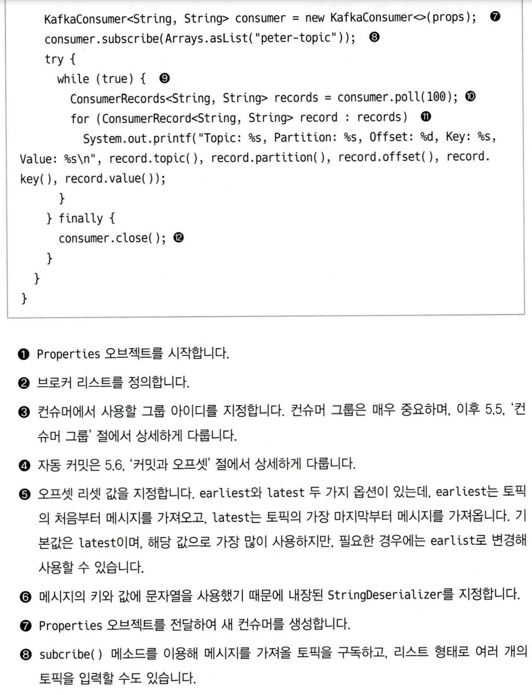
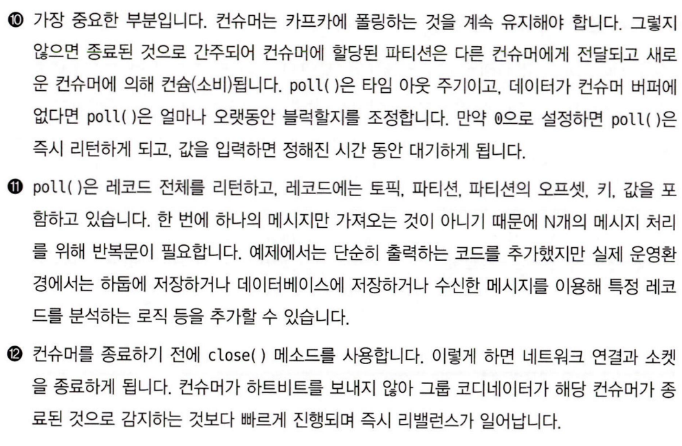
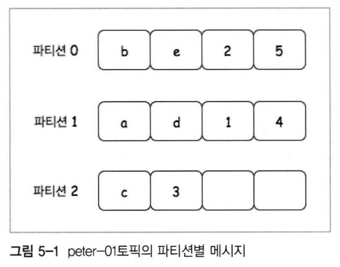

### 컨슈머

---

- 프로듀서가 토픽으로 메시지를 전송하여 보관하면, 그 데이터를 가져와서 보시하는 역할을 하는 애플리케이션, 서버등

- 주요 기능은 특정 파티션을 관리하는 파티션 리더에게 **메시지 가져오기를 요청**하는 것

- 각 요청은 로그의 오프셋을 명시하고 가져오며, 필요시 이미 가져온 데이터를 다시 가져올 수도 있다. 이렇게 이미 가져온 메시지를 가져오는 기능은 래빗앰큐와 같은 일반적인 메시지큐 서비스에선 제공하지 않는 기능이다.

- 이런 재수신 기능이 필요한 이유는 컨슈머 소스에 에러가 있어서 수정이 필요한 시점에 이미 메시지를 가지고 왔다면 해당 내용을 다시 사용할 필요가 있기 때문

 

### 주요 옵션

---

**올드 컨슈머**

- 컨슈머의 오프셋을 주키퍼의 지노드에 저장한다.

**뉴 컨슈머**

- 컨슈머의 오프셋을 카프카의 토픽에 저장한다.

---

- bootstarp-server: 카프카 클러스터에 처음 연결하기 위한 호스트와 포트 정보로 구성된 리스트. 카프카 클러스터 전체의 정보를 입력하는 편이 좋다.

- fetch.min.bytes: 한 번에 가져올 수 있는 최소 데이터 사이즈

- group.id: 컨슈머가 속한 컨슈머 그룹을 식별하는 식별자

- enable.auto.commit: 백그라운드로 주기적으로 오프셋을 커밋한다.

- auto.offset.reset: 카프카에서 초기 오프셋이 없거나, 현재 오프셋이 더 이상 조재하지 않은 경우 다음 옵션으로 리셋하는 명령어

	- `**earliest**`: 가장 초기 오프셋값으로 설정

	- `**latest**`: 가장 마지막 오프셋값으로 설정 (기본값)

	- `**none**`: 이전 오프셋 값이 없으면 에러 발생

- fetch.max.bytes: 한 번에 가져올 수 있는 최대 사이즈

- request.timeout.ms: 요청에 대해 응답을 기다리는 최대 시간

- session.timeout.ms: 컨슈머와 브로커 사이의 세션 타임 아웃 시간. 컨슈머가 그룹 코디네이터에게 하트비트를 보내지 않고 `session.timeout.ms`가 지나면 컨슈머 그룹은 리밸런스를 시도한다.

결국 컨슈머의 하트비트 없이 얼마나 오랫동안 컨슈머가 있을지를 제어하는 옵션. 일반적으로 `**heartbeat.interval.ms**`와 밀접한 관련이 있으며, 두 속성이 함께 수정된다.

`session.timeout.ms`을 기본값으로 낮게 설정하면 실패를 빨리 감지할 수 있지만 가비지 컬렉션이나 poll 루프를 완료하는 시간이 길어지게 되면 정상적인 상황에서 의도찮은 리밸런스가 일어나기도 한다. 반대의 경우 의도찮은 리밸런스는 줄어들지만, 오류를 감지하는데 걸리는 시간이 늘어난다.

- heartbeat.interval.ms: 그룹 코디네이터에게 얼마나 자주 `poll()`을 보낼 것인지 설정한다. session.timeout.ms보다 낮아야한다.

- max.poll.records: 단일 호출 `poll()`에 대해 최대 레코드 수를 조정한다. 

- max.poll.interval.ms: 컨슈머가 하트비트만 보내고 메시지를 가져가지 않는 경우가 있을 수 있기 때문에, 컨슈머가 무한정 파티션을 점유할 수 없도록 주기적으로 `poll`을 호출하지 않으면 장애라고 판단하는 기준

- auto.commit.interval.ms: 주기적으로 오프셋을 커밋하는 시간

- fetct.max.wait.ms: fetch.min.bytes에 의해 설정된 데이터보다 적은 경우 요청에 응답을 기다리는 최대 시간

 

### 콘솔 컨슈머로 메시지 가져오기 

---

- `kafka-console-consumer.sh --bootstrap-server ~~ --topic real-topic --from-beginning` 명령어를 통해 컨슈머를 실행할 수 있으며, 지속적으로 `real-topic` 의 메시지를 가져온다

- 컨슈머를 실행할 때는 항상 컨슈머 그룹이라는 것이 필요한데, `group.id` 를 통해 별도의 그룹을 지정하지 않은 경우, console-consumer-xxxx 로 컨슈머 그룹이 생성된다. 

- 그렇다고 하더라도 **컨슈머 그룹은 굉장히 중요하다.**

- 컨슈머는 카프카 폴링을 지속적으로 유지해야한다. 그렇지 않으면 컨슈머가 종료된 것으로 간주되어 파티션이 다른 컨슈머에게로 넘어가기 때문에. 데이터가 컨슈머 버퍼에 없다면 `poll()`은 얼마나 오랫동안 블럭할지를 조정한다. 값이 없다면 즉시 리턴, 값을 입력하면 정해진 시간 동안 대기한다.

 

### 파티션과 메시지 순서

---

- 파티션 갯수가 3인 경우, a~e까지 순서대로 데이터를 저장하더라도, 컨슈머에서 읽을 때 이 순서가 일치하지 않을 수 있다. 또한 이는 정상이다.

- 컨슈머는 오로지 파티션의 오프셋을 기준으로 메시지를 가져온다.

- 파티션 내의 오프셋은 절대 변하지 않지만, 이것이 입력한 순서 그대로 프로듀서에게 전달된다는 얘기는 아니다. 파티션이 여러 개일 경우 입력 순서와 출력 순서가 일치한다는 보장은 없다.

- 따라서 입력,출력 순서가 동일해야 한다면 파티션 수는 반드시 1개여야 한다. 입출력 느리겠네.

 

### 컨슈머 그룹

---

- 컨슈머 그룹은 하나의 토픽에 여러 컨슈머 그룹이 동시에 접속해서 메시지를 읽을 수 있다. 다른 메시지 큐 솔루션에선 메시지를 가져가면 사라지기 때문에 사용하지 못했던 기능

- 만약 프로듀서의 데이터 생성량은 증가하는데, 컨슈머의 데이터 소비량은 이를 따라가지 못하면 데이터는 계속 증가한다. 이를 위해 컨슈머 갯수가 확장되어야 할 수도 있다.

- 컨슈머 그룹은 이런 컨슈머들을 추가하고, 컨슈머의 오프셋 정보가 뒤섞여 데이터가 엉망이 되지 않도록 제어하는 역할을 한다. 

- 컨슈머 그룹 안에서 컨슈머들은 메시지를 가져오고 있는 토픽의 파티션에 대해 소유권을 공유한다. 이렇게하면 컨슈머가 확장되었을 때, 기존 컨슈머가 담당하던 파티션들을 나눠서 처리할 수 있다.

- 이렇게 소유권을 재분배하여 읽기 처리를 수행하는 방식을 리밸런스라고 하는데, 리밸런스 동안에는 일시적으로 컨슈머가 메시지를 읽을 수 없기 때문에 해당 그룹 전체가 중단된다. 때문에 최대한 리밸런스가 일어날만한 상황은 피하는 것이 좋다.

- 다만 컨슈머의 수를 무한정 늘릴 수는 없는게, 결국 하나의 컨슈머가 하나의 파티션을 잡고 데이터를 받아오는 식이라 파티션의 수를 초과한 컨슈머는 잉여 컨슈머로 아무 것도 안 하기 때문이다. 이는 카프카가 제공하는 파티션 내 오프셋의 절대 순서를 지키기 위함이다. 

- 컨슈머 하트비트는 poll() 할 때, 가져간 메시지의 오프셋을 커밋할 때 보낸다. 오랫동안 하트비트를 보내지 않으면 세션은 타임아웃되고, 해당 컨슈머는 다운되었다고 판단하여 리밸런스가 진행된다.

- 하나의 파티션은 하나의 컨슈머에 의해 소비된다. 또한 컨슈머는 여러 파티션의 데이터를 처리할 수 있다. 명확한 N:1 관계가 성립한다. 물론 양 항의 수가 동일할 때 최고 효율성을 낸다.

- 여러 컨슈머 그룹이 하나의 토픽을 공동으로 사용할 수 있다. 이 경우 각 컨슈머 그룹 마다 별도의 토픽-오프셋을 관리하기 때문에 각 컨슈머 그룹의 상태가 다른 컨슈머 그룹의 상태에 관여하지 않는다. 

 

### 커밋과 오프셋

---

- 컨슈머 그룹은 각각의 파티션에 대해 어디까지 읽어갔는지 오프셋을 기록한다. 또한 각 파티션에 대해 현재 위치를 업데이트하는 동작을 커밋한다고 한다.

- 리밸런스 이후 각 컨슈머는 배정된 파티션의 데이터를 오프셋을 기준으로 가져온다. 

- 마지막으로 커밋된 오프셋이 실제 마지막으로 처리한 오프셋보다 작으면 중복 처리가 일어난다.

- 커밋된 오프셋보다 실제로 마지막 처리된 오프셋이 크다면, 마지막으로 커밋된 오프셋과 실제 처리 오프셋 간의 메시지는 누락된다.

- **따라서 커밋은 조오온내 중요하다.** 

 

**자동 커밋**

- 컨슈머 애플리케이션들이 가장 많이 사용하는 기본값. 컨슈머 설정에서 `enable.auto.commit=true`을 통해 사용할 수 있다. 

- `auto.commit.interval.ms` 옵션을 통해 컨슈머가 `poll()` 을 처리하면서 지금이 커밋한 시간인지 체크하고, 맞다면 요청을 통해 가져온 마지막 오프셋을 커밋한다.

- 편리한 기능이지만, 커밋 인터벌이 길수록 데이터 처리 도중 리밸런스가 일어나 마지막 커밋과 실제 처리된 오프셋 사이의 간극이 커져 중복된 데이터 처리가 늘어날 가능성이 증가한다. 그렇다고 커밋 인터벌을 냅다 줄이면 성능 상의 악영향이 예상된다.

 

**수동 커밋**

- 메시지를 처리하고 완료할 때까지 커밋되면 안 되는 경우에 사용한다.

- 컨슈머 메시지를 가져와서 데이터 베이스에 저장하는 경우 오토 커밋을 사용하면, 데이터를 가져와서 커밋이 되었는데 데이터베이스 로직 상의 오류로 저장되지 않은 경우. 오프셋은 증가하였지만, 데이터는 저장되지 않는 경우가 발생할 수 있다.

- 다만 이 경우에도 중복은 ‘아주 낮은 확률로’ 발생할 수 있다. 때문에 카프카에선 **적어도 한 번 **처리되는 것을 보장한다.

 

**특정 파티션 할당**

- 기본적으로 컨슈머는 토픽을 subscribe하지만, 때론 특정 파티션의 데이터만 가져와야 할 수도 있다. 

- 이 경우 컨슈머에 특정 토픽을 할당하여 사용할 수 있으며, 컨슈머 인스턴스마다 컨슈머 **그룹 아이디를 서로 다르게 설정해야 한다**

 

**특정 오프셋부터 메시지 가져오기**

- 카프카 컨슈머 API를 사용하면 메시지 중복 처리를 이유로 경우에 따라 오프셋 관리를 수동으로 할 수 있다. 이 경우 메시지를 어디서부터 읽어올지 정해야하는데 이를 `seek()` 를 통해 제어할 수 있다.

 

