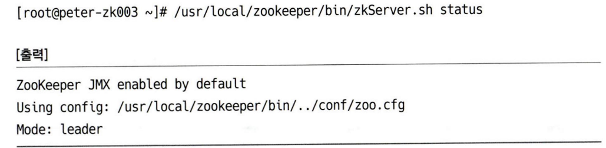

 

### 필수 명령어

---

**토픽 생성**

- kafka-topics.sh를 사용하며, `**--create**` 옵션을 넣어 토픽을 생성한다. 추가 옵션으로`--replication-factor (N), --bootstrap-server (host&port), --partitions (N)` 옵션들이 추가로 요구된다.

- 본 서에서 나오는 `--zookeeper` 옵션은 Deprecated되었다. `--bootstrap-server` 옵션을 사용하여 host, port 정보를 입력해야 한다.

 

**토픽 리스트 확인**

- kafka-topics.sh를 사용하며, `--bootstrap-server` 옵션을 지정 후, `**--list**` 옵션을 통해 확인할 수 있다.

 

**토픽 상세보기**

- 토픽에 대한 상세 정보를 확인해야 할 경우, `kafka-topics.sh --bootstrap-server, --topic, ``**--describe**` 옵션을 사용하여 상세 정보를 확인할 수 있다.

	

 

**토픽 설정 변경**

- 카프카 운영 중 토픽의 설정을 변경해야하는 경우.

- `kafka-configs.sh` 의 옵션으로 `--bootstrap-server, ``**--alter**``, --entity-type topics, --entity-name (topic name)` 을 통해 변경할 수 있다. 예제의 커맨드는 이런 식으로 변경한다~ 로 봐야할 것이며, 토픽의 설정은 별도의 학습이 필요할 것으로 보인다.

	

	 

**토픽 파티션 수 변경**

- 파티션 수는 증가만 가능하고, 감소는 불가능하다. 따라서 처음부터 과하게 파티션을 책정하면 추후에 파티션을 줄여야 할 때는 토픽을 제거한 후 다시 생성할 수 밖에 없으므로 유의해야 한다.

- `kafka-topics.sh`를 대상으로 `--bootstrap-server, ``**--alter**``, --topic, --partitions (N)` 옵션을 통해 파티션 수를 변경할 수 있다.

 

**토픽 리플리케이션 팩터 변경**

- 리플리케이션 팩터를 변경하기 위해선 일단 json 파일을 생성해야 한다.

	

- 이 때, `replicas` 의 첫 번째 브로커는 항상 파티션의 기존 리더여야 한다. (그래야 리더 변경으로 인한 프로듀서, 컨슈머 영향이 없기 때문)

	

 

**컨슈머 그룹 리스트 확인**

- 

	

 

**컨슈머 상태와 오프셋 확인**

- 

	

	

- 여기서 LAG은 파티션의 가장 마지막 오프셋과, 컨슈머 오프셋 간의 차이를 의미한다. 쉽게 말해 컨슈머가 가져가지 않은 메시지 갯수

- 따라서 LAG이 계속 증가한다면 컨슈머가 부족하다는 말이기에 경우에 따라 컨슈머 수나 파티션 수를 증가시켜야 할 수 있다.

 

### 주키퍼 스케일 아웃

---

- zoo.cfg 파일 수정

	

- 모든 주키퍼 호스트의 설정 파일을 수정한 이후엔, 호스트 별로 1대씩 주키퍼를 재시작 해야 한다. 이 때 재기동 순서의 제약은 없지만 리더 변경으로 인한 부작용을 방지하기 위해 리더 호스트는 가장 마지막에 재기동한다.

	

- 모든 호스트의 재시작이 완료되면, 앙상블이 잘 동작하는지 확인해야 한다. 

	

	 

### **카프카 스케일 아웃**

---

- 카프카를 스케일 아웃하기 위해선 새로 추가하는 서버의 카프카 설정 파일에서 `broker.id` 만 겹치지 않게 추가하고 실행하면 카프카 클러스터에 추가할 수 있다.

- 이후 카프카 클러스터에 잘 조인되었는지 확인하기 위해 주키퍼에서 브로커 정보를 확인할 수 있다. 

	

- 다만, 이렇게 클러스터에 브로커를 추가한 이후에도 자동적으로 파티션의 재배치는 이뤄지지 않기 때문에 별도의 파티션 재배치 작업이 요구된다.

	

새로 추가한 브로커는 파티션 레플리카에 포함되지 않는다.

- 파티션 재분배를 위해 `/usr/local/kafka` 하위 경로에 `partition.json `파일을 만들어둬야 한다.

	

- `kafka-reassign-patitions.sh`를 통해 파티션을 재분배할 수 있으며 `--bootstrap-server, --reassignment-json-file (파일 경로), --excute` 옵션을 통해 실행할 수 있다.

- 추가로, 운영 중인 환경에선 파티션에 쌓인 데이터가 상당히 클 것이다. 1~5GB 정도라면 그럭저럭 재분배가 어렵지 않겠지만, 10GB 쯤 되는 파티션이라면 꽤나 시간이 소요될 수 있으므로 아래와 같이 진행하는 것이 도움이 된다.

	1. 토픽의 사용량이 가장 적은 시간대에 작업을 진행한다.

	1. 토픽의 보관주기를 줄여서 임시로 사이지를 축소시킨 후 작업을 진행한다.

 

### 카프카 모니터링

---

- 카프카 클러스터 운영을 위한 모니터링 도구는 필수적이며, 사용하기 편해야 한다. 언제 CLI로 하나하나 보겠어…

- 아파치 카프카 도큐먼트에서 가장 추천하는 방식은 `**JMX(**``Java Management Extensions``**)**`다. 

	- 자바 기반 애플리케이션의 모니터링을 위한 자바API

- JMX 추가 방식은 크게 두 가지로, `카프카 실행 파일에 JMX 관련 설정을 추가하는 방식`과 `systemd` 를 이용한 환경 변수 추가 방법이 있다.

- 첫 번째 방식은 간단하지만, 추후 카프카 버전 업 이후에 반드시 설정을 추가해줘야 하는 단점이 있다.

	- `kafka-server-start.sh`의 내용에 `export JMX_PORT=9999` 를 추가해준다.

	- 이후 서버를 재시작한다. 9999 포트가 잘 작동하는지 확인한다.

- 두번째 방식은 `systemd` 의 환경 변수를 이용하는 방식이다.

	- 내용으로 `JMX_PORT=9999` 가 적힌 JMX 파일을 생성한다.

	- 이후 `systemd` 에 등록한 `kafka-server.service` 파일을 열어, `ExecStop` 줄 다음에 `EnviromentFile=/usr/local/kafka/config/jmx` 를 추가해준다.

	- 이후 `systemd` 를 재시작한다. 9999 포트가 잘 작동하는지 확인한다.

**브로커 주요 항목과 설명**

 

- 이런 옵션을 GUI 형태로 보는 것도 가능하다. 자바에선 jconsole을 제공한다.

	

 

### 카프카 매니저 활용

---

- 카프카를 운영하면서 토픽 추가, 삭제, 설정 변경 등의 작업을 웹 GUI로 이용하는 방식으로 `Kafka manager` 를 사용할  수도 있다. (몇 가지 기능은 CLI를 통해서만 가능하지만, 대부분은 카프카 매니저에서 해결할 수 있다.)

- 설치 방식은 생략. 설치가 필요한 시점에 다시 보거나 별도의 포스팅으로 정리하는 걸로

 

**카프카 클러스터 등록**

- 매니저에서 관리할 클러스터를 등록해야한다.

	

	

- 등록시 필요한 데이터는 클러스터 이름, 클러스터의 주키퍼 경로, 카프카 버전 정보 등. 추가로 카프카에서 JMX를 켜두었다면, `Enable JMX Polling` 옵션을 통해 클러스터의 메시지 유입 상태 등 추가 정보를 확인할 수 있다.

 

**카프카 매니저 메뉴**

- Brokers: 클러스터 브로커 상태 확인

- Topic: 신규 토픽 생성 및 기존 토픽 리스트 확인

	- 토픽의 파티션 수, 분산 정도, 리더의 분산 정도, 리플리케이션의 수와 리플리케이션 상태를 확인할 수 있다.

	- 특히 퍼센트 지표에서 경고는 노란색, 위험은 붉은색으로 표시되기에 토픽 별 상태를 파악하기 용이하다.

- Preferred Replica Election: 브로커 다운, 점검 이후 수동 파티션 리더 복구

- Reassign Parttions: 토픽의 파티션 변경 작업

- Consumers: 클러스터 컨슈머 리스트 확인

- Cluster Information: 클러스터 주키퍼 정보와 버전 정보

- Cluster Summary: 클러스터의 전체 토픽 수와 브로커 

 

**카프카 Q&A**

- 카프카 운영 시 옵션을 변경하려면, OS 점검을 진행하려면

	- 옵션 변경 후 브로커 1대 씩 카프카를 재실행해야합니다. 

- 디스크 사용량이 너무 많아요

	- 토픽의 메시지 보관주기는 기본적으로 일주일입니다. 따라서 이 보관 주기를 48시간 정도로 줄이는 것만으로 많은 양의 데이터가 감소합니다. 또한 스케일-아웃을 통해 브로커와 파티션 혹은 디스크 용량을 증가시키는 방향을 고려할 수 있습니다.

	- 디스크 추가를 위해선 **2.3 카프카 설치**에서 언급된 것처럼 브로커 옵션 설정에서 `log.dirs` 옵션에 추가된 디스크 경로를 추가한 후 브로커를 재시작하면 됩니다.

- 컨슈머의 LAG 상태를 관리하려면

	- **6.1.8 컨슈머 상태와 오프셋 확인**을 참고하여 CLI로 확인하거나, 링크드인의 오픈소스인 버로우를 통해 확인할 수 있습니다.

- 앙상블 전체의 상태 정보를 볼 수 있는 간단한 툴은

	- `zktop `라는 툴을 사용하면 CLI상태에서 한눈에 주키퍼 앙상블 상태를 확인할 수 있습니다.

- 카프카 버전 업그레이드는

	1. 모든 브로커를 종료하고 업데이트하는 방식

	1. 롤링 업데이트 방식이 있습니다. 

		

- 카프카 버전 업그레이드 시 주의사항

	- 버전이 달라지면서 기존 버전의 **환경설정 값이 변경**되는 경우가 있습니다. 릴리스 노트를 확인해 관련 부분을 미리 체크해야합니다. 또한 메시지 전송과 수신 또는 연결 등의 문제가 발생할 수 있으니 **클라이언트 버전 호환성**도 체크해야 합니다.

- 자바 기반의 힙 사이즈는 물리 메모리의 절반 정도로 잡는데, 카프카의 메모리는?

	- 카프카는 힙 사이즈를 5~6GB 정도만 설정하고 남는 메모리는 페이지 캐시로 사용하기를 권합니다.

	 

